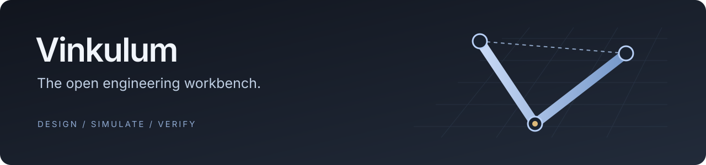
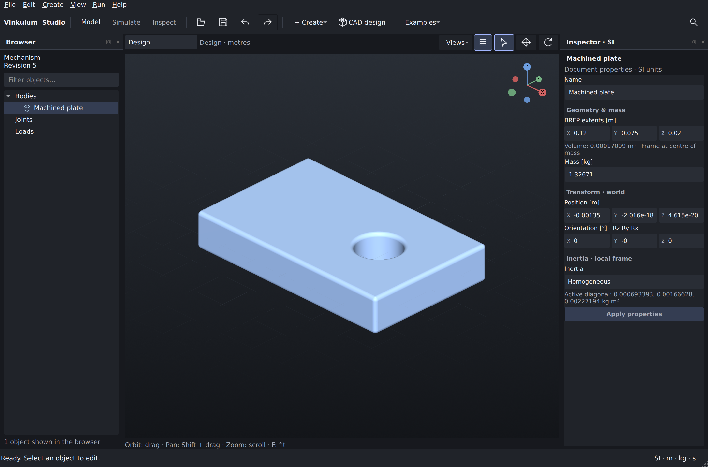
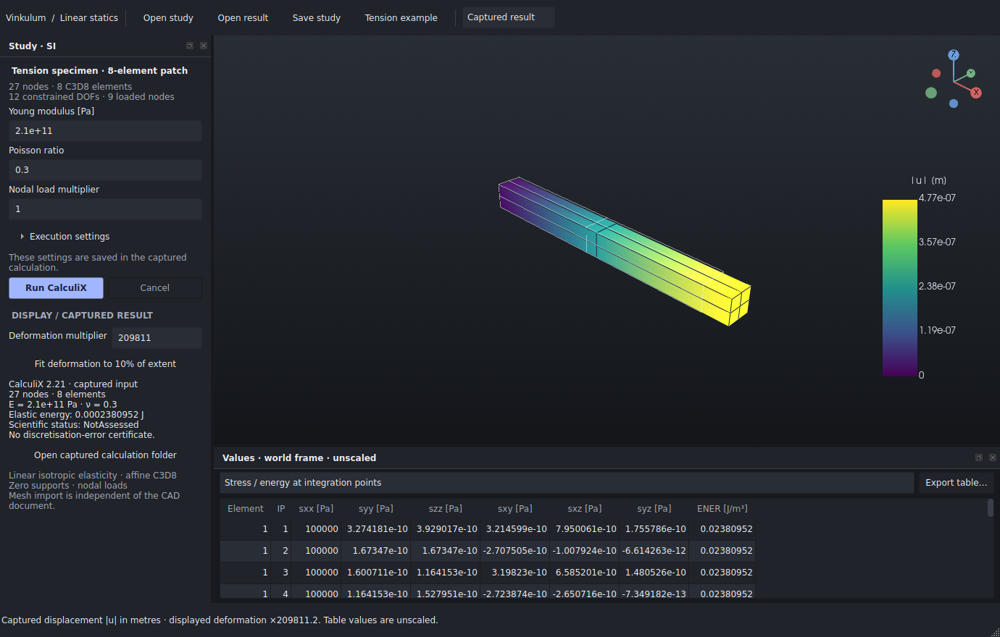
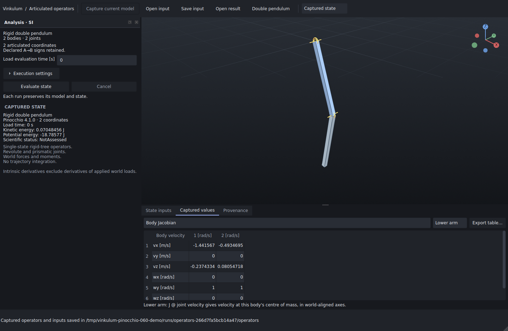
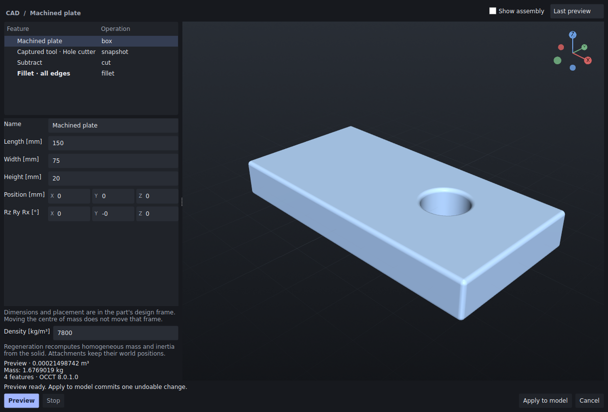
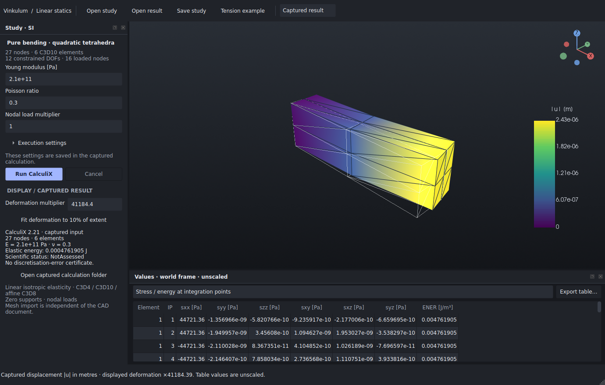
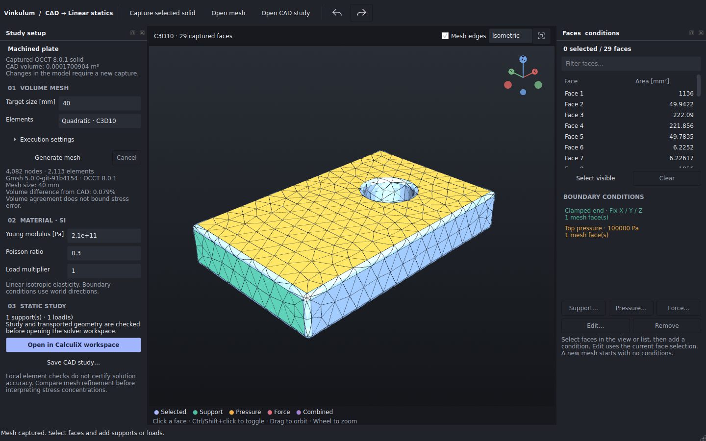

<p align="center">
  
</p>

**Build the mechanism. Run the physics. Inspect the evidence.**

Vinkulum is an open engineering project bringing **CAD, multibody simulation
and scientific verification** into a shared workflow. It combines a Rust
mechanics kernel, a Python API and a native 3D desktop application — with the
ambition of becoming a home for the open solvers engineers and researchers rely on.

[Get started](#get-started) · [Contribute](docs/CONTRIBUTOR_PROJECTS.md) ·
[Share Vinkulum](docs/SHARE_VINKULUM.md) ·
[Scientific guarantees](docs/CERTIFICATION_NOYAU.md) ·
[Support the project](docs/FUNDING.md) · [Documentation technique en français](README.fr.md)

**Try it:** [download the Linux desktop preview](https://github.com/Brietat71/vinkulum-public/releases/tag/studio-v0.5.0-linux)
or [inspect a saved FEM example without installing CalculiX](docs/SHARE_VINKULUM.md#try-a-captured-finite-element-result).
The release contains Studio 0.5.0; the source tree is developing 0.6.0.

<p align="center">
  
</p>

*An actual Studio session: create a plate, subtract a cylinder, fillet the edges,
then obtain mass and inertia from the exact solid. The
[example project](examples/studio/platine-percee.vinkulum.json) and
[reproducible CAD recipe](ci/studio_cad_recipe.py) are included.*

<details>
<summary><strong>See the new CalculiX workspace — a calculation you can reproduce</strong></summary>



A real 8-element tension calculation: a 1,000 N axial load, a displacement field
in metres, and stress values at integration points. Displayed deformation is
amplified; exported values retain their physical units. The
[mesh study](examples/studio/fem/tension.ccx.json),
[capture recipe](ci/studio_static_recipe.py) and
[analytic reference](docs/CALCULIX_INTEGRATION.md#reproduce-a-study) are included.

</details>

<details>
<summary><strong>In the developing source: inspect Pinocchio operators behind a mechanism</strong></summary>



Edit an articulated state, evaluate dynamics operators and inspect mass matrices,
derivatives and Jacobians. The [captured example](examples/studio/articulated/double-pendulum/README.md)
opens without the engine; recomputation uses a separate Pinocchio environment.
The [guide](docs/PINOCCHIO_OPERATORS.md) includes independent Lagrange references.
Introduced in source version **0.6.0.dev1**; the **0.5.0 Linux download** predates this workspace.

</details>

<details>
<summary><strong>In the developing source: change a CAD dimension and regenerate the part</strong></summary>



Change the stock length from **120 to 150 mm** and preview the dependent cut and
fillets. The solid supplies the new mass and inertia; applying the preview is
one undoable change. Try the [parametric plate](examples/studio/platine-parametrique.vinkulum.json)
with the [editing guide](docs/STUDIO_CAD_HISTORY.md) and inspect the
[installed-package checks](docs/bancs/studio-cad-history-060/README.md).
This requires source version **0.6.0.dev2**. Constrained sketches and persistent
face/edge references are still future work.

</details>

<details>
<summary><strong>For numerical researchers: six tetrahedra, one analytic bending solution</strong></summary>



Run a six-element CalculiX study and compare its energy with an independent
elasticity solution. Inspect the input deck, raw output and checks behind the
plot. The source also checks curved tetrahedra using exact-arithmetic Bernstein
bounds on the local Jacobian determinant. These bounds concern element geometry;
solution accuracy is assessed separately.

[Try the bending example](docs/STUDIO_TETRAHEDRA.md#try-a-complete-calculation) ·
[Inspect the qualification](docs/bancs/studio-tetrahedra-060/README.md) ·
[Contribute a convergence study (#4)](https://github.com/Brietat71/vinkulum-public/issues/4)

Requires **Studio 0.6.0.dev3 source**; the downloadable **0.5.0 Linux preview**
predates tetrahedral studies.

</details>

<details>
<summary><strong>In the developing source: take a CAD part into a finite-element study</strong></summary>



Generate a tetrahedral mesh with **Gmsh / OCCT 8**, pick its boundary faces in
3D, add supports and pressure, and open the captured study in **CalculiX**.
The [workflow guide](docs/STUDIO_CAD_MESHING.md) includes installation and limits;
the [saved example](docs/bancs/studio-cad-meshing-060/README.md) includes the solid,
mesh, physical conditions and raw calculation behind the display.

Requires **Studio 0.6.0.dev4 source** and separate engines for new computations.
The **0.5.0 Linux download** predates this workflow. The saved example can be
reopened in the new workspace without running an engine.

</details>

## What you can do today

| Layer | Available in the source tree |
|---|---|
| **Design** | OCCT **8.0.1** and adapted **build123d**: primitives, extrusions, solid booleans, all-edge fillets and single-solid STEP exchange. Edit upstream solid features, preview regeneration and apply one undoable change. BREP mass properties and display meshes remain distinct. |
| **Model** | A Qt/VTK workbench for rigid mechanisms: bodies, joints, loads, numerical properties, 3D manipulation, undo/redo and project files. |
| **Simulate** | The native Rust kernel computes in a separate process. Studio captures the model and settings associated with each run. |
| **Linear statics** | Mesh a captured CAD solid with Gmsh / OCCT 8, select faces and add supports, pressure or total forces. Open the study in CalculiX, inspect displacement, integration-point stress and energy, and reopen saved calculations. |
| **Articulated operators** | A Pinocchio analysis window edits a captured rigid-tree state and inspects dynamics operators, derivatives and body Jacobians. Separate optional worker; CSV export and engine-free result reopening. |
| **Examine** | Animate results, inspect curves and samples, compare captured runs on their native time grids, and export with units and provenance. |
| **Research** | Use the broader Python kernel API for rigid/flexible mechanics, contact and analysis. Explore explicit numerical contracts, independent references and selected Lean proofs. |

**Kernel 0.19.0 · Studio source 0.6.0.dev4 · Linux release 0.5.0.** Research software under active development.
Studio currently exposes a subset of the kernel. CAD is an initial solid-modelling
workflow; interactive constrained sketches and persistent face/edge references
remain future work. The [CAD-to-FEM workspace](docs/STUDIO_CAD_MESHING.md) now captures
tetrahedral meshes and face conditions for CalculiX. The complete kernel is not certified. Each guarantee has a stated
domain and its own evidence. See the [CAD contract](docs/STUDIO_CAD.md),
[Studio guide](apps/studio/README.md) and [kernel API](docs/API.md).

## One workbench, several scientific engines

The long-term goal is a common place to prepare models, choose an appropriate
engine and inspect traceable results. Each engine keeps its identity, licence
and physical assumptions.

| Component | Place in the project | Integration status |
|---|---|---|
| **Vinkulum** | General-purpose mechanics and verifiable numerical research | Native kernel; rigid-mechanism Studio adapter available |
| **OCCT 8 + build123d** | Exact CAD and mass properties | Integrated; local compatibility patches and qualification corpus included |
| **Gmsh** | Tetrahedral CAD meshing | Source workflow requires an external OCCT 8 build; captures boundary groups for supports, pressure and total forces |
| **Pinocchio** | Articulated-body algorithms, Jacobians and derivatives | [Experimental workspace and CLI](docs/PINOCCHIO_OPERATORS.md) for fixed-base rigid trees, with independent references; separate Python environment, source workflow only |
| **MBDyn** | Multibody workflows and independent reference calculations | Existing comparison work; Studio connector planned |
| **CalculiX** | Finite-element workflows | [Experimental static-study workspace and CLI](docs/CALCULIX_INTEGRATION.md): C3D4, curved C3D10 and affine C3D8, cancellable solve, captured displacement and integration-point values; external executable required |
| **DUST** | Aerodynamic workflows and future coupling | Planned |
| **NeuralFoil** | Airfoil polar workflows | Used by optional validation tooling; Studio workflow planned |

A connector must establish units, frames, supported physics and reproducible
reference cases before it becomes a selectable engine. Future integrations in
this table are not part of the current desktop binary.

## Get started

**Try the desktop without compiling:**
[Studio 0.5.0 Linux preview](https://github.com/Brietat71/vinkulum-public/releases/tag/studio-v0.5.0-linux)
includes the standalone archive, checksums and extracted-binary qualification.
It targets Linux x86-64 / Ubuntu 24.04 / glibc 2.39 / X11.
CalculiX calculations additionally require an installed `ccx` executable
(`calculix-ccx` on Ubuntu 24.04). The [FEM guide](docs/CALCULIX_INTEGRATION.md)
explains supported meshes, result meanings and the separation from CAD meshing.

For development, use **Python 3.14**, Rust/Cargo, a C++17 compiler, a system
linker and [uv](https://docs.astral.sh/uv/). Linux desktop prerequisites and the
standalone packaging recipe are in the [Studio guide](apps/studio/README.md).

```bash
git clone https://github.com/Brietat71/vinkulum-public.git
cd vinkulum-public
uv venv --python 3.14 .venv
source .venv/bin/activate
uv pip install 'maturin>=1.15,<2'
maturin develop --uv --release --extras verification
uv pip install -e './apps/studio[test]'
python -m vinkulum_studio
```

To add CAD, install the reviewed OCCT 8 adaptations (`patch` is required):

```bash
python ci/prepare_cad.py build/cad-sources
uv pip install build/cad-sources/build123d-0.11.1 \
  build/cad-sources/ocpsvg-0.6.0 -e './apps/studio[cad,test]'
python -m vinkulum_studio
```

After a Python/UI edit, restart Studio. Rebuild the native extension only after
Rust changes; build a standalone archive when preparing a delivery.
No Vinkulum package is currently published on PyPI. Check version and platform
in the [public releases](https://github.com/Brietat71/vinkulum-public/releases):
older binaries may predate the features shown in this source tree.

Studio's interface, installation guide and contribution guide are in English.
The technical archive and several research reports are still in French;
translations with careful preservation of scientific claims are welcome.

## Evidence you can inspect

Vinkulum publishes the assumptions behind its results: units and frames,
convergence studies, failure cases and bounded guarantees. Passing a test or
agreeing with another solver does not certify every trajectory.

- [Kernel guarantees and remaining obligations](docs/CERTIFICATION_NOYAU.md)
- [Numerical benchmarks and historical comparisons](README.fr.md#résultats-mesurés-et-comparaison-externe)
- [CAD adaptation, analytic checks and upstream test subset](docs/STUDIO_CAD.md)
- [Parametric CAD editing, previews and preserved design frames](docs/STUDIO_CAD_HISTORY.md)
- [Quadratic tetrahedra, analytic bending and exact local Jacobian bounds](docs/STUDIO_TETRAHEDRA.md)
- [CAD meshing, 3D face selection and captured CalculiX studies](docs/STUDIO_CAD_MESHING.md)
- [Studio interaction and rendering qualification](docs/STUDIO_GUI_2026.md)
- [CalculiX statics contract and reproducible tension study](docs/CALCULIX_INTEGRATION.md)
- [Pinocchio conversion, independent Lagrange references and captured-state workspace](docs/PINOCCHIO_OPERATORS.md)
- [Lean proof workspace](preuves/README.md)

Performance contributions start with a reproducible workload and a profile.
Rust is welcome where it improves a measured bottleneck; comparisons must retain
accuracy, account for transfer costs and report regressions as well as gains.

## Help build it

There is room here for **students, researchers, engineers and curious builders**.
A useful contribution can be a failing physical example, a CAD regression part,
a better interaction, a numerical proof or an independently reproduced result.

The [contributor projects](docs/CONTRIBUTOR_PROJECTS.md) describe concrete first
deliverables across dynamics, CAD, Pinocchio, other solver connectors, Rust
performance, Qt and teaching. Read [CONTRIBUTING.md](CONTRIBUTING.md), then
[propose a scoped project](https://github.com/Brietat71/vinkulum-public/issues/new)
or submit a reproducible fix. The issue forms help describe a bug, a scientific
reference or a first contribution without needing to know the whole codebase.

**Pick a concrete first contribution:**

- **CAD:** [add a STEP part with independently known mass properties (#1)](https://github.com/Brietat71/vinkulum-public/issues/1).
- **Desktop:** [qualify one keyboard and high-DPI workflow (#2)](https://github.com/Brietat71/vinkulum-public/issues/2).
- **FEM:** [measure C3D8 bending convergence against an independent reference (#4)](https://github.com/Brietat71/vinkulum-public/issues/4).
- **Dynamics:** [derive and qualify applied-load derivatives for Pinocchio (#6)](https://github.com/Brietat71/vinkulum-public/issues/6).

If this direction matters to you, **star the repository**, share a real use case,
or help reproduce a benchmark. The [share kit](docs/SHARE_VINKULUM.md) includes
a runnable demonstration and short introductions you can adapt.
For labs and organisations interested in funding
maintenance or a public milestone, see [Support Vinkulum](docs/FUNDING.md).

## Licence

Original Vinkulum code is **[Apache-2.0](LICENSE)**. External libraries, solvers
and models retain their own licences and attribution. See
[third-party notices](THIRD_PARTY_NOTICES.md). The CAD compatibility patches are
kept explicit so their provenance can be reviewed and useful changes can return
upstream.
