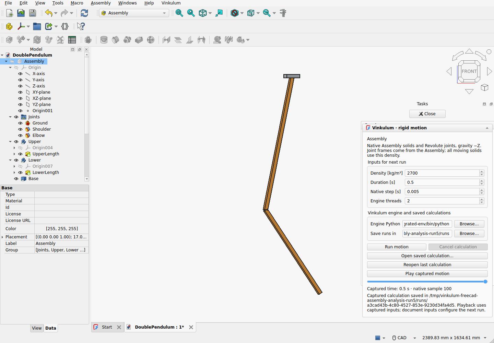
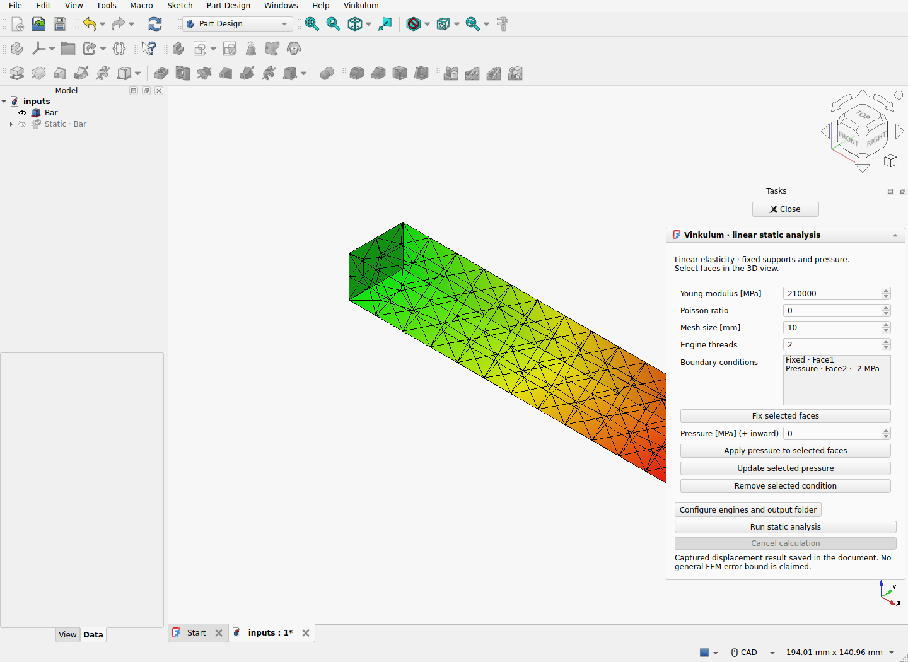

  

**Design in FreeCAD. Run open solvers. Keep the evidence.**

Vinkulum brings a **Rust mechanics kernel** and open scientific engines into
FreeCAD. Keep your editable CAD, native feature tree and familiar modelling
controls. Run calculations in separate processes, then inspect motion or FEM
results in the document.

[First run in FreeCAD](docs/FREECAD_FIRST_RUN.md) ·
[Contribute](docs/CONTRIBUTOR_PROJECTS.md) ·
[Discuss](https://github.com/Brietat71/vinkulum-public/discussions) ·
[Scientific guarantees](docs/CERTIFICATION_NOYAU.md) ·
[Support the project](docs/FUNDING.md) · [Technical archive in French](README.fr.md)

| Rigid mechanisms | Linear static analysis |
|---|---|
|  |  |
| Editable solids and native Revolute joints; inspect captured motion on temporary copies. | Pick faces, define fixed supports and pressure, then inspect native FEM displacements. |

*Actual FreeCAD Linux sessions. These are development workflows; the released
extension and development build have different scopes, detailed below.*

## Start with an editable example

**Released: FreeCAD extension 0.1.0a2. Development: 0.1.0a3.dev6. Kernel: 0.20.0. Linux first.**

The [published 0.1.0a2 ZIP](https://github.com/Brietat71/vinkulum-public/releases/tag/freecad-v0.1.0a2)
contains the single-solid pendulum workflow. Use a
[development source build](docs/FREECAD_FIRST_RUN.md) for native Assemblies,
linear statics and the new preconfigured static example. These source features
are not in that released ZIP.

1. Install the extension and its [separate engine](docs/FREECAD_ENGINE.md).
2. Choose **Vinkulum → Open double-pendulum assembly**, then **Motion analysis…**
   to calculate from native Revolute joints; or choose **Open static tension
   example**, then **Static analysis…** for a bar with its supports and load ready.
3. Choose the engine paths and run. Statics additionally needs OCCT 8-enabled
   Gmsh HXT and CalculiX. Opening an example does not start a solver.
4. Save the analysis with the design, change an input and compare a new capture.
   The [first-run guide](docs/FREECAD_FIRST_RUN.md) gives an expected numerical
   result and explains which files to keep.

Motion analyses preserve the source design and use temporary playback copies.
Static inputs and native FEM displacement results persist in the FCStd file.
Boundary geometry is captured explicitly; changed geometry requires face
reselection, and stale linked static results are hidden on recomputation.
Cancellation retires the task's worker; the static job also owns its mesher and
solver process group and watches for abrupt FreeCAD closure.

This is a **research alpha**. The qualified development paths are flat native
Assemblies with Revolute joints and one uniform density, and one-solid linear
isotropic statics with fixed supports and pressure. General topology persistence,
nonlinear FEM, contact in the FreeCAD workflow and general trajectory/FE error
bounds are not established. Every retained qualification states its scope.

FreeCAD is the primary desktop interface; the custom Studio GUI is paused.
The qualified Linux host is FreeCAD 1.1.3 / Qt 6. Its own OCCT 7.8.1 stays in
its process. Vinkulum reimports captured STEP with **OCCT 8.0.1** and checks
volume, centre and the full inertia tensor before calculating. The two Python
environments keep separate native libraries.

## One project, several scientific engines

The long-term goal is a common engineering environment for open mechanics,
finite elements and other scientific engines. Each engine keeps its identity,
licence, units, physical assumptions and reference cases.

| Component | Implemented backend | FreeCAD development interface |
|---|---|---|
| **Vinkulum** | Native Rust mechanics, Python API, captured rigid-body trajectories | Single-solid and native Assembly motion tasks |
| **OCCT 8 + build123d** | STEP import, solid geometry and SI mass properties | Checked capture boundary with the FreeCAD host |
| **CalculiX** | External linear-elasticity adapter: C3D4, admitted curved C3D10 and affine C3D8; captured results and references | Native one-solid static task: fixed supports, pressure and displacements |
| **Gmsh** | External OCCT 8 mesher and captured boundary conditions | Meshing inside the static task |
| **Pinocchio** | Fixed-base rigid-tree operators, derivatives and independent references through a separate worker | Planned |
| **MBDyn** | Existing comparison work | Connector planned |
| **DUST** | Future aerodynamic workflows | Planned |
| **NeuralFoil** | Optional validation tooling | Connector planned |

The broader kernel API includes work beyond the initial FreeCAD host. See the
[kernel API](docs/API.md), [CalculiX contract](docs/CALCULIX_INTEGRATION.md),
[CAD meshing guide](docs/STUDIO_CAD_MESHING.md) and
[Pinocchio operators](docs/PINOCCHIO_OPERATORS.md). These backend capabilities
are not all exposed by the first FreeCAD extension.

## Evidence you can inspect

Vinkulum publishes units, frames, convergence observations, failure cases and
bounded guarantees. Passing a test or matching another solver does not certify
arbitrary trajectories or models.

- [FreeCAD extension: actual GUI, saved files, process lifecycle and frame transport](docs/bancs/freecad-extension-010/README.md)
- [Native Assembly analyses, editable examples and independent double-pendulum checks](docs/bancs/freecad-assembly-analysis-2026/README.md)
- [Native static task, result persistence, stale inputs and process lifetime](docs/bancs/freecad-static-task-2026/README.md)
- [First-run static example and repeatable opening/closing](docs/bancs/freecad-first-run-2026/README.md)
- [Persistent FreeCAD analyses: save/reopen, Undo/Redo and numeric precision](docs/bancs/freecad-analysis-010a2/README.md)
- [Independent finite-section pendulum reference and four retained FreeCAD captures](docs/bancs/freecad-bridge-2026/README.md)
- [Kernel guarantees and remaining obligations](docs/CERTIFICATION_NOYAU.md)
- [Numerical benchmarks and historical comparisons](README.fr.md#résultats-mesurés-et-comparaison-externe)
- [OCCT 8 adaptation and independent CAD properties](docs/STUDIO_CAD.md)
- [Quadratic tetrahedra, analytic bending and exact local Jacobian bounds](docs/STUDIO_TETRAHEDRA.md)
- [Lean proof workspace](preuves/README.md)

Performance work starts with a reproducible workload and a profile. Rust and
native multithreading belong where measurements justify them. Comparisons must
retain accuracy and include transfer costs, memory use and regressions.

## Development

The [FreeCAD extension guide](apps/freecad/README.md) explains installation,
engine configuration, packaging and the actual FreeCAD qualification recipe.
The extension uses the existing CAD and mechanical adapter modules in the
`vinkulum_studio` Python package, in a separate process. It never opens Studio's
GUI. The engine environment needs Python 3.14, Vinkulum 0.20 and the
[OCCT 8 CAD dependencies](docs/STUDIO_CAD.md).

Development of the custom Studio GUI is paused. Its code and
[previous desktop releases](https://github.com/Brietat71/vinkulum-public/releases)
remain available for reproducibility; new interface work targets FreeCAD.

## Help build it

Students, researchers, engineers and interested contributors can help with a
failing physical example, a CAD regression, a numerical proof or a reproduced
result. Useful priorities for the FreeCAD direction include:

- Extend a bounded assembly case with explicit units, frames and independent mechanics.
- Exercise cancellation, save/reopen and source edits in real FreeCAD sessions.
- Add a STEP solid with independently known mass properties.
- Add a mesh-refinement study or improve the native static task with a reproducible user workflow.
- Profile the capture/process boundary before proposing a performance change.

Read [CONTRIBUTING.md](CONTRIBUTING.md) and the
[contributor projects](docs/CONTRIBUTOR_PROJECTS.md), then
[propose a scoped contribution](https://github.com/Brietat71/vinkulum-public/issues/new).
Several older desktop tasks refer to the paused Studio GUI; prefer FreeCAD
for new interaction work.

If this direction matters to you, **star the repository**, share a real use case
or help reproduce a benchmark. For labs and organisations interested in funding
maintenance or a public milestone, see [Support Vinkulum](docs/FUNDING.md).

## Licence

Original Vinkulum code is **[Apache-2.0](LICENSE)**. FreeCAD, external libraries,
solvers and models retain their own licences and attribution. See
[third-party notices](THIRD_PARTY_NOTICES.md). Compatibility patches and reference
cases remain explicit so their provenance can be reviewed and useful changes
can return upstream.
