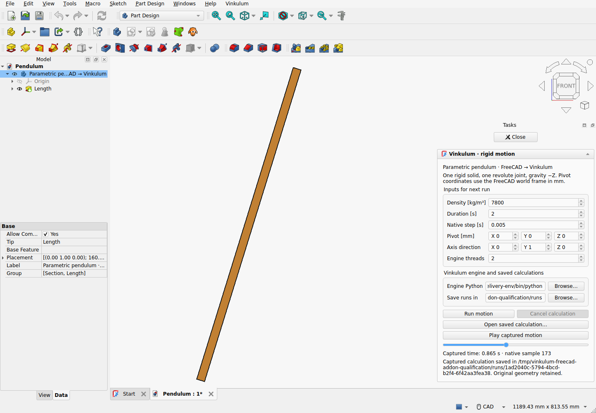

# Vinkulum for FreeCAD

Published extension: **0.1.0a2**. Development source: **0.1.0a3.dev8**.

FreeCAD is Vinkulum's primary desktop interface. The extension adds a **Vinkulum
menu and native task panel** while keeping the current FreeCAD workbench. It
captures a selected solid, runs the existing mechanics backend in a separate
process and displays native poses on a temporary copy. Development of Studio's
custom GUI has ended; no new standalone Studio releases are planned.

Development 0.1.0a3.dev8 extends [explicit geometry admission to Assembly components](../../docs/FREECAD_ASSEMBLY_GEOMETRY.md),
including native links. Extra non-solid geometry is refused instead of silently
discarded during capture.

Development 0.1.0a3.dev7 fixes [single-solid compound capture](../../docs/FREECAD_COMPOUND_CAPTURE.md)
for motion and statics. Boolean results and nested singleton containers retain
their source geometry and face references while mass properties are read from
the contained solid. Extra geometry is rejected explicitly.

Opening the example now completes its initial view setup before queued document
closures run. The [retained before/after regression](../../docs/bancs/freecad-example-close-2026/README.md)
records the original native crash and the corrected installed extension.

The published 0.1.0a2 release covers one top-level rigid solid with one explicit revolute joint,
starting from rest under gravity -Z. Pivot coordinates, axis, density, duration,
time step and engine threads are explicit. The development Assembly workflow
and native linear-static task are described below. General constraints and other
platforms remain outside the host qualification.



## Install

Use **FreeCAD 1.1.3 with Qt 6 on Linux** and the extension ZIP from the
[public releases](https://github.com/Brietat71/vinkulum-public/releases).
Close FreeCAD and extract the `Vinkulum` folder into its user `Mod` directory.
The qualified Linux runtime uses `~/.local/share/FreeCAD/Mod`, or
`$XDG_DATA_HOME/FreeCAD/Mod` when configured. Restart FreeCAD.
`Vinkulum/Init.py` and `Vinkulum/InitGui.py` must be directly inside that folder.

Prepare a separate Python environment with **Vinkulum 0.20, the Studio backend
package and OCCT 8 CAD dependencies** using the [dedicated Linux engine installer](../../docs/FREECAD_ENGINE.md).
Choose that environment's Python in the task panel. The `vinkulum_studio` package
currently supplies the headless CAD and mechanical adapters; the extension never
opens its GUI. Do not install its native libraries inside FreeCAD's interpreter.
The qualified FreeCAD host uses OCCT 7.8.1 and Python 3.11; the engine uses
OCCT 8.0.1 and Python 3.14. Geometry and checked SI properties cross the process
boundary.

**Vinkulum → Open pendulum example** opens the included PartDesign model.
Select its Rod body and open **Vinkulum → Motion analysis**. Configure the engine
Python and the directory for saved calculations, then **Run motion**. The
slider and **Play captured motion** use actual native samples without
interpolating a new physical trajectory. The original design placement stays
unchanged. See [complete installation and controls](INSTALLATION.txt).

The command creates a **Motion object in the native document tree**. Its source
link, density, pivot, axis, time settings and thread budget are saved in `.FCStd`.
Double-click it or use its **Edit motion analysis** context action to resume.
Panel edits participate in FreeCAD Undo/Redo. Opening the panel preserves stored
values; the worker reads document properties directly, independently of display
rounding. Saving uses FreeCAD's native numeric serialization precision.
The engine executable remains a machine-local preference.

One job can run at a time in this FreeCAD process. Cancel and source-document
close retire its worker. A failed start releases admission. Newer geometry
invalidates old-motion playback. Saving the native `.FCStd` file stops playback,
removes the temporary copy and restores the original visibility before writing.
The `.FCStd` design and calculation folders remain separate files. A saved
calculation can reopen without the engine when the selected source still
matches its captured geometry.
The Motion object remembers its last capture folder for **Reopen last
calculation**. This is an absolute external path, not an embedded result; use
**Open saved calculation** if the folder moves. Opening a document starts no
solver or replay. Completed calculations retain their captured settings and do
not overwrite newer edits. Changing the source link cancels its active task.

## Package and qualify

Build a ZIP from reviewed, committed source:

```sh
python3 apps/freecad/package.py /tmp/Vinkulum-FreeCAD-0.1.0a2.zip --require-clean
```

The ZIP contains original extension code, the editable pendulum example,
installation instructions and a source/hash manifest. It contains no FreeCAD,
Python runtime or solver executable. Updating these Python extension files
requires restarting FreeCAD, not rebuilding FreeCAD or the native kernel.

[qualify_extension.FCMacro](qualify_extension.FCMacro) tests the actual installed
extension in a fresh FreeCAD process with isolated user directories. The
[persistent-analysis record](../../docs/bancs/freecad-analysis-010a2/README.md)
covers native documents, Undo/Redo, precision, resumption and input changes
during a real calculation. The earlier
[retained extension record](../../docs/bancs/freecad-extension-010/README.md)
contains the exact runtime, commands, outputs, screenshot and limits. It exercises
real calculation, capture reopening without an engine, save-time preview removal,
source changes, frame transport and process lifecycle. The two existing
[external-worker regressions](../studio/tests/test_freecad_bridge.py) continue
to check the independent pendulum reference and rejection of corrupted mass.

## Native Assembly analyses (development)

Build and install the extension from this source branch to use native Assembly
analyses; the published 0.1.0a2 ZIP retains its single-solid workflow. The existing
**Motion analysis** task accepts an Assembly and reads its native Revolute joints.
**Vinkulum → Open double-pendulum assembly** opens the included editable example.
The task stores the source link, density, time controls and last capture in the
native document. Playback displays copies of moving solids and the fixed part;
saving or closing removes those copies and preserves the original Assembly.

The [native task qualification](../../docs/bancs/freecad-assembly-analysis-2026/README.md)
covers actual menu/task controls, calculations, persistence, stale-source
rejection and worker cleanup. The [conversion reference](../../docs/bancs/freecad-assembly-2026/README.md)
defines the bounded Revolute/flat-assembly scope and independent mechanics
checks. General assembly constraints, nonuniform component densities, topology
persistence and other platforms remain outside this qualification.

## Retained transport prototype

The [earlier four-run record](../../docs/bancs/freecad-bridge-2026/README.md)
contains actual FreeCAD captures and an independent finite-section pendulum
reference. Those retained scripts and observations describe the original
world-origin/world-Y prototype. The extension builds on that boundary and adds
native controls and lifecycle handling; it does not turn the limited reference
into a general trajectory guarantee.

## Process and geometry contract


The tested official **FreeCAD 1.1.3** AppImage uses Python 3.11.14 and OCCT 7.8.1.
The Vinkulum worker uses Python 3.14.7, Studio 0.6.0a2.dev6, kernel 0.20.0 and
OCCT 8.0.1.0. Each process keeps its own Python and native libraries. The bridge
removes inherited `PYTHONHOME` and library/plugin overrides before launching the
explicitly selected Vinkulum interpreter; the AppImage sets those for FreeCAD's
own runtime. FreeCAD already supports external Python extensions through its
[workbench interface](https://github.com/FreeCAD/FreeCAD-documentation/blob/main/wiki/Workbench_creation.md).

[bridge.py](bridge.py) runs inside FreeCAD and captures one valid solid in a
fresh directory. STEP bytes, a request UUID, body identity, local BREP and global
placement identify that capture. Volume, centre and full centroidal inertia are
also recorded from FreeCAD. Its millimetre quantities become SI using `10⁻⁹`
for volume and `ρ × 10⁻¹⁵` for the inertia integral in mm⁵.

[worker.py](worker.py) runs in the existing Studio CAD environment. The production
OCCT 8 importer reads the STEP and recomputes all physical properties. Volume,
mass, centre and every inertia component must agree with the FreeCAD capture
within scale-dependent absolute budgets (`εV`, `εm`, `εL`, `εmL²`, `ε = 10⁻⁸`;
L is the imported bounding-box diagonal). The normal mechanical adapter creates
the explicit world-origin, world-Y revolute joint and validates the native
trajectory archive. The selected allocation is two threads; CAD import and
mechanics run sequentially in this worker.

FreeCAD receives JSON poses in metres and row-major body-to-world matrices.
The bridge checks capture identity, increasing times, finite values, proper
rotations and the initial pose. It also rechecks the source geometry and its
global placement. Moving an enclosing Part can leave the local BREP unchanged;
that inherited placement is therefore part of the signature. Playback applies
the rigid transform about the captured centre to a separate `Part::Feature`.
It does not write the motion into the original pad or its design placement.
Replacing the input file also invalidates admission, even if a result carries
the hash of that replacement: identity is checked against the original capture.

The QProcess has a 60-second timeout and bounded diagnostic capture. The
retained transport experiment exercised one job in a dedicated FreeCAD process.
The extension now adds application-wide single-job admission and native
close/cancel controls. Multi-body host scheduling and complete production
lifecycle coverage remain outside the retained prototype's qualification.

## Reproduce

Install the [Studio CAD environment](../../docs/STUDIO_CAD.md), then use a
dedicated FreeCAD process. The qualification creates and closes its own document
and exits that process; it refuses to start if documents are already open.
Use a new output directory:

```sh
export VINKULUM_FREECAD_PROTOTYPE="$PWD/apps/freecad"
export VINKULUM_FREECAD_PYTHON=/absolute/path/to/studio-environment/bin/python
export VINKULUM_FREECAD_CAPTURE=/tmp/freecad-vinkulum-capture
FreeCAD "$VINKULUM_FREECAD_PROTOTYPE/qualify.FCMacro"
"$VINKULUM_FREECAD_PYTHON" apps/freecad/verify.py \
  "$VINKULUM_FREECAD_CAPTURE" --plot
```

`FreeCAD` above denotes the executable for a normal FreeCAD installation. On
headless Linux, prefix it with `xvfb-run -a -s '-screen 0 1600x1100x24'`.
The qualification used the extracted official AppImage's `AppRun`, with
`XDG_CONFIG_HOME`, `XDG_DATA_HOME` and `XDG_CACHE_HOME` pointing to separate
temporary directories. The release URL and checked checksum are in the record.

[qualify.FCMacro](qualify.FCMacro) changes the pad length from 800 to 1200 mm,
with native time steps of 5 and 2.5 ms for each length. It checks all displayed
centres against the returned poses, confirms that the source stays unchanged,
and rejects changed geometry, a moved parent, a corrupted rotation and a
replaced request. A Qt
timer records continued event-loop delivery during each external calculation.

[verify.py](verify.py) needs numpy, and matplotlib only for `--plot`. It imports
neither FreeCAD, Studio nor a geometry/physics engine. It checks input/result
hashes, exact agreement between the native archive and the replayed data, the
analytic box mass/inertia, pivot kinematics and convergence against an independent
scalar pendulum equation. It can also verify the extracted retained archive.

The normal Studio suite includes [two external-worker regressions](../studio/tests/test_freecad_bridge.py)
using the retained FreeCAD STEP. They require the Studio CAD environment but no
running FreeCAD: one checks an actual native trajectory against the independent
pendulum equation; the other changes the captured mass and checks rejection
before simulation. Run them directly with:

```sh
"$VINKULUM_FREECAD_PYTHON" -m unittest discover \
  -s apps/studio/tests -p test_freecad_bridge.py -v
```

## Scope of the result

The positive experiment is one uniform rectangular rigid body, one explicitly
defined revolute joint, two lengths and two seconds of motion from rest at 20°.
It establishes this parametric-edit → physical-capture → mechanics → native-pose
display path across the two runtimes. It does not establish general assembly
constraint conversion, persistent face attachment, arbitrary mechanisms,
multi-window scheduling, FEM or macOS/Windows packaging. STEP transfers evaluated
geometry; the original FreeCAD feature graph remains in `.FCStd`.

All bridge code, models, reference calculations and capture data are original
Vinkulum contributions under [Apache-2.0](../../LICENSE). The unchanged official
FreeCAD runtime remains available from its upstream project with its own licence.

## Static FEM experiment

A [source-only FreeCAD → CalculiX experiment](../../docs/FREECAD_STATIC_EXPERIMENT.md)
checks captured boundary faces and imports native FEM results. It is a qualification
prototype, not an additional command in the published extension.

## Development: native linear static task

The [static analysis task](../../docs/FREECAD_STATIC_TASK.md) adds native face
selection, fixed supports, pressure, persistent inputs and asynchronous CalculiX
results. This development workflow is not in the published 0.1.0a2 release ZIP.

Start with the [first-run guide](../../docs/FREECAD_FIRST_RUN.md): it covers the
editable Assembly and preconfigured static example, engine setup and an expected
numerical result.

Development static result persistence requires the two qualified FreeCAD host patches.
See [geometry identity, host requirements and retained evidence](../../docs/FREECAD_GEOMETRY_IDENTITY.md).
