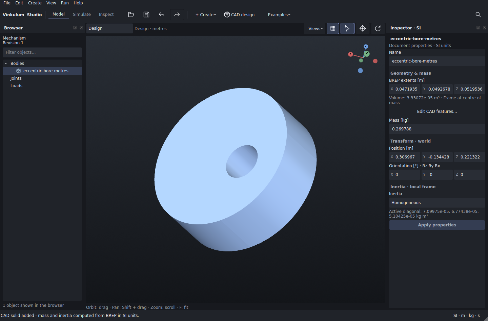
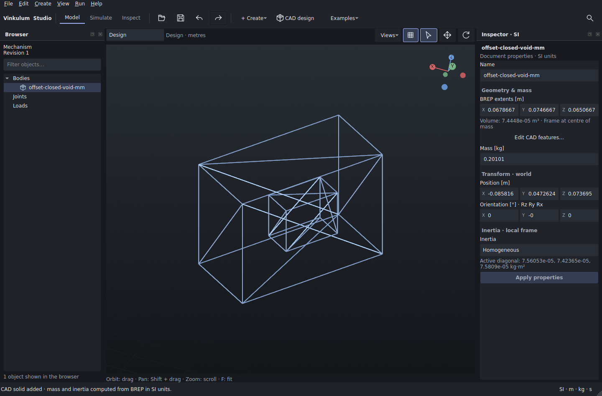

# Analytic STEP corpus: curved bore and closed void

These two original parts extend the [independent L bracket](../independent_step/README.md)
to three redistributable STEP fixtures. Each has an independently derived volume,
centre and full centroidal inertia tensor, a real Studio import capture and an
input-level counterexample.

| Retained input | Declared length unit | Exact local construction (mm) | Density (kg/m³) |
|---|---|---|---:|
| [eccentric-bore-metres.step](eccentric-bore-metres.step) | metre | Cylinder R25, height 18; through bore R6 at (8, −5) | 8100 |
| [offset-closed-void-mm.step](offset-closed-void-mm.step) | millimetre | Box 60 × 44 × 30; enclosed void 22 × 18 × 12, centred at (36, 17, 16) | 2700 |

The models, scripts, reference data and captures are original contributions by
Vinkulum contributors, 2026, under the repository's
[Apache-2.0 licence](../../../../../LICENSE). No third-party model, CAD export or
solver implementation was copied. [generate.py](generate.py), version 1.0, writes
AP214 entities using only Python's standard library. The retained files were
generated with Python 3.14.7 on Linux and are 11,277 and 14,234 bytes respectively.
Density is an importer input, not a material property in the STEP file.

## Geometry, topology and placement

The bored cylinder occupies `0 ≤ z ≤ 18 mm`. Its outer and inner circular rims
use shared vertices and exact quarter-circle edges. Eight cylindrical faces and
two planar faces close one shell; the inner cylinder is oriented into the hole.
The curves are analytic, not polygonal approximations. The resulting solid is
written as `MANIFOLD_SOLID_BREP`.

The outer box occupies `(0, 0, 0)` to `(60, 44, 30) mm`. The void occupies
`(25, 8, 10)` to `(47, 26, 22) mm` and does not touch the exterior. Two closed
six-face shells are written as `BREP_WITH_VOIDS`, with the void's shell orientation
reversed. This is one connected solid with an enclosed cavity, not an assembly.
Both imported solids must be valid; the tests also check their shell and face
counts.

Every point is rotated and translated before writing:

```text
        [ -10   2  11 ]
Q = 1/15[  10  -5  10 ]     Q Qᵀ = 1, det(Q) = +1
        [   5  14   2 ]

t_bore = (300, −140, 220) mm
t_void = (−80, 25, 41) mm
```

The bore file stores `(Q p + t) × 10⁻³` and declares `SI_UNIT($,.METRE.)`.
The void file stores `Q p + t` and declares `SI_UNIT(.MILLI.,.METRE.)`.
Studio places the body origin at its centre of mass, with axes parallel to the
STEP axes and identity body orientation. The tensor below is about that centre;
translation does not add an inertia term about the world origin.

## Independent physical reference

[reference.py](reference.py) imports neither the generator nor Vinkulum nor a CAD
library. It integrates a positive outer primitive and a negative inner primitive.
All polynomial coefficients, centroids and transforms use `fractions.Fraction`;
the cylinder's common factor π is introduced only when writing the final floats.
The reference derives Q separately from quaternion `(1, 2, 3, 4)/√30` and verifies
orthogonality and determinant exactly.

For signed volumes `Vᵢ`, primitive centres `cᵢ` and density ρ:

```text
V = Σ Vᵢ                  m = ρ V
c = Σ Vᵢ cᵢ / V           dᵢ = cᵢ − c
I_local = Σ [Iᵢ + ρ Vᵢ ((dᵢ·dᵢ)1 − dᵢdᵢᵀ)]
I_STEP = Q I_local Qᵀ     c_STEP = Q c + t
```

Each `Iᵢ` also carries the sign of `Vᵢ`. A box `(a,b,c)` contributes central
diagonal `ρVᵢ (b²+c², a²+c², a²+b²)/12`. A cylinder of radius r and height h
contributes `ρVᵢ ((3r²+h²)/12, (3r²+h²)/12, r²/2)`. Off-diagonal entries use
negative coordinate products. Lengths in mm require factors `10⁻⁹` for volume
and `10⁻¹⁵` for the volume-weighted inertia integral before multiplying by ρ.

Thus:

| Part | Volume (mm³) | Local centroid (mm) | Mass (kg) |
|---|---:|---|---:|
| Eccentric bore | 10602π | (−288/589, 180/589, 9) | 0.2697880390382078 |
| Closed void | 74448 | (1392/47, 1049/47, 702/47) | 0.2010096 |

[reference.json](reference.json) retains the exact rational coefficients and all
nine numerical tensor entries. All three distinct off-diagonal terms are nonzero
for both parts. [observed.json](observed.json) retains the actual imports
separately, with versions and input SHA-256 hashes; it is never used as an oracle.

Tests use zero relative tolerance and absolute budgets `εV`, `εm`, `εL` and
`εmL²` for volume, mass, each centre coordinate and each inertia entry. Here
`ε = 10⁻⁸`, with `L = 0.08 m` for the bore and `0.09 m` for the box. These lengths
exceed the local bounding-box diagonals. The budgets allow decimal STEP encoding
and numerical integration errors for these inputs; they do not bound general
CAD accuracy.

## Counterexamples and worker admission

[The regression](../../test_analytic_step_corpus.py) changes actual STEP inputs:

- Declaring the bore coordinates as millimetres instead of metres must fail the
  physical reference. The imported mass scales by `10⁻⁹`, inertia by `10⁻¹⁵`.
- Replacing `BREP_WITH_VOIDS` with its outer `MANIFOLD_SOLID_BREP` leaves a valid
  filled box but must fail the same reference; volume becomes 79,200 mm³.
- Adding a separate 10 mm cube must be rejected by the one-solid import contract.

A desktop test also sends both positive files through the real CAD process and
background admission path, checks the full physical properties, then submits
the disjoint-solid variant. Failure must preserve the last accepted result and
prepared document and clean up temporary files.

## Captures and reproduction

The retained screenshots come from the actual Studio import dialog and worker.
Each import is one undo transaction. The bore is shown in the regular surface
view; the closed void has both a [regular view](offset-closed-void-mm.png) and a
diagnostic wireframe capture. The capture script changes the VTK actor's display
representation to reveal the inner shell; it does not change the geometry or
claim that Studio provides a wireframe UI command.





From the repository root, with `PY` pointing to the installed
[Studio CAD environment](../../../../../docs/STUDIO_CAD.md):

```sh
fixture=apps/studio/tests/fixtures/analytic_step_corpus
python3 "$fixture/generate.py"
python3 "$fixture/reference.py"
"$PY" -m unittest discover -s apps/studio/tests -p test_analytic_step_corpus.py -v
PY="$PY" bash ci/studio.sh
"$PY" "$fixture/capture.py" /tmp/analytic-step-capture
```

The generator and reference need only Python 3.10 or later. The first unittest
command skips the desktop case unless `VINKULUM_3D_TESTS=1`; `ci/studio.sh` enables
it. On headless Linux, prefix the capture command with `QT_QPA_PLATFORM=xcb
xvfb-run -a -s '-screen 0 1600x1100x24'`. The output directory must be new.
The capture also saves reopenable `.vinkulum.json` documents alongside the
screenshots and observations. For a manual import, choose **CAD design → Import
STEP part** and enter the density from the table above.

Validation on 2026-09-10: all seven new tests pass within the full 196-test dev5
suite and the 212-test dev6 suite after integration with main `7015b81`. Both
skip 16 optional in-process Pinocchio tests and one optional keyboard recipe.
The capture uses installed Studio 0.6.0a2.dev5, OCCT 8.0.1.0 and build123d
0.11.1+vinkulum.occt8. `ci/local.sh --bancs` passes, including all 46 mechanical
and nine contact cases; three optional Exudyn integration tests are skipped.
The kernel, proofs and local-CI inputs did not change during dev6 integration.
This corpus covers elementary curved and planar solids from an
independent writer. Vendor exports, trimmed splines and accepted multi-part
assemblies remain outside this qualification.

Schema references used for the original writer:
[advanced BREP representation](https://www.steptools.com/docs/stp_aim/html/t_advanced_brep_shape_representation.html),
[advanced face](https://www.steptools.com/docs/stp_aim/html/t_advanced_face.html),
[edge curve](https://www.steptools.com/docs/stp_aim/html/t_edge_curve.html),
[cylindrical surface](https://www.steptools.com/docs/stp_aim/html/t_cylindrical_surface.html),
[BREP with voids](https://www.steptools.com/docs/stp_aim/html/t_brep_with_voids.html),
and [oriented closed shell](https://www.steptools.com/docs/stp_aim/html/t_oriented_closed_shell.html).
