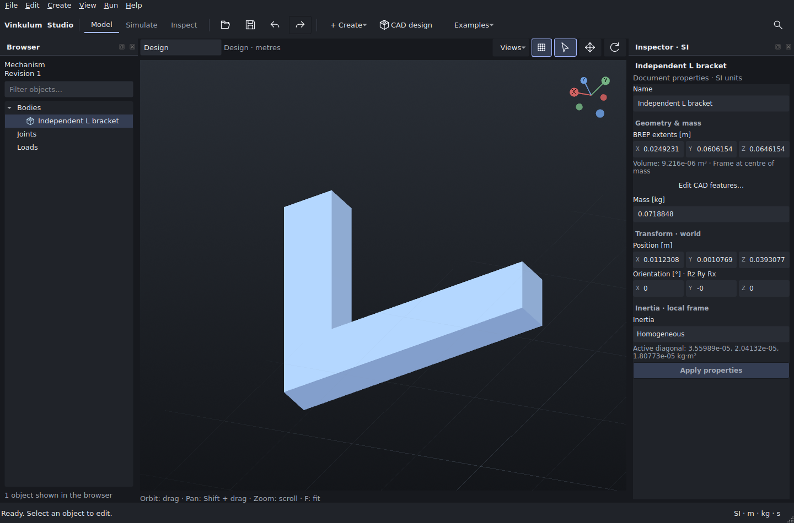

# Independent STEP L bracket

[l-bracket.step](l-bracket.step) is a 5,556-byte, single connected solid for
[issue #1](https://github.com/Brietat71/vinkulum-public/issues/1). Its construction
source is [generate.py](generate.py), version 1.0, using only Python's standard
library. The retained file was generated with Python 3.14.7 on Linux.

This is an original model authored for this Vinkulum contribution. The model,
scripts, reference data and screenshot are contributed under the repository's
[Apache-2.0 licence](../../../../../LICENSE); redistribution is permitted under
those terms. Attribution: Vinkulum contributors, 2026. No third-party model or
CAD-generated geometry was used as input.



## Construction and placement

All STEP coordinates are **millimetres**, declared by
`SI_UNIT(.MILLI.,.METRE.)`. Homogeneous density is **7800 kg/m³**; density is supplied
to the importer and is not encoded as a STEP material property.

The unplaced solid is the XY polygon `(0,0), (60,0), (60,12), (12,12), (12,48),
(0,48)`, extruded over `0 ≤ z ≤ 8 mm`. It has a 60 mm foot, 48 mm overall height,
12 mm leg widths and 8 mm thickness. The generator explicitly writes 12 vertices,
eight outward-oriented planar faces and one closed shell as an AP214 faceted BREP.
The top and bottom faces are concave polygons. These are the exact planar faces
of the intended solid, rather than an approximation of a curved surface.

Every point is placed by `p_STEP = Q p_local + t`, where coordinates and `t` are
in mm, and the matrix acts on column vectors:

```text
        [ -3  -4  12 ]
Q = 1/13[ 12   3   4 ]       t = (17, -23, 31) mm
        [ -4  12   3 ]
```

`Q Qᵀ = 1` and `det(Q) = +1`. The rotation is already in the file's coordinates.
Studio recentres the imported body's origin at its centre of mass, with body
axes parallel to the STEP axes; its separate orientation remains the identity.

## Independent mass-property derivation

[reference.py](reference.py) uses exact `fractions.Fraction` arithmetic until
the final JSON conversion. It imports neither the generator nor any CAD library.
It integrates two boxes whose interiors are disjoint and which share a face:

| Box | Dimensions (mm) | Centre (mm) | Volume (mm³) |
|---|---|---|---:|
| Foot | 60 × 12 × 8 | (30, 6, 4) | 5760 |
| Upright above the foot | 12 × 36 × 8 | (6, 30, 4) | 3456 |

Thus `V = 9216 mm³ = 9.216 × 10⁻⁶ m³`, `m = ρV = 0.0718848 kg`, and
`c_local = Σ Vᵢ cᵢ / V = (21, 15, 4) mm`.

A box with dimensions `(a,b,c)` has central inertia
`mᵢ diag(b²+c², a²+c², a²+b²) / 12`. With `dᵢ = cᵢ − c_local`, its contribution
about the combined centre is `Iᵢ + mᵢ[(dᵢ·dᵢ)1 − dᵢdᵢᵀ]`. The off-diagonal
entries use the **negative** products of coordinates in the inertia tensor.
Summing gives:

```text
                             [ 565/3    135      0 ]
I_local = m × 10⁻⁶ ×         [   135  997/3      0 ]   kg·m²
                             [     0      0    510 ]
```

The factor `10⁻⁶` converts mm² to m². In the placed STEP axes,
`c = (Q c_local + t) × 10⁻³ = (146, 14, 511) / 13000 m` and
`I = Q I_local Qᵀ`, still **about the centre of mass**. Translation does not
add another parallel-axis term to this centroidal tensor. Numerically:

```text
I = [ 3.559885587692308e-5  2.559354092307692e-6  8.370963692307692e-7 ]
    [ 2.559354092307692e-6  2.041315643076923e-5  1.142670572307692e-5 ] kg·m²
    [ 8.370963692307692e-7  1.142670572307692e-5  1.807725489230769e-5 ]
```

All nine entries, including the three distinct nonzero off-diagonal terms, are
checked against [reference.json](reference.json). The observed import is retained
separately in [observed.json](observed.json), together with versions and the STEP
SHA-256. Expected values are computed from the box integrals, never from OCCT.

## Reproduce and check

From the repository root, with the [Studio CAD environment](../../../../../docs/STUDIO_CAD.md)
installed and `PY` set to its Python interpreter:

```sh
fixture=apps/studio/tests/fixtures/independent_step
python "$fixture/generate.py"
python "$fixture/reference.py"
PYTHONPATH=apps/studio "$PY" -m unittest discover -s apps/studio/tests -p test_step_fixture.py -v
PYTHONPATH=apps/studio "$PY" "$fixture/capture.py" /tmp/independent-step-capture
```

The two source generators require only Python 3.10 or later. On headless Linux,
prefix the capture command with `QT_QPA_PLATFORM=xcb xvfb-run -a -s '-screen 0
1600x1100x24'`. The capture supplies the fixture path to the real CAD worker,
then records the Studio window and observed properties; the STEP is not rewritten.
To inspect manually, open **CAD design → Import STEP part**, choose the retained
file and enter density `7800 kg/m³`.

[The regression](../../test_step_fixture.py) also checks that both original
sources reproduce their retained outputs. Physical comparisons use zero relative
tolerance and absolute budgets scaled by `ε = 10⁻⁸`, `L = 0.08 m` (greater than
the unplaced part's bounding-box diagonal), and the analytic `V` and `m`:

| Quantity | Absolute error budget |
|---|---:|
| Volume | εV = 9.216 × 10⁻¹⁴ m³ |
| Mass | εm = 7.18848 × 10⁻¹⁰ kg |
| Each centre coordinate | εL = 8 × 10⁻¹⁰ m |
| Each inertia component | εmL² = 4.6006272 × 10⁻¹² kg·m² |

These budgets accommodate STEP decimal conversion and this planar OCCT import;
they are not accuracy bounds for general CAD operations. The negative case
changes the actual STEP declaration from millimetres to centimetres and imports
that file. The same physical comparison must fail. The reader then produces
1000 times the mass and 100000 times the centroidal inertia, confirming that
declared units participate in the tested path.

Validation on 2026-09-10: the three fixture tests pass; the complete Studio suite
has 152 tests with no failures and 13 optional Pinocchio tests skipped. The
capture used Studio 0.6.0a2.dev2, OCCT 8.0.1.0 and
build123d 0.11.1+vinkulum.occt8. Coverage is one planar solid from this independent
writer; exports from CAD vendors, curved surfaces and assemblies need their own
fixtures.

Schema references used to write the original generator:
[faceted BREP representation](https://www.steptools.com/docs/stp_aim/html/t_faceted_brep_shape_representation.html),
[face surface](https://www.steptools.com/docs/stp_aim/html/t_face_surface.html),
[polygon loop](https://www.steptools.com/docs/stp_aim/html/t_poly_loop.html), and
[STEP unit encoding](https://steptools.com/docs/help/howto_java.html).
