# CAD process reuse in Studio

Studio **0.6.0a2.dev6** retains one idle CAD worker between operations and
parametric previews. The next compatible operation can use its already imported
OCCT/build123d environment. Geometry still runs in a separate process, and each
operation keeps its own immutable request, result file and explicit document
transaction.

The [preceding experiment](CAD_SERVICE_EXPERIMENT.md) identified the import and
termination costs and the memory tradeoff. The desktop implementation adds shared
ownership across dialogs, normal CPU admission, idle expiry, transaction identity
checks and conservative restart after failures. The
[retained GUI qualification](bancs/cad-reuse-dev6/README.md) measures the actual
Create/Modify click through document application and rendering.

## Memory and CPU

There is at most **one retained idle worker per application**. By default it
expires after **15 seconds** without another compatible operation. Set
`VINKULUM_CAD_IDLE_SECONDS` before launch to an integer from 0 to 30; 0 disables
idle retention. This controls the memory kept between operations. An idle worker
holds no CPU reservation and performs no geometry computation.

Active operations retain the application's existing FIFO
[CPU admission contract](ENGINE_CPU_ADMISSION.md). Their timeout starts only
after admission. Each operation receives a lease sized for its native OCCT pool,
and keeps it through result validation. Simultaneous admitted requests may start
separate workers; they do not wait for a busy cached worker while holding CPU
resources. Once operations finish, only one idle process is retained. Processes
being retired are killed and reaped asynchronously.

The native pool size stays fixed throughout a resident process's lifetime.
A different allocation requires a replacement. The reuse key also identifies the
interpreter, Studio source files, declared CAD package versions, captured working
directory and process environment. A mismatch discards the idle worker and starts
one with the new captured configuration. This is not a hot-reload guarantee for
arbitrary in-place changes to third-party native libraries.

## Transactions and failure handling

```mermaid
stateDiagram-v2
    [*] --> Queued: capture request and reserve queue position
    Queued --> Running: CPU lease granted; take idle worker or start one
    Queued --> Cancelled: cancel without starting native work
    Running --> Validating: response acknowledges this transaction
    Validating --> Completed: result and captured identity agree
    Running --> Stopping: cancellation, deadline, error or crash
    Validating --> Stopping: invalid result
    Stopping --> Failed: process has terminated; release lease
    Completed --> Idle: release lease; retain one compatible worker
    Idle --> Running: next operation receives its own CPU lease
    Idle --> Retired: expiry, configuration change or application exit
```

The controller's `process` field still identifies an active transaction; it is
`None` after success or cancellation. An idle process belongs to the application
cache, so closing a dialog cannot destroy another dialog's worker or leave a CPU
lease attached to a closed editor.

The editor also destroys its closed create/edit dialogs after copying the accepted
result. Previously those hidden widgets stayed parented to the main window and
kept their captured projects and result payloads. The regression checks cancellation,
creation and feature editing, while verifying that the shared worker survives.

The sequential worker accepts bounded JSON commands over its private input pipe.
Each command names a fresh request/output pair and a unique transaction ID.
Standard output carries a small versioned acknowledgement; Python and native
diagnostics go to standard error. Diagnostic capture is bounded to a recent
8 KiB tail. The full result retains the request hash, transaction ID and actual
native allocation. Existing body, mass, design-frame and feature-graph checks
still run before publication.

Response validation and attachment-preserving document preparation use the
background reader introduced in dev5. The worker stays attached to its active
controller throughout admission. Cancellation interrupts publication, kills the
process, and waits for the reader before deleting files or releasing the lease.
The retained idle state begins only after that reader has completed successfully.

A stale acknowledgement, extra protocol response, wrong transaction ID or
invalid result kills the worker and preserves the previous accepted result.
Cancellation and timeout do the same, even when the native calculation has
already written a result but has not published it. The lease remains held until
the process exits. An operation error also retires the process; arbitrary OCCT
error recovery is not assumed safe for reuse. The next operation starts a new
worker. No implicit retries can apply a CAD transaction twice.

The one-shot worker entry point remains available for bundle checks, automation
and explicit executable/argument overrides. Its command remains
`python -m vinkulum_studio.cad_worker request.json response.json`. The application
uses the additional `--service` mode; the existing frozen `--cad-worker` dispatch
passes that mode through without starting a GUI in the worker.

## Validation scope

The numerical adapter and project format are unchanged. Existing primitive,
boolean, STEP, inertia, frame, feature-history and sketch references exercise the
same geometry implementation. Dedicated lifecycle tests exercise two-controller
reuse, thread/environment invalidation, FIFO admission, idle expiry, a real
invalid fillet, stale protocol/file identities, cancellation, timeout and process
death. The latter cases use the real worker and real OCCT result with a controlled
barrier before publication, so interruption is reproducible. That barrier and
the external process kill are test instrumentation, not identified upstream
OCCT defects.

The GUI recipe compares the normal cached path with the retained one-shot path
using the same interpreter and geometry inputs. It checks independent box and
through-bore mass/inertia references, numerical equivalence, one undoable apply
per operation and the actual rendered document. It records sampled GUI/worker
RSS and observes expiry of the default idle worker. Separate keyboard recipes
exercise creation, editing, undo/redo and saving at 100% and 200% DPI with both
normal and narrow inspectors.

The retained qualification is Linux/X11 and an installed source wheel. It does
not establish macOS/Windows bundle qualification, arbitrary native-failure
recovery or the absence of memory growth in indefinitely long CAD sessions.
No performance threshold is a CI gate; the raw measurements identify their
platform, inputs, versions and timing boundaries.
