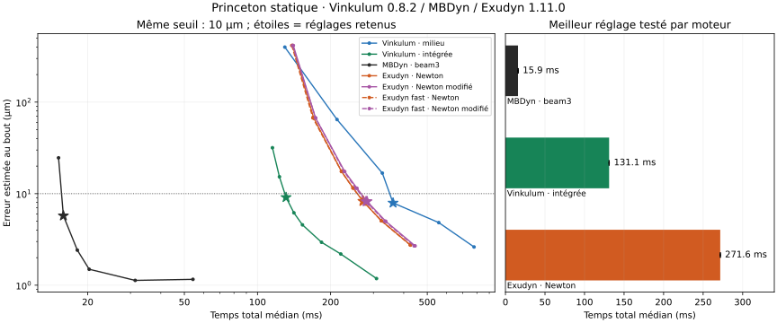

# Vinkulum 0.8.2, Exudyn 1.11.0 et MBDyn

**Sur la console Princeton, Vinkulum intégré est 2,07 fois plus rapide
qu'Exudyn dans les réglages testés, mais reste 8,26 fois plus lent que
MBDyn.** Sa formulation milieu par défaut reste plus lente qu'Exudyn.
Ce résultat du 7 septembre 2026 porte sur un problème statique et un
observable précis. Il ne classe ni la dynamique générale, ni les contacts,
ni les corps flexibles réduits de ces moteurs.

## Résultat exécuté à précision commune

Console anisotrope de 0,508 m, encastrement complet, charge globale de
8,896 N à 45° entre les axes y et z, cinquante paliers cosinus.
Le seuil est **10 µm sur le maximum des trois composantes de position
du bout**. Le tableau retient le meilleur maillage admissible de chaque
variante dans la grille essayée, avec trois répétitions après échauffement.

| Variante | Intervalles | Temps total médian | Calcul interne médian | Erreur estimée, marge incluse | Pic RSS médian |
|---|---:|---:|---:|---:|---:|
| MBDyn, `beam3` | 6 | 15,88 ms | Non mesuré | 5,740 µm | 13,0 Mio |
| Vinkulum, intégrée expérimentale | 8 | 131,10 ms | 33,71 ms | 9,107 µm | 40,0 Mio |
| Exudyn, Newton complet | 60 | 271,62 ms | 156,80 ms | 8,277 µm | 51,0 Mio |
| Exudyn fast, Newton complet | 60 | 272,38 ms | 156,89 ms | 8,277 µm | 51,3 Mio |
| Exudyn fast, Newton modifié | 60 | 279,81 ms | 164,72 ms | 8,221 µm | 51,5 Mio |
| Exudyn, Newton modifié | 60 | 282,59 ms | 167,52 ms | 8,221 µm | 51,0 Mio |
| Vinkulum, milieu par défaut | 60 | 361,47 ms | 262,90 ms | 7,925 µm | 41,0 Mio |

MBDyn emploie trois éléments à trois nœuds pour ses six intervalles ;
Vinkulum et Exudyn emploient des éléments à deux nœuds. L'égalité des
nombres d'éléments n'est donc pas le critère de comparaison.



Le gain interne de l'intégrée face au meilleur Exudyn est **4,65 fois**.
Les imports, la construction et les sorties réduisent ce gain à 2,07 sur
le processus complet. Les méthodes Newton et les binaires standard/fast
restent tous publiés : aucun gain substantiel du mode fast n'est établi
sur ce lot. À méthode et maillage identiques, ses positions finales sont
identiques à celles du binaire standard.

L'écart de formulation est déterminant : le seuil exige 60 éléments
Exudyn contre 8 éléments Vinkulum intégrés. Cela constitue un avantage
local de cette option, dans son [domaine documenté](POUTRE_INTEGREE.md).
Le défaut milieu de Vinkulum n'obtient pas cet avantage. Ces mesures ne
prouvent pas que l'élément intégré est meilleur pour tout chargement,
toute dynamique ou toute grandeur d'intérêt.

## Modèles, versions et coûts

Les rigidités communes, dans l'ordre extension, cisaillements y/z,
torsion et flexions y/z, sont
`[2.84191e6, 6.40131e5, 9.03881e5, 3.10338, 36.2794, 2.42873]` en SI.
Le repère matériel initial est le repère global. Aucune correction de
cisaillement propre à Vinkulum n'est appliquée au modèle Exudyn.

Exudyn utilise `Beam3D` / `ObjectBeamGeometricallyExact`, des nœuds
`RigidBodyEP` avec contrainte de quaternion unitaire et un `GenericJoint`
pour l'encastrement. La section est définie directement par les six
rigidités. Les inerties positives arbitraires ne participent pas à ce
calcul statique. La construction suit les interfaces et les entrées de
modèle documentées, sans lecture des sources des solveurs concurrents.
[Modèle Princeton officiel](https://exudyn.readthedocs.io/en/latest/docs/RST/TestModels/geometricallyExactBeamTest.html).

La roue officielle Exudyn **1.11.0**, publiée le 5 août 2026, est installée
dans un environnement isolé ; son SHA-256 est
`e07c6886c05a1771dcb8c29674e0e92aa6caee1f897057b6d8d23b0036b3c5a4`.
Les deux extensions et le module réellement chargé sont identifiés
dans les archives. La provenance de la roue figure dans les sondages.
[Métadonnées officielles PyPI](https://pypi.org/pypi/exudyn/1.11.0/json).

Vinkulum est la roue figée du tag `v0.8.2`, commit
`098fcb58d25fb45250504a862bb03bde391c7e48`. MBDyn est le même exécutable
que dans la [confrontation 0.8.1](CONFRONTATION_STATIQUE_MBDYN_0.8.1.md),
issu du commit `eb3bb5796e99c70e9ee0af072c38aada13a199f6`, avec SHA-256
`aa210a635918b15616e282f15d5ee8742b43d4ce9c9ac13b023e254a5290325b`.

Les processus sont successifs, fixés au processeur logique 8 d'un AMD
EPYC 7543, avec un fil demandé aux bibliothèques et aux solveurs.
Les deux environnements Python ont **Python 3.14.7, NumPy 2.5.3 et
SciPy 1.18.1**. L'ordre des configurations varie entre répétitions.
Aucune compilation ni autre campagne de calcul n'accompagne les mesures.

Le temps total comprend démarrage, imports, préparation, calcul et
sorties du processus. Le calcul du juge reste hors chronomètre. Le temps
interne Vinkulum mesure la boucle des cinquante résolutions et ses
diagnostics ; celui d'Exudyn mesure `MainSolverStatic.SolveSystem`, avec
le rappel de fin de palier qui conserve ses diagnostics. Ces périmètres
sont proches mais ne désignent pas le coût d'une même opération interne.
Exudyn conserve les observables en mémoire et désactive le fichier de
coordonnées ; MBDyn écrit ses positions nodales. Le RSS comprend ces
politiques de sortie et les runtimes.

## Convergence, tolérances et échecs conservés

La campagne finale comprend **232 processus, dont 62 échauffements**,
tous réussis. **3 200 paliers Vinkulum** atteignent la tolérance stricte ;
**7 000 paliers Exudyn** sont marqués convergés par le solveur. Pour
Exudyn, le contrôle final réunit la position et l'orientation de
l'encastrement, la norme des quaternions et le bilan de la résultante
des forces. Ce contrôle ne certifie pas les moments de réaction ni les
contraintes matérielles dans toute la poutre.

Vinkulum conserve `tol=1e-8, iters=100, strict=True`, MBDyn sa tolérance
de `1e-6` et dix itérations maximales. Exudyn utilise `EigenSparse`,
cinquante pas fixes, une tolérance relative de `1e-8`, une tolérance
absolue de `1e-5` et 25 itérations maximales. La force dépend du
pseudo-temps ; `useLoadFactor=False` évite une seconde multiplication
par la rampe. Newton complet et modifié sont chacun mesurés avec les
binaires standard et fast. Ce dernier est activé par l'option officielle
`sys.exudynFast=True`, qui supprime des contrôles d'indices.
[Réglages du solveur](https://exudyn.readthedocs.io/en/v1.11.0/docs/RST/structures/SimulationSettings.html),
[options de performance](https://jgerstmayr.github.io/EXUDYN/docs/RST/ExudynBasics.html).

Les **24 sondages préalables comprennent six échecs** : certains résidus
Exudyn stagnent aux tolérances absolues plus serrées, particulièrement
sur les maillages fins et au premier palier. Ils restent archivés et ne
sont pas comptés comme des succès. L'attribution de cette stagnation à
l'arrondi est une hypothèse, pas une analyse exhaustive du solveur.
Les journaux manquants de quelques tout premiers sondages sont signalés.

Le choix `1e-5` est contrôlé en resserrant à `3e-6` sur 60, 160 et
320 éléments pour les quatre variantes Exudyn. Le déplacement du bout
change au plus de **0,06664 µm**, bien sous les 10 µm visés. Cette
variation entre deux réglages entre aussi dans la marge du classement.
Une même valeur nominale de tolérance ne signifie pas une même précision
pour des résidus de dimensions et de normalisations différentes.

Chaque variante calcule deux références : 160/320 éléments pour Exudyn
et Vinkulum milieu, 80/160 pour Vinkulum intégré et MBDyn. La variation
maximale est **0,77796 µm** ; l'écart maximal entre les références fines
est **0,31601 µm**. Le juge exige respectivement moins de 1 et 2 µm.
Il ajoute **0,84459 µm** au maximum des erreurs envers toutes les
références fines, sur toutes les répétitions. Cette estimation par
raffinement n'est pas une borne mathématiquement certifiée.

## Ce qu'Exudyn change dans le positionnement scientifique

Exudyn est une référence proche de la vocation généraliste de Vinkulum :
un moteur compilé piloté depuis Python, avec corps rigides et flexibles.
Son existence interdit de présenter cette architecture comme un avantage
distinctif à elle seule.
[Article de présentation du moteur](https://doi.org/10.1007/s11044-023-09937-1).

| Axe | Exudyn documenté aujourd'hui | Conséquence pour Vinkulum |
|---|---|---|
| Intégration géométrique récente | La cinématique σ issue des travaux de 2025 figure déjà dans les réglages recommandés des nœuds de Lie. | L'option σ livrée en 0.8.0 ne constitue pas une exclusivité ; comparer erreurs d'orientation, réactions et coût. |
| Flexibles réduits | FFRF, Hurty–Craig–Bampton, imports de matrices et maillages depuis NGSolve, Abaqus et ANSYS, reconstruction de contraintes. | Une console à grandes déformations ne suffit pas à établir une avance sur les pièces industrielles réduites. |
| Calcul modal | Modes creux par `eigsh` et décalage spectral inversé documentés pour les modèles EF. | La chaîne d'analyse dense de Vinkulum reste une priorité concrète de passage à l'échelle. |
| Contact | `GeneralContact` documente recherche de contacts, géométries et friction. | Il faut une campagne commune de trajectoires, efforts et événements ; aucun classement n'est exécuté ici. |
| Optimisation | Variation paramétrique, optimisation génétique et analyses de sensibilité dans l'API `processing`. | Les adjoints de Vinkulum doivent prouver leur coût et leur exactitude ; l'absence d'une capacité concurrente ne se déduit pas d'une recherche documentaire partielle. |

Sources primaires :
[cinématique σ](https://exudyn.readthedocs.io/en/v1.11.0/docs/RST/structures/SimulationSettings.html#generalizedalphasettings),
[réduction et modes](https://jgerstmayr.github.io/EXUDYN/docs/RST/ModelOrderReductionAndComponentModeSynthesis.html),
[contact](https://exudyn.readthedocs.io/en/v1.11.0/docs/RST/cInterface/GeneralContact.html),
[traitements paramétriques](https://exudyn.readthedocs.io/en/v1.11.0/docs/RST/pythonUtilities/processing.html).

La piste distinctive reste à démontrer dans la combinaison : flexibles
précis avec peu d'inconnues, opérateurs creux partagés par simulation,
modes et adjoints, puis gradients contrôlés dans leur domaine de
validité. Exudyn renforce la nécessité de confronter cette combinaison
à un outil qui utilise déjà des travaux récents. La simple accumulation
de méthodes modernes ne suffit pas à obtenir une avance généraliste.

## Archives et reproduction

- [Bilan recalculable](bancs/confrontation-exudyn-0.8.2.json).
- [Tous les essais et diagnostics](bancs/confrontation-exudyn-0.8.2-essais.json.gz).
- [Modèles, sources de mesure et journaux](bancs/confrontation-exudyn-0.8.2-journaux.json.gz).
- [Manifeste des empreintes](bancs/confrontation-exudyn-0.8.2-manifest.json).
- [Sondages, échecs et provenance de la roue Exudyn](bancs/confrontation-exudyn-0.8.2-sondages.json.gz).

Le SHA-256 de l'archive des sondages est
`dff4605e48d6aa065b97cbb97039a43b910ce095569252a1969f77d400d7c990`.
Un premier lot indépendant de **150 calculs Vinkulum 0.8.2 / MBDyn**,
réalisé juste avant l'ajout d'Exudyn, reste également conservé dans son
[bilan](bancs/confrontation-statique-mbdyn-0.8.2.json) et ses archives
associées. Le tableau de ce document utilise exclusivement la nouvelle
campagne commune de 232 calculs.

Le juge se rejoue sans installer les solveurs concurrents :

```bash
python ci/confronte_exudyn.py --verifier docs/bancs/confrontation-exudyn-0.8.2
python ci/test_confrontation_exudyn.py
python ci/archive_confrontation.py --verifier docs/bancs/confrontation-statique-mbdyn-0.8.2
```

Pour recalculer les mesures, utiliser la roue Vinkulum figée comme
interpréteur principal, un environnement Exudyn séparé, les mêmes
dépendances et le processeur choisi. Les chemins absolus exacts sont
conservés dans les métadonnées ; exemple de commande avec chemins locaux :

```bash
taskset -c 8 /chemin/venv-vinkulum/bin/python ci/confronte_exudyn.py \
  --exudyn-python /chemin/venv-exudyn/bin/python \
  --exudyn-wheel /chemin/exudyn-1.11.0-cp314-cp314-manylinux_2_27_x86_64.manylinux_2_28_x86_64.whl \
  --mbdyn /chemin/mbdyn --benchmarks /chemin/mbdyn/tests/benchmarks \
  --sortie /tmp/confrontation-neuve --archive /tmp/confrontation-neuve-archive
```

Le protocole ne recherche pas exhaustivement tous les éléments,
paramétrages et chemins de continuation d'Exudyn. Les résultats
dynamiques MBDyn restent ceux de la 0.7.2 ; aucune confrontation
dynamique Exudyn ou exécution Simpack n'est ajoutée par ce lot.
