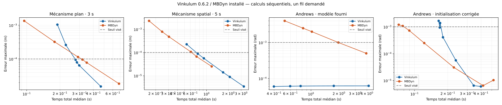

# Vinkulum 0.6.2 face à MBDyn — confrontation exécutée

**Archive avant correctif :** l'échec statique décrit ici a depuis été
traité dans le [correctif de robustesse](CORRECTIF_STATIQUE_PRINCETON.md).
Les mesures ci-dessous restent celles du binaire 0.6.2 identifié par son empreinte.

Campagne du 6 septembre 2026. Les deux moteurs sont exécutés sur la même
machine, séquentiellement. Le programme de mesure est
[`ci/confronte_mbdyn.py`](../ci/confronte_mbdyn.py), le juge numérique
[`ci/bilan_confrontation.py`](../ci/bilan_confrontation.py).

## Ce que mesure cette campagne

Trois dynamiques : 6barmech (cinq corps, mécanisme plan, 3 s), srscm
(trois corps, mécanisme spatial avec Cardan, 5 s), Andrews (mécanisme raide,
20 ms). Une statique : Princeton, charge de 8,896 N à 45°, grandes
déformations d'une poutre anisotrope de 0,508 m.

Les paramètres des mécanismes viennent des bancs existants de Vinkulum et
des fichiers de **modèle** distribués avec MBDyn. Aucune source du solveur
MBDyn n'a été lue. Princeton utilise les deux rigidités de cisaillement du
modèle : GAY = 640131 N et GAZ = 903881 N. Les éléments diffèrent : poutres
à deux nœuds dans Vinkulum, `beam3` dans MBDyn ; le raffinement porte sur le
nombre d'intervalles, avec le même nombre de nœuds.

### Erreur et références

Chaque moteur calcule sa propre référence à deux raffinements. On mesure :

- la variation entre ces deux raffinements pour chaque moteur ;
- l'écart entre les références les plus fines des deux moteurs ;
- pour chaque candidat, le **maximum de ses écarts aux deux références**.

Le maximum porte sur les composantes des positions de tous les corps
mobiles et sur les instants échantillonnés. Pour Andrews, il porte sur
l'angle déroulé de la manivelle, en radians, relatif à son orientation
initiale. Il ne s'agit pas de l'erreur des seules positions finales.

Les grilles d'observation sont respectivement de 4 ms, 2 ms et 0,2 ms.
Les trajectoires sont interpolées linéairement sur ces grilles. L'état
initial de Vinkulum est ajouté explicitement : `simule()` ne le renvoie
pas. Le temps des sorties MBDyn est lu dans `.out`, et non déduit du nombre
de lignes. Un éventuel dernier pas au-delà de l'horizon est interpolé.

Un classement exige les deux références par moteur, une variation sous
10 % du seuil visé, et un désaccord entre références sous 20 % du seuil.
Ces contrôles sont des estimations de convergence, pas des bornes
mathématiques de l'erreur continue. Les vitesses, réactions et événements
entre échantillons ne sont pas jugés par ce classement.

### Temps et mémoire

Un échauffement par configuration, puis trois répétitions des candidats.
Les références servent à la précision ; leur temps n'est pas une médiane
sur trois répétitions. L'ordre des moteurs alterne. Rayon, OpenBLAS, OMP et
MKL sont demandés à un fil ; les modèles MBDyn désactivent leurs threads.

Le chronomètre extérieur inclut le démarrage, les imports Python pour
Vinkulum, la construction/lecture du modèle, le calcul et ses sorties.
Le traitement des fichiers MBDyn par le juge est hors chronomètre.

**Ce sont des temps d'utilisation de l'API et de l'exécutable, pas des temps
isolés des noyaux numériques.** Vinkulum matérialise tous les états en
mémoire puis écrit les observables échantillonnés en JSON ; MBDyn écrit ses
sorties structurelles à chaque pas sur disque. Ce coût d'entrée/sortie et
la consommation mémoire sont différents. Les valeurs RSS du JSON incluent
ces différences et le runtime Python ; elles ne classent pas la mémoire
du seul solveur linéaire. Aucune optimisation de sortie ni campagne de
choix des solveurs linéaires MBDyn n'a été faite.

MBDyn utilise le schéma `ms, .6` des modèles, leurs tolérances et leurs
réglages Newton. Vinkulum utilise le generalized-alpha par défaut
(`rho=.9`, `tol=1e-12`) pour la dynamique. Ces paramètres ne sont pas
équivalents ; c'est la convergence mesurée qui arbitre.

## Résultats

**Vinkulum est compétitif sur ces dynamiques, sans domination générale.
Le défaut le plus net révélé ici concerne son chemin statique sur Princeton.**

Configurations les plus rapides **parmi celles essayées**, satisfaisant le
seuil et la marge de variation des références. On ajoute à l'enveloppe
d'erreur la plus grande variation des références ; cette marge reste une
estimation, non une garantie mathématique.

| Cas | Seuil visé | Pas Vinkulum / MBDyn | Vinkulum, médiane | MBDyn, médiane | Enveloppe d'erreur V / M |
|---|---|---|---|---|---|
| Mécanisme plan | 0.0001 m | 0.0012 / 0.0011 s | 0.277 s | 0.319 s | 9.46e-05 / 9.61e-05 m |
| Mécanisme spatial | 0.0001 m | 0.00125 / 0.0004 s | 0.758 s | 0.730 s | 8.89e-05 / 6.68e-05 m |
| Andrews, initialisation corrigée | 0.001 rad | 7.5e-05 / 7.5e-05 s | 0.169 s | 0.090 s | 0.00094 / 0.000724 rad |

- **Plan :** Vinkulum demande environ 13 % de temps en moins (rapport des
  temps MBDyn/Vinkulum : 1,15). Les plages des trois répétitions sont
  0,272–0,277 s et 0,316–0,320 s.
- **Spatial :** résultats proches. MBDyn demande environ 4 % de temps en
  moins dans cette campagne. À pas égal il est beaucoup plus rapide, mais
  Vinkulum peut employer ici un pas plus grand pour satisfaire le seuil.
- **Andrews initialisé :** MBDyn demande environ 47 % de temps en moins
  (rapport Vinkulum/MBDyn : 1,88). Les deux configurations retenues utilisent
  le même pas de 75 µs.

La mémoire maximale du processus pour ces configurations est respectivement
60 / 12–13 Mio (plan), 61 / 13 Mio (spatial) et 44 / 13,5 Mio (Andrews),
Vinkulum / MBDyn. Ces valeurs incluent les runtimes et les politiques de
sortie différentes décrites plus haut.



### Andrews : le réglage qui aurait faussé la conclusion

Le modèle fourni déclare `derivatives tolerance: 1e6`. Son journal donne
**zéro itération d'initialisation et un résidu de 161,2969**. Dans ce réglage,
la grille initiale aurait donné 0,398 s pour Vinkulum contre 3,941 s pour
MBDyn au seuil demandé. Ce rapport de 9,9 ne caractérise pas un avantage
général du moteur.

En remplaçant uniquement cette tolérance par `1e-6`, MBDyn réduit fortement
son erreur. Une seconde grille, incluant des pas plus grands pour **les
deux** moteurs, donne le classement publié dans la table.

L'initialisation stricte n'est pas robuste à tous les pas : MBDyn échoue à
initialiser à 4 µs, 0,25 µs et 0,125 µs avec les autres réglages conservés.
Ces trois échecs restent archivés. Le classement corrigé utilise les
références réussies à **20 et 10 µs** : variations de 50,1 µrad pour Vinkulum
et 30,7 µrad pour MBDyn, désaccord des références fines de 6,48 µrad. Elles
satisfont les critères fixés pour le seuil de 1 mrad. Le coefficient
d'initialisation MBDyn n'a pas été optimisé.

Vinkulum atteint aussi les références extrêmes originales : 41,3 s à
0,25 µs et 100,6 s à 0,125 µs, contre 4,18 s à 1 µs. À 0,25 µs, ses
statistiques comptent 251236 jacobiens contre 21438 à 1 µs pour quatre fois
plus de pas. Ce coût est un sujet d'investigation ; la campagne ne démontre
pas à elle seule sa cause.

### Princeton : échec du chemin statique de Vinkulum

Même charge finale, direction de 45° et rampe cosinus en **50 paliers**.
MBDyn utilise son modèle statique ; Vinkulum appelle `statique()` à chaque
palier. Les masses arbitraires des nœuds Vinkulum ne participent pas à cet
équilibre statique.

- **MBDyn :** convergence à 10, 20, 40, 80 et 160 intervalles. À 10,
  l'écart de position du bout à la référence 160 est de **0,648 µm** ;
  temps médian 0,021 s. La variation 80 → 160 est de 1,50e-10 m.
- **Vinkulum :** **9 échecs sur 9 essais mesurés** à 10, 20 et 40
  intervalles. À 10, stagnation dès le troisième palier, vers 1,96e-2
  de résidu, pour une charge de 0,89 % de la charge finale. Relâcher
  `tol` de `1e-8` à `1e-6` ne résout pas cet échec. Les références Vinkulum
  à 80/160 n'ont pas été poursuivies ; l'essai de chauffe à 80 a été arrêté
  après les neuf échecs reproductibles.

Il n'y a donc **pas de rapport de vitesse à précision commune** pour cette
statique. L'ancien accord Princeton du README avait été obtenu par
**relaxation dynamique**. Il ne démontrait pas que l'appel statique direct
résolvait ce chargement. Il n'est pas invalidé par cet échec, mais sa portée
est maintenant mieux délimitée.

Un autre essai exploratoire, hors grille finale, a fait échouer MBDyn sur
6barmech à h=62,5 µs, t=0,714375 s, avec la limite de dix itérations du
modèle. Son journal d'erreur est également archivé.

### Traçabilité et reproduction

Machine : AMD EPYC 7543, Linux x86-64, Python 3.14.7. Vinkulum : commit
`fda8291e202be8c909fddafaca63ee7559fca08c`, version 0.6.2. MBDyn : binaire
`develop`, configuré le 16 août 2026. Le commit du checkout contenant les
modèles est `eb3bb5796e99c70e9ee0af072c38aada13a199f6` ; il ne prouve pas à
lui seul le commit ayant produit ce binaire. Son SHA-256, celui de
l'extension Vinkulum et ceux des entrées sont dans les métadonnées.

- [Bilan numérique et répétitions](bancs/confrontation-mbdyn-0.6.2.json).
- [Mesures, trajectoires dédupliquées et échecs](bancs/confrontation-mbdyn-0.6.2-trajectoires.json.gz).
- [Programme de la première phase, empreinte conservée](bancs/confrontation-mbdyn-0.6.2-harness-initial.py.gz).

```bash
.venv314/bin/python ci/confronte_mbdyn.py \
  --mbdyn /root/src/mbdyn/mbdyn/mbdyn \
  --benchmarks /root/src/mbdyn/tests/benchmarks \
  --sortie /tmp/confrontation-rejouee \
  --pas-supplementaires '{"six_barres":[0.0012,0.0011],"spatial":[0.00125,0.0004],"andrews":[0.000005]}'

.venv314/bin/python ci/confronte_mbdyn.py \
  --mbdyn /root/src/mbdyn/mbdyn/mbdyn \
  --benchmarks /root/src/mbdyn/tests/benchmarks \
  --sortie /tmp/andrews-initialise-rejoue --cases andrews \
  --initialisation-andrews --references '{"andrews":[0.00002,0.00001]}' \
  --pas-supplementaires '{"andrews":[0.0001,0.00005,0.00002,0.00001,0.000075,0.00009]}'

.venv314/bin/python ci/bilan_confrontation.py \
  docs/bancs/confrontation-mbdyn-0.6.2-trajectoires.json.gz /tmp/bilan-recalcule.json
.venv314/bin/python -m unittest discover -s ci -p test_confrontation.py -v
```

La seconde commande permet de refaire le classement corrigé. Les sondages
échoués à très petits pas figurent dans les données brutes, en plus des
références choisies pour ce classement. Le programme conserve les erreurs
et continue les autres configurations. La première commande retente aussi
les références statiques Vinkulum non poursuivies lors de la campagne.

Les cinq tests du juge passent : ils vérifient notamment qu'une référence
en échec, non convergée ou en désaccord interdit le classement et qu'une
grille temporelle décalée est refusée. Le bilan a été recalculé depuis
l'archive, empreintes des trajectoires vérifiées.


## Limites et suites

Cette sélection couvre des mécanismes rigides et une poutre flexible.
Elle ne classe pas les contacts avec frottement, les impacts, une
suspension complète, les modèles de grande taille, la co-simulation ou
l'aérodynamique. Elle ne constitue pas un verdict général sur les deux
logiciels.

Les prochaines priorités issues de cette confrontation sont le chemin
statique de la poutre chargée et le coût des Newton d'Andrews au pas très
fin. Le noyau Vinkulum n'a pas été modifié pendant cette campagne.
