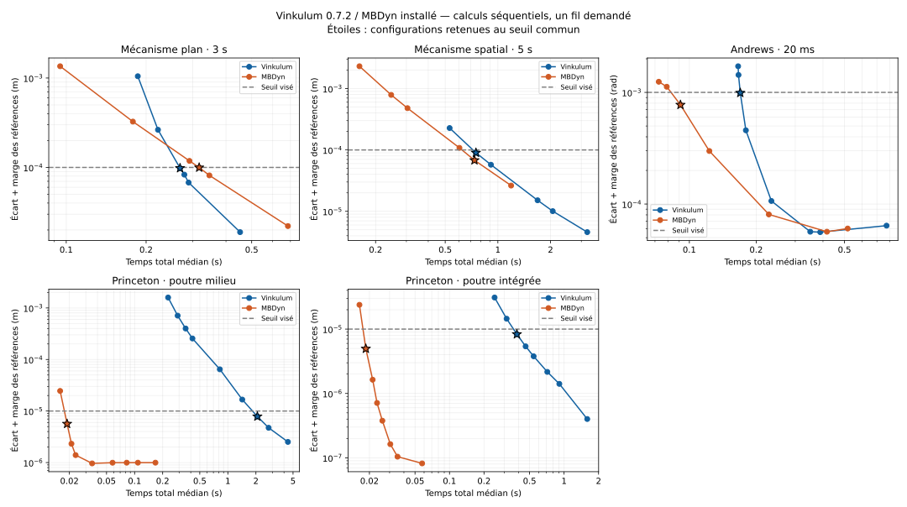

# Vinkulum 0.7.2 face à MBDyn — confrontation exécutée

**La statique Princeton est désormais résolue et classable, mais son coût
reste nettement supérieur à celui de MBDyn.** Les avantages restent partagés
sur les trois dynamiques. Cette campagne du 7 septembre 2026 actualise la
[confrontation 0.6.2](CONFRONTATION_MBDYN_0.6.2.md), dont les résultats restent
attachés à leur ancien binaire.

La roue **0.7.2** est mesurée dans son environnement isolé, hors de
l'installation de développement. Elle correspond au tag `v0.7.2`, commit
`30c2c5ad4027efa5196267010835feee52f1bbc4`. Le noyau n'a pas été reconstruit
pendant les mesures. Il n'y a pas de nouvelle version du paquet dans cette
mise à jour des bancs et de la documentation.

## Résultats à précision commune

Configurations les plus rapides **parmi les grilles essayées**, avec trois
répétitions réussies après échauffement. Les erreurs ci-dessous comprennent
la marge de variation des références définie plus bas.

| Problème | Seuil | Pas ou intervalles V / M | Temps total médian V / M | Erreur estimée V / M |
|---|---|---|---|---|
| Mécanisme plan, 3 s | 100 µm | 1,2 / 1,1 ms | 0,269 / 0,317 s | 98,27 / 99,73 µm |
| Mécanisme spatial, 5 s | 100 µm | 1,25 / 0,4 ms | 0,749 / 0,735 s | 90,03 / 67,96 µm |
| Andrews, 20 ms | 1 mrad | 75 / 75 µs | 0,170 / 0,091 s | 0,9904 / 0,7736 mrad |
| Princeton, poutre milieu | 10 µm | 60 / 6 intervalles | 2,072 / 0,0189 s | 7,827 / 5,643 µm |
| Princeton, poutre intégrée | 10 µm | 8 / 6 intervalles | 0,387 / 0,0186 s | 8,326 / 4,959 µm |

V désigne Vinkulum, M MBDyn. Les deux dernières lignes représentent le
**même problème physique**, avec deux formulations Vinkulum. MBDyn utilise
`beam3` et est remesuré dans chacune des deux séries.

- Sur le mécanisme plan, Vinkulum prend **15,3 % de temps en moins**.
- Sur le spatial, MBDyn prend **1,9 % de temps en moins** ; les temps sont proches.
- Sur Andrews, MBDyn est **1,86× plus rapide**.
- Sur Princeton, MBDyn est **109,8× plus rapide** face au défaut milieu,
  et **20,8×** face à l'option intégrée. Le gain de **5,35×** entre les deux
  configurations Vinkulum ne comble donc pas son retard externe.

L'option `formulation="integree"` reste expérimentale. Sa précision ici
ne lève pas sa [limite sur le câble condensé extrême](POUTRE_INTEGREE.md).



Les courbes représentent les configurations entièrement réussies. Les
échecs sont conservés dans les données et détaillés ci-dessous. L'étoile
désigne le meilleur temps admissible de chaque moteur dans sa grille.

## Coûts mesurés et limites de leur interprétation

Même machine AMD EPYC 7543, Linux x86-64, Python 3.14.7. Tous les processus
de calcul sont successifs, fixés au processeur logique 8. Rayon, OpenBLAS,
OMP et MKL sont demandés à un fil ; les modèles MBDyn désactivent leurs
threads. Les moteurs alternent entre répétitions. Les références ont un
échauffement et un essai mesuré, ou trois lorsqu'elles sont aussi candidates.

Le temps extérieur inclut démarrage, imports, construction ou lecture du
modèle, calcul et sorties. Le traitement des fichiers MBDyn par le juge
est hors chronomètre. Vinkulum conserve la trajectoire complète en mémoire
puis écrit ses observables échantillonnés ; MBDyn écrit ses sorties à
chaque pas sur disque. Les métadonnées consignent les commandes exactes.

| Configuration retenue | Pic RSS Vinkulum / MBDyn |
|---|---|
| Plan | 60 / 13 Mio |
| Spatial | 61 / 13 Mio |
| Andrews | 44,5–45 / 13,5 Mio |
| Princeton milieu | 41 / 12,5 Mio |
| Princeton intégrée | 40–40,5 / 12,5 Mio |

Ces valeurs comparent des usages de l'API Python et de l'exécutable, avec
leurs runtimes et leurs sorties différentes. Elles ne mesurent pas la
mémoire du seul solveur linéaire ni la vitesse isolée des noyaux. Le temps
interne `solve_seconds` de Vinkulum est aussi archivé, mais aucun rapport
avec un temps interne MBDyn non mesuré n'en est déduit.

Les schémas et tolérances internes ne sont pas identiques : MBDyn conserve
`ms, .6` et les réglages des modèles ; Vinkulum conserve sa dynamique par
défaut. Princeton impose à Vinkulum `tol=1e-8, iters=100, strict=True` ;
MBDyn conserve `tolerance: 1e-6` et dix itérations maximales. C'est l'erreur
de déplacement mesurée qui arbitre le classement. Il n'y a pas eu de
recherche exhaustive des tolérances, des solveurs linéaires ou des sorties.

## Références et contrôles physiques

Les données des mécanismes restent celles du
[programme de modèles](../ci/modeles_confrontation.py) et des fichiers
d'entrée des bancs MBDyn. Aucune source du solveur MBDyn n'a été lue.

Princeton est une console anisotrope de 0,508 m, chargée à 8,896 N à 45°,
avec les deux rigidités de cisaillement du modèle. Les cinquante charges
suivent la même rampe cosinus. Dans Vinkulum, chaque incrément est ajouté
par `effort()` ; les cinquante efforts équivalents s'additionnent. MBDyn
utilise une force pilotée. Les masses nodales Vinkulum n'interviennent pas
dans cet équilibre. Un intervalle correspond à un élément à deux nœuds
Vinkulum ; deux intervalles forment un `beam3` MBDyn.

Chaque moteur calcule deux raffinements. Leur variation doit rester sous
10 % du seuil demandé, et l'écart entre les deux références fines sous
20 %. Pour chaque candidat, le juge prend le maximum de ses écarts aux
**deux** références fines, sur toutes les répétitions, puis ajoute la plus
grande variation des références. Ce total doit respecter le seuil.

| Problème | Références V / M | Variation V / M | Écart entre références fines |
|---|---|---|---|
| Plan | 250 → 125 µs / idem | 3,055 / 3,636 µm | 0,190 µm |
| Spatial | 62,5 → 31,25 µs / idem | 0,164 / 1,125 µm | 0,382 µm |
| Andrews | 20 → 10 µs / idem | 50,05 / 30,71 µrad | 6,478 µrad |
| Princeton milieu | 160 → 320 / 80 → 160 intervalles | 0,747 / 0,000150 µm | 0,249 µm |
| Princeton intégrée | 80 → 160 / idem | 0,0633 / 0,000150 µm | 0,0211 µm |

Le maillage des références peut différer entre moteurs. Les sondages
préalables motivent ce choix : la variation Vinkulum milieu à 160 → 320
respecte le critère de 1 µm ; MBDyn converge suffisamment à 80 → 160 mais
échoue à 320 avec ses réglages conservés. Ce refus est archivé, sans
utiliser son temps comme celui d'une solution.

L'erreur est le maximum absolu des composantes des positions, sur les
grilles d'observation de 4 ms et 2 ms ; pour Andrews, c'est l'angle déroulé
de la manivelle, observé tous les 0,2 ms. Princeton compare la position du
bout à charge pleine. Les instants MBDyn sont lus dans ses sorties ; les
observables sont interpolés linéairement. Les grilles, dimensions, valeurs
finies et répétitions sont contrôlées par le juge.

Ces tests fournissent une **estimation de convergence**, pas une borne
certifiée de l'erreur continue. Ils ne classent pas les vitesses, efforts
intérieurs, réactions ni événements entre échantillons.

## Robustesse et prochain coût à traiter

La campagne compte **326 exécutions**, dont 89 échauffements. Les
**119 essais mesurés Vinkulum réussissent**. MBDyn réussit 115 essais
mesurés et échoue trois fois à initialiser Andrews à 4 µs ; l'échauffement
correspondant échoue aussi. Sa tolérance d'initialisation est fixée à
`1e-6`, au lieu du `1e6` du modèle fourni, selon le contrôle publié en 0.6.2.
Les anciennes sondes Andrews à 0,25 et 0,125 µs ne sont pas rejouées ici.

Sur les deux formulations Princeton, les **76 calculs Vinkulum**, chauffes
et références comprises, passent leurs **3 800 paliers stricts**. Aucun
n'utilise une acceptation sur stagnation. Le plus grand résidu relatif
rapporté est 8,35e-9 pour une tolérance de 1e-8. Dix sondages préalables
supplémentaires sont archivés, dont le refus MBDyn à 320 intervalles.

Le rapport révèle un travail répété dans la stratégie de Newton : les
configurations Vinkulum retenues, milieu à 60 et intégrée à 8, comptent
chacune **879 évaluations principales et 100 tentatives pour 50 paliers**.
Chaque palier essaie le mérite en forces, échoue, restaure l'état puis
réussit avec le mérite en corrections. Les évaluations de recherche amortie
ne sont pas incluses dans 879. Cette répétition est un coût concret à
traiter, en conservant les contrôles physiques et les cas qui bénéficient
du mérite en forces. Elle ne démontre pas à elle seule la part du temps
qui sera récupérable.

La formulation de poutre, les sorties et le démarrage Python constituent
d'autres fronts. Les contacts, la multiphysique, les gradients, le temps
réel et la couverture industrielle ne sont pas comparés par ces quatre
problèmes. **Aucune exécution Simpack n'est archivée.** L'objectif général
de supériorité reste ouvert.

## Traçabilité et reproduction

MBDyn se décrit comme `develop`, configuré le 16 août 2026. Son exécutable
a le même SHA-256 que lors de la campagne 0.6.2. Le checkout des modèles
est `eb3bb5796e99c70e9ee0af072c38aada13a199f6` ; ce commit ne prouve pas
à lui seul la provenance de compilation du binaire.

- [Bilan, erreurs et répétitions](bancs/confrontation-mbdyn-0.7.2.json).
- [Trajectoires, diagnostics stricts et sondages](bancs/confrontation-mbdyn-0.7.2-trajectoires.json.gz).
- [Journaux, modèles générés et programmes de mesure](bancs/confrontation-mbdyn-0.7.2-journaux.json.gz).
- [Manifeste et liaison à la roue figée](bancs/confrontation-mbdyn-0.7.2-manifest.json).

L'archive vérifie les empreintes des fichiers produits. Les gros `.mov`
restent dans le répertoire de calcul : l'archive garde leurs empreintes
et leurs observables échantillonnés, sans arrondi supplémentaire. Le juge
se rejoue hors de la machine de calcul. Les journaux conservent aussi les
erreurs et les sorties des échauffements.

```bash
# PY doit pointer sur un environnement contenant la roue 0.7.2 figée.
PY=/tmp/vinkulum-release-0.7.2/venv/bin/python
taskset -c 8 "$PY" ci/confronte_mbdyn.py \
  --mbdyn /root/src/mbdyn/mbdyn/mbdyn \
  --benchmarks /root/src/mbdyn/tests/benchmarks \
  --sortie /tmp/confrontation-0.7.2-rejouee \
  --repetitions 3 --timeout 90 --initialisation-andrews \
  --pas '{"six_barres":[0.004,0.002,0.0012,0.0011,0.001,0.0005],"spatial":[0.002,0.00125,0.001,0.0005,0.0004,0.00025],"andrews":[0.0001,0.00009,0.000075,0.00005,0.00002,0.00001,0.000008,0.000004],"princeton":[4,6,8,10,20,40,60,80,120],"princeton_integree":[4,6,8,10,12,16,20,40]}' \
  --references '{"andrews":[0.00002,0.00001],"princeton":{"vinkulum":[160,320],"mbdyn":[80,160]},"princeton_integree":[80,160]}'

"$PY" ci/archive_confrontation.py \
  --verifier docs/bancs/confrontation-mbdyn-0.7.2
"$PY" -m unittest discover -s ci -p test_confrontation.py -v
```

Choisir un processeur autorisé sur la machine de reproduction et un
répertoire de sortie inexistant. La commande principale rejoue les
326 exécutions ; les dix sondages préalables restent distincts. Les
quinze tests vérifient le juge, l'archivage et l'arrêt des processus enfants
après dépassement du délai. Le recalcul conserve aussi les verdicts de
l'archive 0.6.2. Les graphiques sont générés par
[`ci/trace_confrontation.py`](../ci/trace_confrontation.py) avec Matplotlib,
installé dans un environnement séparé après la fin des mesures.
