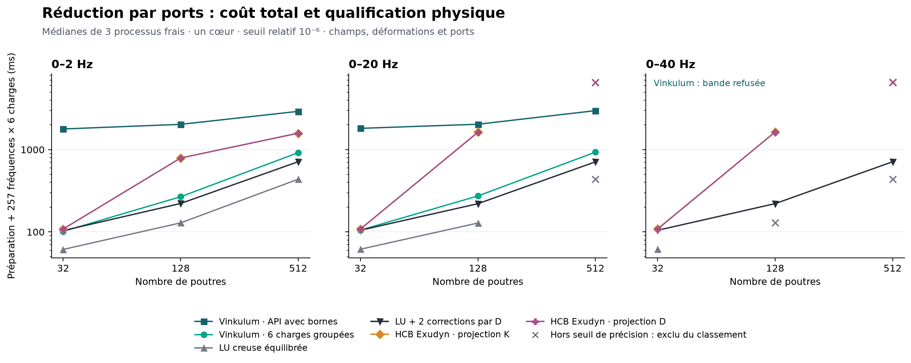

# Confrontation des réductions par ports : Vinkulum 0.10.0 et HCB Exudyn 1.11.0

Cette confrontation mesure la préparation et les réponses harmoniques de réductions linéaires sur les mêmes données mécaniques, avec la routine HCB publique d’Exudyn et un juge physique commun. Elle distingue le coût des champs groupés de celui de l’API Vinkulum avec ses bornes supplémentaires. Les deux campagnes et la contre-épreuve du calcul HCB sont conservées pour rendre la comparaison vérifiable.

## Résultats de la campagne finale

**La réduction est compacte, mais le coût total reste le problème à résoudre.**
Vinkulum conserve 12 directions intérieures sur 0–2 Hz et 18 sur 0–20 Hz,
aux trois tailles. À 128 poutres sur 0–20 Hz, ses champs groupés prennent
**0,274 s**, contre **1,623 s** pour la plus rapide des deux projections HCB
retenues : **5,93×** dans ce protocole. Cependant la LU corrigée prend
**0,220 s**, et l'API Vinkulum avec bornes **2,034 s**. L'API avec bornes
reste plus lente que les deux variantes HCB dans tous les cas où les deux
familles sont qualifiées. La petite dimension ne suffit donc pas.

Temps **totaux en secondes**, préparation incluse, médianes de trois
processus frais. Chaque processus calcule 257 fréquences et six charges,
avec champs complets et normes. **† : précision insuffisante, temps exclu
du classement à erreur commune** ; un refus n'est pas un temps nul.

| Poutres | Bande (Hz) | Vinkulum groupé | Vinkulum API + bornes | LU | LU corrigée | HCB K | HCB D |
| ---: | --- | ---: | ---: | ---: | ---: | ---: | ---: |
| 32 | 0–2 | 0,102 | 1,782 | 0,061 | 0,104 | 0,109 | 0,109 |
| 32 | 0–20 | 0,105 | 1,813 | 0,062 | 0,105 | 0,108 | 0,109 |
| 32 | 0–40 | refus | refus | 0,062 | 0,105 | 0,109 | 0,109 |
| 128 | 0–2 | 0,268 | 2,028 | 0,129 | 0,222 | 0,791 | 0,791 |
| 128 | 0–20 | 0,274 | 2,034 | 0,128 | 0,220 | 1,631 | 1,623 |
| 128 | 0–40 | refus | refus | 0,130 † | 0,221 | 1,641 | 1,636 |
| 512 | 0–2 | 0,918 | 2,916 | 0,437 | 0,713 | 1,579 | 1,585 |
| 512 | 0–20 | 0,932 | 2,974 | 0,435 † | 0,710 | 6,560 † | 6,532 † |
| 512 | 0–40 | refus | refus | 0,437 † | 0,712 | 6,604 † | 6,530 † |

[Figure SVG](figures/confrontation-ports-exudyn-0.10.0.svg) ·
[Bilan numérique](bancs/confrontation-ports-exudyn-0.10.0/bilan.json) ·
[Manifeste et empreintes](bancs/confrontation-ports-exudyn-0.10.0/manifest.json)



La campagne finale conserve **216 essais**, dont 54 échauffements et
162 répétitions mesurées, ainsi que **128 sondages HCB**. Elle utilise
Python 3.14.7, NumPy 2.5.3 et SciPy 1.18.1, un CPU logique fixé à 8 et
un fil par bibliothèque native. Les sources des cinq scripts, les entrées,
les roues et les métadonnées des installations sont identifiées par leurs
empreintes. Les roues Vinkulum 0.10.0 et Exudyn 1.11.0 sont isolées ;
aucun changement de production n'a été introduit pendant les mesures.

### Dimension, coût et précision

HCB retient 185 modes internes pour 32 poutres sur les trois bandes,
384 pour 128 poutres à 2 Hz et 761 à 20/40 Hz. À 512 poutres, 384 modes
suffisent à 2 Hz ; 768, plafond de la grille, restent insuffisants à
20 et 40 Hz. Ces nombres viennent d'une grille discrète : ce ne sont
pas des minima démontrés ni les meilleurs temps possibles de toute
stratégie HCB.

À 512 poutres sur 0–2 Hz, Vinkulum groupé prend **0,918 s** contre
**1,579 s** pour HCB K, mais **0,437 s** pour LU et **0,713 s** pour LU
corrigée. Sa préparation représente **0,806 s**, ses réponses **0,112 s**.
Le coût de préparation domine donc même sur ce cas favorable à la
réduction. Les minima/maxima de temps sont conservés dans le bilan ;
par exemple, à 128 poutres et 20 Hz, le total groupé varie de 0,2732 à
0,2750 s, contre 1,6181 à 1,6256 s pour HCB D.

Les deux voies Vinkulum passent le juge dans **6 cas sur 9**, avec une
pire erreur d'opérateur d'environ **2,37 × 10⁻¹¹** à 2 Hz et
**5,55 × 10⁻⁹** à 20 Hz. Elles refusent les trois bandes à 40 Hz : la
minoration automatique autorise une bande intérieure d'environ 28,3 Hz.
LU passe 6 cas, LU corrigée les 9, et chaque projection HCB 7 cas.
Les fréquences testées restent discrètes ; ces comptes ne certifient pas
les intervalles continus entre elles.

L'[audit direct des points défavorables](bancs/controle-reponse-hcb-0.10.0.json)
reprend les quatre configurations HCB écartées sur 512 poutres. La
résolution directe de la même paire confirme les erreurs énergétiques
**1,31 × 10⁻⁵** à 20 Hz et **3,23 × 10⁻⁵** à 40 Hz. Ces échecs ne sont
donc pas réparés par le remplacement du préconditionneur spectral à ces
points. Cette observation concerne les bases et projections testées,
sans établir une impossibilité pour un autre nombre de modes ou un autre
modèle réduit Exudyn.

Les bornes internes de champ et le juge restent distincts. À 512 poutres,
la borne relative massique maximale rapportée par l'API est environ
5,1 × 10⁻⁶ sur 0–2 Hz et 3,8 × 10⁻⁴ sur 0–20 Hz. Ces bornes évaluées
en flottants ne prouvent donc pas, à elles seules, l'erreur 10⁻⁶ observée
par l'oracle. La certification machine livrée concerne la **minoration
spectrale**, pas l'ensemble des réponses calculées.

### Mémoire : aucune conclusion de classement

Le compteur brut `rss_avant_oracle_kib` est conservé pour traçabilité,
mais **écarté de l'interprétation mémoire**. Dans cet environnement,
`ru_maxrss` du nouvel interpréteur hérite d'un pic du processus parent.
Le parent accumule les rapports au fil des essais, ce qui fausse la
comparaison des pics. La [calibration séparée](bancs/controle-rss-processus-0.10.0.json)
alloue 160 Mio dans le parent : le compteur de l'enfant augmente d'environ
160 Mio, alors que son `VmHWM` reste proche de son état initial.
La mémoire devra être remesurée avec un compteur limité à l'image exécutée
et au périmètre demandé, notamment avant chargement de l'oracle.

### Conséquences pour le noyau généraliste

Trois travaux ressortent : amortir la préparation et partager les contrôles
entre charges ; accélérer l'encadrement spectral sans supprimer ses
arrondis dirigés ; élargir la bande en conservant les directions résonantes
et en certifiant leur complément. Le [carnet de trace complémentaire](TRACE_COMPLEMENT_SPECTRAL_PREUVES.md)
dérive cette dernière voie, avec contraintes obliques, masse couplée,
perturbation énergétique et contre-exemple de cancellation en binary64.
Ses six contrôles en fractions exactes éprouvent les identités ; ils ne
constituent pas encore une implémentation machine certifiée.

Ces résultats justifient un travail sur les interfaces et les contrôles,
mais ne classent ni MBDyn ni Simpack, et ne démontrent pas une supériorité
sur le solveur multicorps complet d'Exudyn. Contacts, amortissement,
trajectoires non linéaires et autres topologies restent à confronter.

## 1. Protocole reproductible

### Modèle, ports et domaine fréquentiel

Les neuf cas croisent trois discrétisations, **32, 128 et 512 poutres**, et trois bandes, **0–2, 0–20 et 0–40 Hz**. Chaque bande comporte 257 fréquences uniformément espacées, bornes comprises ; les calculs utilisent les pulsations correspondantes, en rad/s. Les bandes sont fixées indépendamment de la borne spectrale que Vinkulum parvient à établir.

Le modèle est la console droite de [l’expérience native](../ci/experience_reduction_native.py) : longueur 1 m, section rectangulaire de 0,04 m × 0,006 m, module d’Young 70 GPa, coefficient de Poisson 0,3, masse volumique 2 700 kg/m³ et correction de cisaillement 5/6. Les poutres utilisent la formulation native `integree`. Les paramètres de torsion et les deux rigidités de flexion restent ceux enregistrés dans les données d’entrée. La gravité est nulle et la racine encastrée.

Chaque corps porte les six coordonnées physiques `(tx, ty, tz, rx, ry, rz)`. Après élimination de la racine, un cas à \(n\) poutres possède \(6n\) coordonnées, dont \(6(n-1)\) intérieures et les six coordonnées terminales conservées comme ports. La masse est concentrée aux nœuds : poids 1/2 aux deux extrémités et 1 ailleurs, avec les inerties du parallélépipède associé à chaque segment. La masse de la racine disparaît avec ses coordonnées. Il s’agit d’une matrice diagonale, et non d’une masse éléments finis consistante.

Les six colonnes de charge terminale sont

\[
F_p=\operatorname{diag}(0{,}1,0{,}1,0{,}1,0{,}01,0{,}01,0{,}01),
\]

en newtons pour les translations et en newtons-mètres pour les rotations. Chaque réponse comprend le **champ de toutes les coordonnées libres**, ainsi que ses normes de masse et de déformation. La métrique des ports est l’inverse de la compliance statique de cette console, avec ses couplages translation–rotation et leurs signes. Elle évite d’additionner directement des mètres et des radians dans une norme euclidienne arbitraire.

### Un modèle cible, deux représentations numériques

Les matrices creuses canoniques \(D\) et \(M\) proviennent d’une extraction commune par `Noyau.facteurs_materiels_poutres()`. Les mêmes fichiers d’entrée sont transmis à toutes les variantes. Le problème cible est

\[
\bigl(K_\star-\omega^2M\bigr)X=F,
\qquad K_\star=D^\mathsf TD,
\]

où les coefficients binary64 de \(D\), \(M\), \(\omega\) et \(F\) sont interprétés comme des nombres réels exacts. Cette définition ne rend pas exacte l’extraction mécanique native : elle fixe précisément le problème discret soumis aux méthodes.

La formation d’une matrice de raideur en double précision produit en revanche \(K_{\mathrm{Gram}}=\operatorname{fl}(D^\mathsf TD)\). Une erreur de formation de ce produit et une erreur de réduction sont donc susceptibles de se cumuler. La confrontation conserve cette distinction et fournit aussi à HCB une projection utilisant directement \(D\). Le coût de formation de \(K_{\mathrm{Gram}}\) est compté pour les variantes qui la construisent.

### Six variantes mesurées

| Identifiant archivé | Préparation et réponse mesurées |
| --- | --- |
| `vinkulum_api` | `ReductionMaterielle` avec borne spectrale automatique, tolérance de Schur \(10^{-10}\), au plus 12 blocs et 128 directions ; six appels publics `reponse` par fréquence, avec reconstruction, normes et bornes internes de champ. |
| `vinkulum_reduit` | Même préparation, puis résolution simultanée des six charges dans le Schur et reconstruction groupée ; calcul des normes, sans les bornes individuelles supplémentaires de l’API. |
| `lu` | Formation de \(K_{\mathrm{Gram}}\), équilibrage diagonal symétrique de \(K,M\), puis factorisation creuse `splu` à chaque fréquence et résolution des six charges ensemble. |
| `lu_corrigee` | Même LU, suivie de deux corrections utilisant le résidu \(F-D^\mathsf T(DX)+\omega^2MX\), évalué à partir de \(D\). |
| `hcb_standard` | Base produite par la routine HCB officielle, projection \(K_r=T^\mathsf TK_{\mathrm{Gram}}T\), puis réponse harmonique dans l’espace réduit. |
| `hcb_energie` | Même construction officielle de base, mais projection \(K_r=(DT)^\mathsf T(DT)\), puis même méthode de réponse harmonique. |

Les deux variantes Vinkulum préparent leur espace à partir du critère de Schur ; cette campagne n’appelle pas `adapter` pour ajuster séparément chaque charge. Un budget épuisé ou une préparation refusée ne devient pas une réussite au motif que le calcul s’arrête rapidement. Les deux corrections de LU sont un procédé numérique mesuré, sans garantie de convergence ou d’erreur d’arrondi revendiquée.

Pour HCB, l’enveloppe [reference_hcb_exudyn.py](../ci/reference_hcb_exudyn.py) forme d’abord

\[
S=\operatorname{diag}(K_{\mathrm{Gram}})^{-1/2},\qquad
\widehat K=SK_{\mathrm{Gram}}S,\quad \widehat M=SMS.
\]

Elle appelle la routine officielle sur cette paire, puis ramène la base aux coordonnées physiques par \(T=S\widehat T\). La masse réduite est toujours \(M_r=T^\mathsf TMT\), avec tous ses couplages. Les deux petites matrices projetées sont symétrisées, équilibrées à nouveau, puis diagonalisées par le problème généralisé `scipy.linalg.eigh`. Avec \(Q^\mathsf TM_rQ=I\) et \(Q^\mathsf TK_rQ=\Lambda\), une première approximation des six champs est donnée par

\[
X_r(\omega)=TQ(\Lambda-\omega^2I)^{-1}Q^\mathsf TT^\mathsf TF.
\]

La campagne finale ajoute **deux corrections résiduelles** dans la petite paire équilibrée, en réutilisant son inverse spectral approché. Si cette paire vaut A et le préconditionneur P, chaque correction s’écrit q ← q + P(b − Aq). La paire cible précède la diagonalisation : le résidu ne doit pas être calculé contre une paire reconstruite depuis le spectre arrondi. Les champs finaux sont reconstruits depuis les coordonnées corrigées.

Il n’y a pas de nouvelle factorisation dense du petit système à chaque fréquence. L’équilibrage, la projection choisie, la diagonalisation, les données et opérations de correction, les vérifications de trace/dimensions et la reconstruction sont notre enveloppe de comparaison ; leur coût est inclus. Les diagnostics facultatifs qui calculent une seconde projection et des résidus modaux sont désactivés dans les mesures finales. La génération de la base HCB est celle d’Exudyn. Deux corrections ne donnent aucune garantie générale de contraction ou de précision : le juge indépendant reste nécessaire.

### Référence indépendante et juge commun

[OracleChamps](../ci/oracle_champs_ports.py) assemble les blocs de \(D^\mathsf TD\) en arithmétique `Decimal` à partir des coefficients binary64, puis effectue une élimination par blocs et reconstruit les champs. Il n’utilise ni la base réduite ni les factorisations des méthodes évaluées. Son domaine actuel est une chaîne de blocs contigus d’au plus six coordonnées, avec masse diagonale, charges terminales et pivots de blocs non singuliers.

Les références sont recalculées à **70 et 90 chiffres décimaux**. Après conversion des deux résultats en binary64, leur écart maximal, contrôlé par le même juge sur les six colonnes et leurs combinaisons dans les trois normes, doit rester inférieur à \(10^{-8}\), soit un centième de la tolérance de qualification. La référence à 90 chiffres est ensuite convertie en binary64 pour le juge commun. Ce contrôle de convergence entre précisions ne constitue pas une preuve par intervalles de l’erreur d’arrondi. Une référence refusée ou non convergée invalide le cas, plutôt que de servir à classer les méthodes.

Pour chaque fréquence, le juge mesure les erreurs relatives des six charges en trois normes :

\[
\|x\|_M=\|M^{1/2}x\|_2,\qquad
\|x\|_D=\|Dx\|_2,\qquad
\|x_p\|_P=\|L^\mathsf Tx_p\|_2,\quad P=LL^\mathsf T.
\]

Il contrôle aussi **toutes les combinaisons réelles des six charges**, à chaque fréquence échantillonnée. Pour l’un de ces opérateurs de norme, notons \(Y\) les six champs de référence transformés et \(E\) l’erreur transformée. Après normalisation commune des colonnes par une matrice diagonale inversible \(C\), une factorisation QR mince donne \(YC=QR\). Si \(Y\) est de rang colonne plein,

\[
\sup_{a\ne0}\frac{\|Ea\|_2}{\|Ya\|_2}
=\|(EC)R^{-1}\|_2.
\]

Le code utilise une résolution triangulaire et une norme spectrale ; il ne forme pas les matrices normales du problème de quotient. Il refuse une référence numériquement déficiente en rang, sans supprimer des combinaisons de charges pour faciliter l’acceptation. L’identité ci-dessus est algébrique ; son évaluation en double précision reste un contrôle numérique.

La qualification exige que **tous les maxima**, sur les fréquences, les charges individuelles et leurs combinaisons, soient finis et au plus égaux à **\(10^{-6}\)** dans les trois normes. Elle porte sur les 257 fréquences testées, sans garantir l’intervalle continu entre elles. Les bornes internes de champ de `vinkulum_api` sont conservées séparément : le juge commun repose sur les références indépendantes.

### Choix des modes et mesure des coûts

HCB bénéficie d’un sondage préalable, séparé pour chaque cas et chaque projection, sur la grille de nombres de modes internes `0, 12, 24, 48, 96, 192, 384, 768`, tronquée aux dimensions admissibles et complétée par `min(dimension_interieure−1, 768)`. Le premier nombre de cette grille qui satisfait le juge est retenu. Ce choix n’est ni le minimum de tous les nombres possibles de modes, ni une optimisation exhaustive du temps. Si aucun sondage ne passe, la dernière configuration reste enregistrée avec son absence de qualification.

**Le coût de cette recherche utilisant l’oracle est offert à HCB** : il est archivé mais exclu des temps finaux. La construction automatique de Vinkulum, y compris son certificat spectral, est comptée. Cette asymétrie rend le choix HCB informé par une référence dont une application ordinaire ne disposerait pas gratuitement ; elle doit accompagner toute lecture des temps.

Chaque configuration est lancée dans quatre processus frais : un premier passage exclu des statistiques, puis trois répétitions mesurées. L’ordre des variantes est inversé un passage sur deux. Le lancement fixe l’affinité sur un CPU disponible et limite les bibliothèques natives à un fil. Cette précaution ne démontre pas l’absence de toute activité concurrente sur la machine.

Les imports, la lecture des entrées communes et la préallocation des tableaux de sortie précèdent le chronomètre. La préparation comprend ensuite toutes les opérations propres à la méthode ; les réponses comprennent les 257 × 6 champs complets et leurs normes de masse et de déformation. La construction native commune des entrées, la génération et le chargement des oracles, et le juge sont hors de ces durées. Les temps de processus complets sont également enregistrés, mais ne se confondent pas avec `total_s`.

Les mesures exposent séparément préparation, réponses et total, avec médiane, minimum et maximum des trois répétitions. Le compteur ru_maxrss est relevé avant chargement de l’oracle, mais la calibration décrite plus haut l’invalide pour un classement mémoire de cette campagne ; ses valeurs brutes restent archivées. Les versions Python, NumPy et SciPy doivent coïncider entre les deux environnements. Les versions des moteurs, empreintes natives, manifestes de distributions installées et roues disponibles, modules Python Vinkulum, sources du protocole, entrées, références, avertissements et journaux sont conservés. Pour Exudyn, les empreintes de roue et du manifeste RECORD documentent l’installation isolée ; son implémentation Python n’a pas été consultée. Une configuration refusée ou hors tolérance est exclue d’un classement de vitesse à précision égale.

### Reproduire et vérifier

Le pilote est [confronte_ports_exudyn.py](../ci/confronte_ports_exudyn.py). Les commandes suivantes, exécutées à la racine du dépôt, créent un nouveau lot ; les deux interpréteurs doivent charger respectivement Vinkulum 0.10.0 et Exudyn 1.11.0 avec les mêmes versions de NumPy et SciPy. Le numéro de CPU doit appartenir à l’affinité autorisée sur la machine.

```bash
vink_python=/chemin/venv-vinkulum/bin/python
exudyn_python=/chemin/venv-exudyn/bin/python
ports_run=/tmp/confrontation-ports-010
ports_archive=/tmp/confrontation-ports-010-archive
ports_cpu=8
export OPENBLAS_NUM_THREADS=1 OMP_NUM_THREADS=1 MKL_NUM_THREADS=1 RAYON_NUM_THREADS=1
mkdir -p "$ports_run"
for n in 32 128 512; do
  for hz in 2 20 40; do
    ports_stem="$ports_run/n${n}-f${hz}"
    "$vink_python" ci/confronte_ports_exudyn.py --entree "$n" "$hz" "$ports_stem.npz"
    "$vink_python" ci/confronte_ports_exudyn.py --reference "$ports_stem.npz" "$ports_stem.ref.npy"
  done
done
"$vink_python" ci/confronte_ports_exudyn.py --campagne "$ports_run" "$vink_python" "$exudyn_python" --cpu "$ports_cpu"
"$vink_python" ci/confronte_ports_exudyn.py --archiver "$ports_run" "$ports_archive"
"$vink_python" ci/confronte_ports_exudyn.py --verifier "$ports_archive"
```

L’archive contient `manifest.json`, `essais.json.gz`, `bilan.json`, les journaux, les matrices d’entrée et une copie des cinq scripts nécessaires à la reproduction. `--verifier` contrôle l’inventaire, les empreintes et les liens de provenance entre sources, entrées, journaux et essais, puis recalcule le bilan à partir des essais enregistrés ; cette commande ne relance ni les solveurs ni les oracles. Les grands tableaux de référence ne sont pas inclus, mais leurs empreintes sont conservées. Ils sont recalculables depuis les entrées archivées, par exemple :

```bash
"$vink_python" "$ports_archive/sources/confronte_ports_exudyn.py" \
  --reference "$ports_archive/entrees/n32-f2.npz" /tmp/n32-f2-recalcule.ref.npy
```

La comparaison de ce recalcul à son empreinte archivée suppose le même environnement numérique. Le fichier de métadonnées produit en parallèle expose à nouveau le contrôle 70/90 chiffres. Les temps de cette opération ne sont pas des temps de réduction.

Pour rejouer toute une campagne depuis les sources archivées après une
évolution du dépôt, copier les cinq fichiers de `sources/` dans le
sous-répertoire `ci/` d'un répertoire de reproduction, puis employer ce
pilote avec les roues identifiées. Cette disposition préserve sa recherche
des sources par rapport à la racine. Les commandes `--entree` et
`--reference` recréent les fichiers et leurs métadonnées avant le lancement.
Les contrôles directs supplémentaires se rejouent avec
`ci/controle_reponse_hcb.py DOSSIER_RESULTATS SORTIE_JSON --cpu 8`, dans
l'environnement Exudyn et avec le budget d'un fil déclaré plus haut.

## 2. Contre-épreuve du calcul harmonique HCB

La [première campagne](bancs/confrontation-ports-exudyn-0.10.0-initiale/bilan.json)
et ses sources restent archivées. Elle utilisait une réponse spectrale
sans correction et comptait des diagnostics facultatifs. Ses échecs de
précision ne doivent pas être attribués directement à la base HCB.

La [contre-épreuve sur 32 poutres, 185 modes, 0–20 Hz](bancs/contre-epreuve-hcb-0.10.0/hcb-refinement-n32-f20.json)
compare la même paire réduite, sur les 257 fréquences et six charges :

| Projection HCB | Spectral seul : pire erreur commune | Résolution directe | Spectral + deux corrections |
| --- | ---: | ---: | ---: |
| Par K | 2,80 × 10⁻⁶ | 1,03 × 10⁻⁸ | 1,03 × 10⁻⁸ |
| Par D | 3,18 × 10⁻⁶ | 1,03 × 10⁻⁸ | 1,03 × 10⁻⁸ |

Le calcul spectral seul échoue ; les deux autres passent. L'écart apparaît
près de 4,921875 Hz. Cette expérience isole une erreur de notre calcul de
réponse. Elle motive une **seconde campagne intégrale**, avec nouveau
sondage des modes et nouveaux chronométrages des six variantes. Aucun
temps HCB de la première campagne ne remplace un temps corrigé.

Pour comprendre les deux corrections, notons \(A\) la petite matrice
dynamique équilibrée, \(P\) l'inverse modal approché et \(q_*=A^{-1}b\).
En arithmétique exacte, l'itération

\[
q_{j+1}=q_j+P(b-Aq_j)
\quad\Longrightarrow\quad
q_*-q_{j+1}=(I-PA)(q_*-q_j).
\]

Si \(\|I-PA\|\le\theta<1\) dans une norme fixée, deux corrections
contractent l'erreur initiale d'au moins un facteur \(\theta^2\).
Cette hypothèse n'est pas démontrée uniformément par la campagne. Les
erreurs d'arrondi du résidu et de la mise à jour s'ajoutent en machine.
Même dans le cas scalaire \(A=\epsilon\),
\(P=(\epsilon+\delta)^{-1}\), le facteur vaut
\(|\delta/(\epsilon+\delta)|\) : pour \(\delta=-0,9\epsilon\), il vaut
9 et les corrections amplifient l'erreur.

Un dénominateur modal arrondi exactement nul est donc un refus du
préconditionneur ; il ne prouve pas une singularité exacte du modèle
matériel. La résolution directe de la même paire reste disponible pour
contrôler les configurations écartées. La correction ne répare pas
l'espace réduit ni les perturbations de formation ou projection de K.

## 3. Portée scientifique et limites

### Ce que fait HCB et ce que l’interface permet

Pour une partition frontière/intérieur, la réduction Hurty–Craig–Bampton conserve les déplacements de frontière, leur prolongement statique dans l’intérieur et des modes à interface bloquée. En coordonnées ordonnées frontière puis intérieur, sa base classique est

\[
T_{\mathrm{HCB}}=
\begin{bmatrix}
I&0\\
-K_{ii}^{-1}K_{ib}&V_r
\end{bmatrix},\qquad
K_{ii}V_r=M_{ii}V_r\Lambda_r.
\]

Les inverses de cette écriture désignent des résolutions. Le prolongement statique reproduit l’équilibre intérieur à fréquence nulle lorsque les charges intérieures sont nulles et que les résolutions sont exactes ; les modes supplémentaires enrichissent la réponse dynamique. La documentation théorique officielle explicite cette partition, la masse couplée et les différences avec les interfaces RBE2/RBE3. [Exudyn : réduction de modèle et synthèse modale de composants](https://jgerstmayr.github.io/EXUDYN/docs/RST/ModelOrderReductionAndComponentModeSynthesis.html).

L’API `FEMinterface.ComputeHurtyCraigBamptonModes` propose `HCBstaticModeSelection.allBoundaryNodes`, qui conserve une direction statique par coordonnée de frontière. Le pont utilise `useSparseSolver=True`, `excludeRigidBodyMotion=False` et les deux derniers groupes de trois indices dans `boundaryNodesList`. Le bloc encastré a déjà été supprimé ; aucune coordonnée terminale n’est retirée comme mouvement de référence. Les dimensions et la trace de la base sont vérifiées. [Exudyn 1.11.0 : documentation de l’API FEM](https://exudyn.readthedocs.io/en/v1.11.0/docs/RST/pythonUtilities/FEM.html).

Cette interface attend ici des nœuds de type `Position`. Le pont représente donc chaque groupe physique de six coordonnées par **deux triplets d’indices algébriques**, avec des positions auxiliaires. Il conserve les six ports indépendamment grâce à `allBoundaryNodes`. Cela ne construit pas un maillage solide ayant la géométrie ou les rotations physiques de la console. Cette représentation n’est pas destinée à `ObjectFFRFreducedOrder`, à une cinématique FFRF, ni à une liaison RBE2/RBE3. La variante HCB de NGSolve n’est pas appelée.

L’accès à Exudyn s’est limité à la documentation publique, aux signatures et à l’exécution de cette API ; l’implémentation concurrente n’est pas la source du pont. HCB, le prolongement statique et la projection de Galerkin sont des antériorités. Ni leur emploi ni le regroupement algébrique en triplets ne sont présentés comme une invention de Vinkulum.

### Conclusions admissibles et questions ouvertes

La confrontation concerne une **routine officielle de construction HCB, entourée de notre calcul harmonique**, face au réducteur de ports et à deux résolutions creuses sur un problème commun. Elle permet d’examiner précision physique, taille réduite, coût de préparation, coût des champs demandés et domaine de refus. Elle ne mesure pas le solveur multicorps complet d’Exudyn : intégration temporelle, contraintes, contacts, géométrie non linéaire, FFRF, assemblages de composants et performances de modélisation restent hors périmètre.

Le modèle Vinkulum étudié est le modèle **linéaire matériel** au repos. Il ne teste ni la tangente géométrique sous précontrainte, ni les grandes rotations, ni l’amortissement, ni le contact. La console unique, les masses diagonales et les charges terminales limitent la représentativité mécanique de la campagne. La vocation généraliste de Vinkulum exige d’autres familles de graphes, de couplages de masse et de sollicitations avant toute généralisation.

Le certificat spectral de la préparation Vinkulum impose une condition de bande pour son opérateur intérieur. Une borne automatique trop conservative peut conduire à un refus alors que le problème physique discret reste résoluble. HCB n’est pas soumis à ce même certificat. Les bandes 20 et 40 Hz restent donc dans le protocole même lorsqu’une variante refuse : ce refus est une limitation à rapporter, sans modifier après coup le domaine demandé. Réciproquement, une réponse numérique produite près d’une résonance n’est qualifiée que si elle satisfait le juge.

L’emploi de \(D\) pour former \((DT)^\mathsf T(DT)\) examine la stabilité de la projection HCB sans changer sa construction officielle de base. Il ne répare pas automatiquement les erreurs déjà présentes dans les modes ou le prolongement issus de \(K_{\mathrm{Gram}}\). Les deux projections doivent rester visibles dans le bilan. De même, conserver \(D\) et disposer d’un certificat spectral ne certifie pas automatiquement l’ensemble des champs calculés en arithmétique machine.

Enfin, une comparaison de temps doit respecter les services rendus : `vinkulum_api` calcule des bornes individuelles supplémentaires, tandis que `vinkulum_reduit` expose le coût groupé des champs et normes communs. Le choix HCB bénéficie du sondage gratuit avec oracle ; les coûts d’import et de création du modèle sont exclus pour tous. Les mesures ne peuvent donc soutenir qu’une conclusion conditionnelle sur ces cas, ces tolérances, ce nombre de requêtes, ces variantes et cet environnement.
