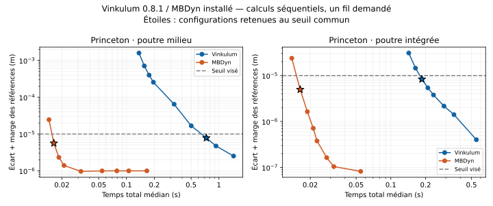

# Vinkulum 0.8.1 face à MBDyn : statique Princeton

**Le gain de Newton réduit le retard, mais MBDyn reste nettement plus
rapide sur ce problème.** Cette campagne du 7 septembre 2026 mesure la
roue isolée 0.8.1, liée au tag `v0.8.1` et au commit
`fdd22d64030a9b86db272da8c73ce12ced992033`. Elle reprend les deux séries
statiques de la [confrontation 0.7.2](CONFRONTATION_MBDYN_0.7.2.md).

## Résultat à précision commune

Meilleurs réglages admissibles parmi les grilles essayées, avec trois
répétitions réussies après échauffement. Le seuil est **10 µm au bout**
de la console ; il ne porte pas sur le champ de déplacement entier.

| Formulation Vinkulum | Intervalles V / M | Temps médian total V / M | Erreur estimée V / M | Rapport des temps V / M |
|---|---|---|---|---|
| Milieu | 60 / 6 | 0.73056 / 0.016369 s | 7.827 / 5.643 µm | 44.6 |
| Intégrée | 8 / 6 | 0.18599 / 0.016362 s | 8.326 / 4.959 µm | 11.4 |

MBDyn utilise `beam3` dans les deux séries et est remesuré dans chacune.
Les deux lignes concernent le même problème physique, avec deux
formulations Vinkulum. L'option intégrée reste expérimentale dans le
domaine documenté des [poutres intégrées](POUTRE_INTEGREE.md).

Dans la campagne 0.7.2, les rapports étaient respectivement 109.8 et 20.8.
Le temps total Vinkulum passe de 2.072 à 0.731 s pour la formulation
milieu retenue et de 0.387 à 0.186 s pour l'intégrée. MBDyn est lui aussi
plus rapide dans la nouvelle mesure. Cette comparaison entre campagnes
ne remplace donc pas la comparaison interne alternée entre roues 0.8.0
et 0.8.1, qui isole mieux le changement de Newton.



Les étoiles indiquent les meilleurs réglages admissibles dans les grilles.
La marge des références impose un plancher à l'erreur estimée affichée,
particulièrement visible dans la série milieu ; il ne signifie pas que
les raffinements MBDyn cessent de converger.

## Protocole, contrôles et mémoire

Les **150 exécutions**, dont **41 échauffements**, terminent. Les
**3 800 paliers Vinkulum**, échauffements inclus, atteignent la tolérance
en mode strict. Les temps et les observables bruts restent archivés.
Les diagnostics des configurations Vinkulum retenues comptent chacune
334 évaluations principales et 50 tentatives pour leurs cinquante paliers.

Les processus sont successifs, fixés au processeur logique 8 d'un AMD
EPYC 7543. Rayon, OpenBLAS, OMP et MKL sont demandés à un fil ; les entrées
MBDyn désactivent leurs threads. Les moteurs alternent entre répétitions.
Aucune compilation ni autre campagne de calcul ne tourne simultanément.

Le temps total comprend démarrage, imports, construction ou lecture du
modèle, calcul et sorties. Le traitement des fichiers MBDyn par le juge
est hors chronomètre. Le temps interne Vinkulum est également conservé,
sans comparaison à un temps interne MBDyn qui n'a pas été mesuré.

Les pics RSS des configurations retenues sont **40.5 Mio / 12.5 Mio**
pour milieu et **40.0 Mio / 12.5 Mio** pour intégrée, Vinkulum / MBDyn.
Les runtimes et politiques de sortie diffèrent : ces nombres ne mesurent
pas la mémoire du seul noyau linéaire. Aucune amélioration de mémoire
significative n'est établie par ce lot.

Le modèle et les réglages restent ceux du protocole précédent : console
anisotrope de 0.508 m, charge de 8.896 N à 45°, cinquante paliers cosinus.
Vinkulum ajoute les cinquante incréments d'effort et emploie
`tol=1e-8, iters=100, strict=True` ; MBDyn conserve sa force pilotée,
`tolerance: 1e-6` et dix itérations maximales. La sélection repose sur
l'erreur de déplacement, pas sur l'égalité des tolérances internes.

Chaque moteur calcule deux raffinements : Vinkulum milieu 160 et
320 intervalles, Vinkulum intégré 80 et 160, MBDyn 80 et 160. La variation
des références doit rester sous 10 % du seuil, et leur écart croisé sous
20 %. Le juge ajoute la plus grande variation de référence au maximum
des erreurs envers les deux références fines, sur toutes les répétitions.
Les deux séries satisfont ces conditions.

## Archives et reproduction

- [Bilan et métadonnées](bancs/confrontation-statique-mbdyn-0.8.1.json).
- [Trajectoires et diagnostics](bancs/confrontation-statique-mbdyn-0.8.1-trajectoires.json.gz).
- [Entrées, journaux et sources du protocole](bancs/confrontation-statique-mbdyn-0.8.1-journaux.json.gz).
- [Empreintes et lien avec la roue livrée](bancs/confrontation-statique-mbdyn-0.8.1-manifest.json).

L'exécutable MBDyn est le même que dans la campagne 0.7.2, identifié par
son empreinte et le commit `eb3bb5796e99c70e9ee0af072c38aada13a199f6`.
Ses fichiers d'entrée ont été utilisés ; aucune source du solveur n'a été
lue. Les versions, commandes et configurations exactes figurent dans les
métadonnées de l'archive.

Le juge et les journaux peuvent être revérifiés sans ces exécutables :

```bash
python ci/archive_confrontation.py --verifier docs/bancs/confrontation-statique-mbdyn-0.8.1
```

Cette campagne couvre la statique Princeton. Les résultats dynamiques
externes restent ceux de la 0.7.2, et aucun calcul Simpack n'est ajouté.
La formulation flexible, le coût des évaluations et celui de l'usage
Python restent des leviers à examiner ; ce résultat ne prouve pas une
avance généraliste.
