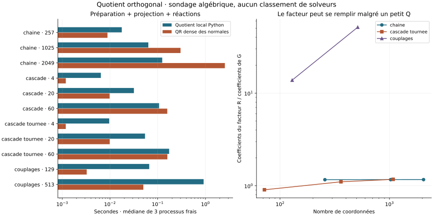

# Contraintes : quotient orthogonal local et limites de rang

Expérience du 7 septembre 2026, issue du
[programme de recherche fondamentale](FONDEMENTS_MATHEMATIQUES_VINKULUM_2026.pdf).
Le prototype est indépendant de l'API distribuée de Vinkulum 0.9.0.
Il sert à éprouver le premier axe : exploiter la structure des contraintes
redondantes sans construire une grande base dense des normales ou des
mouvements admissibles.

**Le résultat porte sur une brique algébrique.** Il ne qualifie ni une
trajectoire multicorps, ni un gain face à MBDyn, Exudyn ou Simpack. Le noyau
livré emploie déjà un QR creux lorsque les contraintes sont indépendantes ;
les dépendances générales d'une grande composante peuvent encore imposer
un repli dense. Le prototype explore ce domaine précis. Il ne remplace pas
le calcul de réactions de norme minimale du noyau.

Les [preuves complémentaires sur le quotient et la réduction](QUOTIENT_LOCAL_PREUVES.md)
donnent ensuite une condensation avec masse exacte, le report des pivots
faibles, un certificat conditionnel d'erreur physique et une limite de
dimension dynamique même pour une interface scalaire. Elles incluent
une obstruction d'ordre deux au triangle aplati : les dépendances du
jacobien ne suffisent pas à supprimer une contrainte non linéaire.

## Mesures et contre-épreuves

L'archive finale contient **88 essais** : onze configurations, deux
variantes, un échauffement conservé et trois répétitions. Chaque essai
utilise un processus frais, le CPU 8 d'un AMD EPYC 7543 et un fil demandé
aux bibliothèques. Les variantes sont alternées. La roue 0.9.0 figée
fournit les matrices des cascades ; le prototype modal n'intervient pas.

Les temps comprennent normalisation, factorisation, une projection et
les réactions sur trois vecteurs. Imports, construction du modèle et
oracles sont exclus. Le QR dense pivoté forme une base des normales et
calcule, comme le prototype, des réactions sélectionnées. Ce témoin
algébrique ne représente pas le meilleur solveur creux disponible.

| Famille | Taille | Quotient local | QR dense | QR / local |
|---|---:|---:|---:|---:|
| Chaîne | 257 coordonnées | 17,67 ms | 8,875 ms | 0,502 |
| Chaîne | 1 025 coordonnées | 63,70 ms | 301,1 ms | 4,73 |
| Chaîne | 2 049 coordonnées | 124,4 ms | 2 553 ms | 20,5 |
| Cascade | 4 cellules | 6,449 ms | 1,189 ms | 0,184 |
| Cascade | 20 cellules | 31,76 ms | 9,840 ms | 0,310 |
| Cascade | 60 cellules | 107,0 ms | 158,7 ms | 1,48 |
| Cascade tournée | 4 cellules | 9,643 ms | 1,187 ms | 0,123 |
| Cascade tournée | 20 cellules | 54,28 ms | 9,878 ms | 0,182 |
| Cascade tournée | 60 cellules | 173,8 ms | 159,5 ms | 0,918 |
| Couplages dispersés | 129 coordonnées | 66,47 ms | 3,256 ms | 0,049 |
| Couplages dispersés | 513 coordonnées | 916,7 ms | 50,07 ms | 0,055 |

Une valeur supérieure à un favorise le prototype. Les durées sont des
médianes, sans intervalle de confiance : trois répétitions ne donnent
pas un classement robuste de différences faibles. Les surcoûts Python
contribuent aux régressions, mais le remplissage observé est également
un problème structurel.



La chaîne contient des différences adjacentes et des sommes de deux
contraintes successives. Son noyau est exactement l'espace des constantes.
À 2 049 coordonnées, le prototype stocke 4 096 coefficients de réflexions
et 7 166 coefficients de R ; la base dense des normales comporte
4 196 352 coefficients. Le pic RSS avant oracle est de 64,0 MiB contre
202,4 MiB. Ce pic inclut le processus et ses dépendances, pas seulement
les facteurs.

Les couplages dispersés ajoutent des équations x_i+x_j−2x_k=0 à une
chaîne : le noyau reste connu analytiquement. À 513 coordonnées, les
réflexions restent de support deux, mais R possède **131 890 coefficients
pour 2 563 dans l'entrée**. Le prototype devient 18,3 fois plus lent et
consomme davantage de mémoire. Un Q compact ne suffit donc pas.

Chaque cellule de cascade compte trois corps et une mobilité ; le
jacobien possède 20 lignes et 18 colonnes par cellule, de rang 17 par
cellule. L'oracle reconstruit les vitesses à partir des angles des bielles,
indépendamment du jacobien assemblé. Le repère tourné garde le même problème
physique mais change le remplissage. Les supports maximaux passent de
7 à 69 entre 4 et 60 cellules dans le repère initial. Aucune croissance
linéaire générale n'est déduite de ces trois tailles. Le pic RSS des grandes
cascades est dominé par la construction du modèle commune aux variantes.

Les 88 essais calculent un résultat accepté, sans refus de budget dans
cette campagne. Sur les répétitions mesurées, l'erreur maximale de projection
est 4,56×10⁻¹⁴ et l'erreur maximale de force généralisée 1,40×10⁻¹³,
en norme maximale par composante sur les trois vecteurs sondés. Ces
sondes ne sont pas une borne en norme d'opérateur.

Les **onze contre-épreuves** ajoutent SVD de petits systèmes, permutations,
rotations locales, changement d'échelle des équations de 10⁻¹²⁰ à 10¹²⁰,
projection en métrique de masse, cas vides et entièrement contraints,
absence de conversion dense sur la grande chaîne, réactions non minimales,
refus au seuil et au budget, puis mobilité fausse malgré un résidu petit.

## Antériorité et apport de la recherche complémentaire

Trois lectures primaires empêchent de confondre cette expérience avec une
invention algorithmique ou une preuve de complexité universelle :

- **Foster–Davis, 2013, Algorithm 933.** Les noyaux orthonormaux implicites
  par Householder, la correction du rang et les solutions de norme minimale
  sont déjà étudiés. Leur théorème 5 relie les suppressions à une perturbation
  de Frobenius. Les estimations spectrales servent à avertir d'un rang
  incertain ; les auteurs précisent en section 2.3 qu'un succès annoncé
  n'est pas une garantie absolue. La section 2.7 signale le remplissage
  supplémentaire possible d'une seconde factorisation pour la décomposition
  orthogonale complète. [Manuscrit auteur, sections 2.1–2.3 et 2.7](https://people.engr.tamu.edu/davis/publications_files/Reliable_Calculation_of_Numerical_Rank_Null_Space_Bases_Pseudoinverse_Solutions_and_Basic_Solutions_using_SuiteSparseQR.pdf),
  [référence publiée](https://doi.org/10.1145/2513109.2513116).
- **Scott–Tůma, 2022.** Les sections 2–3 confrontent bases de noyau,
  élimination directe, remplissage et précision des contraintes. Leur pivotage
  considère aussi la matrice de l'objectif : optimiser les seules contraintes
  peut densifier le problème réduit. Les circuits donnent des dépendances
  locales, mais une base creuse non orthogonale peut dégrader la fermeture.
  L'étude suppose principalement des contraintes indépendantes et peu
  nombreuses dans un problème de moindres carrés ; ce n'est pas notre KKT
  général. [Article ouvert](https://link.springer.com/article/10.1007/s10543-022-00930-2).
- **Gnanasekaran–Darve, préprint 2020, spaQR.** La réduction de rang des
  interfaces d'une dissection emboîtée dépasse le simple stockage implicite
  de Q. La section 3.4 obtient O(N log N) pour la factorisation sous des
  hypothèses de séparateurs, de voisinage borné et de rang comprimé
  O(N_i^(1/3)). Les sections 3.1–3.3 analysent l'effet de l'équilibrage
  sur l'erreur. L'article rapporte aussi une croissance empirique N^1,4
  dans une expérience : la borne conditionnelle ne prédit pas tous les
  temps mesurés. Le manuscrit traite de matrices carrées et d'un
  préconditionneur approché, pas d'un quotient exact de contraintes
  redondantes. [Manuscrit, version 1 consultée](https://arxiv.org/pdf/2010.06807v1).

Aucun code d'implémentation de solveur concurrent n'a été consulté.
Le programme ci-dessous est une dérivation propre d'une élimination QR
classique, avec un ordre glouton local. Il ne reproduit ni SPQR RANK ni
spaQR. Le théorème de Fürer–Hoppen–Trevisan de 2025, étudié dans le rapport
fondamental, reste un résultat en opérations de corps avec décomposition
du graphe fournie : il ne donne pas la complexité ni la stabilité de ce
prototype flottant.

## Dérivation et contrat exact

Soit G la matrice réelle de contraintes homogènes, avec m lignes et n
coordonnées. On normalise chaque ligne non nulle : B=D G, D diagonale
inversible. Cela conserve le noyau exact. La géométrie ci-dessous est
euclidienne dans les coordonnées choisies ; elle ne mélange pas implicitement
translations et rotations dans une norme physique.

À chaque étape, on choisit une ligne active de support minimal. Une
réflexion H_j=I−2u_j u_jᵀ, limitée à ce support, ramène ses coefficients
actifs à une seule coordonnée pivot p_j. Le signe de Householder évite la
soustraction de nombres proches. On applique la réflexion aux autres lignes
qui touchent ce support, puis on retire la coordonnée pivot des équations
actives. Ses coefficients sont conservés dans un facteur creux R.
Les lignes choisies donnent un bloc triangulaire inférieur T inversible.

En arithmétique exacte, après élimination des seules dépendances exactes :

\[
Q=H_1\cdots H_r,\qquad BQ E_p=R,\quad BQ E_f=0,
\qquad T=R_{\mathcal I,:}.
\]

E_p injecte les coordonnées pivots dans l'ordre d'élimination ; E_f injecte
les coordonnées restantes ; I est l'ensemble ordonné des lignes choisies.
Le nombre r est le rang exact. D'où :

\[
Z=QE_f,\qquad Z^TZ=I,\qquad
P=ZZ^T=Q E_f E_f^T Q^T.
\]

On stocke les supports et les vecteurs u_j. Appliquer Qᵀ revient à appliquer
les réflexions dans l'ordre de construction ; appliquer Q utilise l'ordre
inverse. La projection consiste à appliquer Qᵀ, annuler les coordonnées
pivots, puis appliquer Q. Ni Q, ni Z, ni B Bᵀ ne sont construits.

Pour une force f, la solution sélectionnée est obtenue par :

\[
T^T\eta_{\mathcal I}=E_p^TQ^Tf,\qquad
\eta_{\overline{\mathcal I}}=0,\qquad
B^T\eta=(I-P)f.
\]

Les multiplicateurs des contraintes originales sont λ=Dη. Leur force
physique est correcte en arithmétique exacte ; **λ n'est pas en général
de norme minimale**. Avec G=(1,2)ᵀ, la sélection de la première ligne
donne λ=(1,0), alors que la solution minimale pour une force unitaire est
(1/5,2/5). Ce contre-exemple est exécuté.

En métrique de masse M=L Lᵀ définie positive, la substitution x=L^(−T)y
conduit à B=D G L^(−T). La projection physique est alors
L^(−T) P Lᵀ, orthogonale pour M, et non nécessairement symétrique dans les
coordonnées originales. Le sondage publié ci-dessous porte sur les
coordonnées euclidiennes ; une intégration modale devra appliquer cette
transformation explicitement et recontrôler les équations physiques.

## Coût : ce qui est compté et ce qui reste à prouver

Soient s_j le support de la réflexion j et a_j le nombre d'autres lignes
qu'elle transforme. On mesure :

\[
W=\sum_j s_j(a_j+1),\qquad S=\sum_j s_j.
\]

W compte des coefficients à transformer, pas des FLOP. Il ne comprend pas
tous les coûts des dictionnaires, tris et files de priorité Python. Une
application de Q à k vecteurs demande O(k S) opérations scalaires ; la
projection utilise deux applications. Le facteur R et le graphe actif ont
leurs propres coûts de stockage. S seul n'est donc pas la mémoire totale.

Le programme expose S, W, le support maximal, les nombres de coefficients
du facteur et du graphe actif. Il refuse un panneau qui ferait dépasser
le budget W fixé. Ce garde-fou n'est pas une limite en octets : le stockage
de l'entrée et les objets Python restent à compter. Aucun petit coefficient
isolé n'est supprimé pour cacher le remplissage.

La borne O(k²(m+n)) du résultat de 2025 ne se déduit pas de ces compteurs.
Un ordre glouton de petites lignes ne garantit pas une largeur bornée ;
un support de réflexion petit ne garantit pas non plus un petit nombre
de lignes touchées. La compression des séparateurs reste à implémenter
et à contrôler sur les opérateurs mécaniques complets.

## Rang numérique : un résidu petit peut cacher une mobilité fausse

Le prototype emploie un seuil τ=64 ε max(m,n,1) après normalisation des
lignes. Il refuse les résidus de lignes dans [τ/4,4τ], conserve ceux
au-dessus et supprime ceux en dessous. Cette séparation locale est
**une heuristique**, sans garantie globale de rang révélateur. Une petite
diagonale triangulaire et une petite valeur singulière ne sont pas
interchangeables.

Dans le modèle idéal de réflexions exactes, supprimer des résidus de
lignes distinctes e_i équivaut à perturber B d'une matrice ΔB telle que
‖ΔB‖_F²=Σ_i‖e_i‖². Les transformations orthogonales ultérieures conservent
chaque norme de ligne. C'est le mécanisme du théorème 5 de Foster–Davis,
redérivé ici avec l'orientation transposée. Le compteur des résidus
supprimés **n'inclut pas les arrondis** de toutes les transformations.
Il ne constitue donc pas une borne certifiée de l'erreur arrière flottante.

Un exemple exact suffit à interdire une conclusion abusive :

\[
G_\delta=\begin{pmatrix}1&0\\1&\delta\end{pmatrix},
\qquad \delta\ne0.
\]

Son noyau exact vaut {0}. Supprimer la seconde contrainte après élimination
autorise e₂ : le résidu vaut |δ|, mais l'erreur sur le projecteur a une
norme égale à 1. Le test δ=10⁻¹⁴, τ=10⁻¹⁰ reproduit cette situation.
Un test de fermeture seul ne certifie donc pas la mobilité.

À rang égal r, une information supplémentaire change la conclusion.
Si γ=σ_r(B)>0 et si P̃ est un projecteur orthogonal de dimension n−r avec
‖B P̃‖₂≤δ, la décomposition singulière donne :

\[
\|(I-P)\widetilde P\|_2\le\delta/\gamma,
\qquad \|P-\widetilde P\|_2\le\delta/\gamma.
\]

La seconde inégalité utilise l'égalité des dimensions des deux
espaces. Une estimation non certifiée de γ ou quelques sondes aléatoires
ne transforment pas cette implication en certificat. La suite devra
combiner les dépendances structurelles du mécanisme, une vérification
spectrale du rang et le contrôle des erreurs dans la métrique physique.

## Reproduction et statut d'intégration

- [Prototype autonome](../ci/contraintes_orthogonales.py).
- [Contre-épreuves](../ci/test_contraintes_orthogonales.py).
- [Sondage et vérificateur d'archive](../ci/mesure_quotient_orthogonal.py).

```bash
OPENBLAS_NUM_THREADS=1 python ci/test_contraintes_orthogonales.py
python ci/mesure_quotient_orthogonal.py --sortie /tmp/quotient-nouvelle-campagne --cpu 8
python ci/mesure_quotient_orthogonal.py --verifier docs/bancs/quotient-orthogonal-2026
```

NumPy et SciPy sont requis ; les cascades utilisent l'export CSC de Vinkulum
0.9.0. L'archive conserve les versions, l'empreinte de l'extension native,
les sources de modèle, les compteurs, les contrôles et les refus.
La version distribuée n'est pas modifiée par cette expérience.
