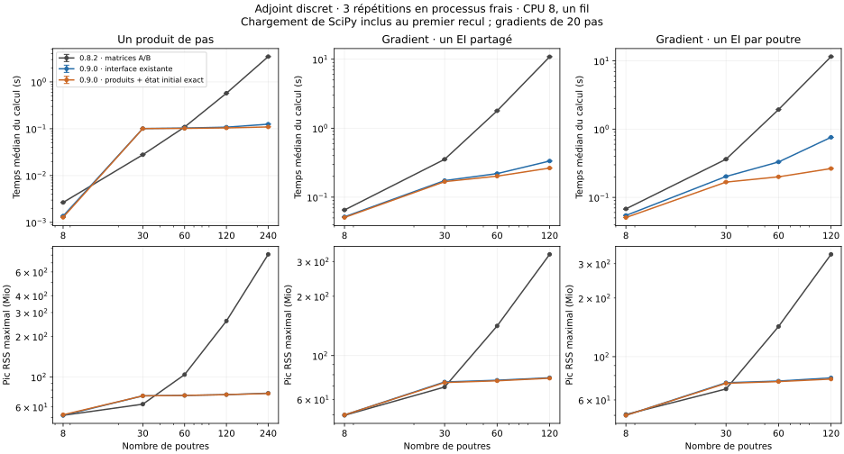

# Adjoint discret par produits implicites — 0.9.0

Le pont `PontNoyau` calcule désormais le gradient d'un objectif final sans
construire les matrices de transition d'état `A` et de paramètres `B`.
Le noyau fournit les tangentes mécaniques en stockage creux ; le recul
résout un système transposé avec un second membre, puis applique des
produits locaux. La trajectoire et les équations mécaniques restent celles
de l'intégrateur à pas fixe, `sigma_lie=0` et sans GGL.

Cette livraison met en œuvre l'axe « structure et sensibilités » de
l'[étude scientifique](RECHERCHE_MATHEMATIQUE.md). Le théorème des fonctions
implicites et les adjoints discrets sont classiques. Le lien avec les
travaux de Blondel et al. (2022) est l'architecture modulaire : dériver le
résidu convergé et composer des produits de dérivées sans dérouler les
itérations du solveur. Vinkulum adapte ce principe à son état de schéma et
à SO(3) ; il n'intègre pas leur bibliothèque et ne revendique pas une
nouvelle théorie de l'adjoint. [Article original](https://arxiv.org/abs/2105.15183).

## Coût supprimé

Pour `n` degrés physiques et `p` paramètres, l'ancien pont exportait
`K,C,M,Z,G` sous forme de listes denses, bien qu'il ne se serve pas de `Z`.
Il construisait ensuite `A ∈ R^(4n×4n)` et `B ∈ R^(4n×p)`, avec `4n+p`
seconds membres, pour n'en utiliser que `Aᵀμ` et `Bᵀμ`.

Le nouveau chemin conserve les matrices locales assemblées, le Jacobien
contraint du pas et les facteurs nécessaires à sa résolution. Il ne forme
ni `A`, ni `B`, ni la base dense `Z`. Les rappels de dérivées transposées
permettent aussi d'éviter la matrice globale `R_p ∈ R^(n×p)`.
Le coût d'une factorisation creuse dépend du remplissage et de la topologie ;
ce changement ne garantit pas une complexité linéaire pour tout mécanisme.

## Dérivation du recul

Les covecteurs sont exprimés dans les coordonnées de perturbation spatiales
du noyau : translations et rotations infinitésimales à gauche, par corps.
On note `z=(q,u,u̇,a)`, `x=(u̇₁,λ₁)` et `R(x;z₀,p)=0` le résidu complet
du pas. La reconstruction de l'état s'écrit `z₁=Φ(x,z₀)`.

À topologie fixe, pour un Jacobien `J=R_x` inversible :

```text
Jᵀ ψ = Φ_xᵀ μ₁
μ₀   = Φ_zᵀ μ₁ − R_zᵀ ψ
g_p  = −R_pᵀ ψ
```

Les paramètres doivent entrer par le résidu et l'état initial. Une
dépendance explicite de `Φ` ou du calendrier temporel aux paramètres
demanderait des termes supplémentaires. Le gradient total ajoute les
contributions de tous les pas et `(∂z₀/∂p)ᵀμ₀`. Une dépendance explicite
de l'objectif final à `p` doit être ajoutée par l'utilisateur.

Pour les coefficients de l'α-généralisé :

```text
c   = (1−α_f)/(1−α_m) ; k_a = α_f/(1−α_m) ; k_b = α_m/(1−α_m)
a₁  = c u̇₁ + k_a u̇₀ − k_b a₀
θ   = h [u₀ + (1/2−β)h a₀ + βh a₁]_rotation
D   = diag_corps(I₃, J_l(θ))
E   = diag_corps(I₃, exp([θ]×))
s_q = βh²c ; s_u = γhc
```

`K` inclut la dérivée des forces effectives et de `Gᵀλ`, puis la correction
`∂(J_s u̇₁)/∂θ = −[J_s u̇₁]× + J_s[u̇₁]×`. Le gyroscopique est déjà inclus
dans les tangentes mécaniques ; il ne faut pas l'ajouter une seconde fois.
Avec `C` la dérivée en vitesse et `G` le Jacobien des contraintes holonomes :

```text
J = [ M + s_u C + s_q K D    Gᵀ ]
    [ s_q G D                0  ]

b = [ s_q Dᵀμ_q + s_u μ_u + μ_u̇ + c μ_a ]
    [                   0                  ]
Jᵀ ψ = b

v_q = μ_q − Kᵀψ_physique − Gᵀψ_contraintes
v_u = μ_u − Cᵀψ_physique

μ_q₀ = Eᵀv_q
μ_u₀ = hDᵀv_q + v_u
μ_u̇₀ = βh²k_a Dᵀv_q + γhk_a v_u + k_a μ_a
μ_a₀ = h²(1/2−β−βk_b)Dᵀv_q + h(1−γ−γk_b)v_u − k_b μ_a
```

Les blocs cinématiques font `6×6` par corps. Même le chemin NumPy applique
ces blocs directement, sans produit dense cubique par `D`.
L'ancienne construction `_pas` est conservée comme contre-calcul dans les
tests ; `gradient` appelle `_recul`.

## Interfaces et résolution numérique

`N.k_c_m_g_creux(t=None)` renvoie quatre exports CSC :
`(n_lignes,n_colonnes,indptr,indices,donnees)` pour `K,C,M,G`.
Les doublons locaux sont sommés dans un ordre stable, les indices triés,
les zéros omis, les sommes non finies refusées. L'export ne modifie pas
l'état du modèle. Les conventions sont celles de `k_c_m_z`, qui reste
disponible : états internes figés, précontrainte courante ou multiplicateurs
initialisés sur une copie. Les lignes de contact complémentaire sont nulles ;
cet export ne dérive pas un événement ou un changement d'ensemble actif.

```python
from scipy.sparse import csc_matrix

k, c, m, g = [
    csc_matrix((data, indices, indptr), shape=(nr, nc))
    for nr, nc, indptr, indices, data in n.k_c_m_g_creux()
]
```

`PontNoyau(...,creux=None)` utilise NumPy en dessous de 180 degrés physiques,
et SciPy au-dessus s'il est installé. Le seuil est une heuristique issue
du profilage local, pas une frontière universelle. `creux=False` force
NumPy ; `creux=True` exige SciPy. Le stockage CSC convient à `splu` ;
le recul utilise `solve(...,trans='T')`.
[Documentation `splu`](https://docs.scipy.org/doc/scipy/reference/generated/scipy.sparse.linalg.splu.html),
[résolution transposée](https://docs.scipy.org/doc/scipy/reference/generated/scipy.sparse.linalg.SuperLU.solve.html).

Le système est équilibré par lignes puis par colonnes. Pour
`J_e=D_r J D_c`, on résout `J_eᵀ y=D_c b`, puis `ψ=D_r y`.
Un raffinement, limité à trois corrections, réutilise la factorisation
creuse. Le critère est l'erreur arrière normique :

```text
||D_c b − J_eᵀy||∞ / (||J_eᵀ||∞ ||y||∞ + ||D_c b||∞) ≤ 10⁻¹¹.
```

Il porte sur le système équilibré. Il ne borne ni son conditionnement,
ni l'erreur du gradient physique. Les systèmes singuliers détectés par
le solveur, les valeurs non finies et les échecs du critère sont refusés.
Aucun repli silencieux en moindres carrés ne redéfinit l'adjoint.
`residu_adjoint_max` expose ce critère ; `n_resolutions_adjoint` compte les
résolutions, raffinement compris. `n_kcmz` conserve son nom historique et
compte les linéarisations, sans impliquer un appel à `k_c_m_z`.

## Paramètres et état initial

Le rappel historique `d_residu_p(N,p)` reste utilisable pour des paramètres
de forces, à masse et contraintes indépendantes de `p` : tableau `(n,p)`.
Le rappel optionnel `d_residu_transpose(N,p,u̇₁,ψ)` rend directement
`R_pᵀψ`, de taille `p`, à `q,u,u̇,λ` fixés. `ψ` possède `n+m` composantes.
Il doit inclure toutes les dépendances du résidu complet, notamment
`(∂M/∂p)u̇` et celles des contraintes si ces quantités varient.
Le pont applique lui-même le signe moins.

`N.d_residu_poutres_transpose(poids,quoi="ei")` calcule un produit par
poutre à partir de ses douze contributions locales. `poids` comporte
`n` composantes. Les directions `ea,ga,gj,ei,ei_e2,ei_e3` conservent le sens
de `d_residu_poutre` ; `ei` et `ga` varient leurs deux composantes.
La règle de chaîne de la formulation intégrée est incluse.

Sans rappel initial, le pont suppose `q₀,u₀` indépendants de `p` et garde
la différence finie de l'accélération consistante : deux constructions
du modèle et deux premiers pas par paramètre. Le rappel optionnel
`d_initial_transpose(p,μ₀)` fournit `(∂z₀/∂p)ᵀμ₀` pour l'état initial complet.
Il ne faut le remplacer par zéro qu'après avoir établi cette indépendance.

Dans le banc de cette livraison, chaque poutre est initialement sans
déformation et `p` ne change que `EI`. Ni `M`, ni `G`, ni `q₀,u₀` ne changent ;
tous les `R_p(q₀)` sont vérifiés nuls. L'équation d'accélération initiale
donne donc `∂a₀/∂p=0` : le rappel nul est exact pour ce modèle précis.

## Contrôles et mesures

Les tests couvrent les exports contre le champ dense sur six modèles,
la précontrainte après mouvement, les produits contre `Aᵀμ,Bᵀμ`, un corps
libre, un pendule spatial et un pendule flexible, ainsi que les six
directions de sensibilité des deux poutres. Un oscillateur forcé amorti
à deux paramètres vérifie le gradient de trajectoire par différences
finies, y compris un dernier pas raccourci et un état initial dépendant
des paramètres. Un système à fortes disparités d'échelles et des systèmes
singuliers ou non finis contrôlent la résolution.

La démonstration mécanique conserve les contre-épreuves qui retirent
`J_l`, la correction d'inertie et le traitement correct du gyroscopique.
La différence finie du pendule flexible reste un juge bruité à environ
1 % ; son critère ajoute une marge égale à la dispersion des différences
finies. Ce test n'établit pas une précision relative universelle de 10⁻⁹.

Les mesures finales comparent **156 processus frais** : treize cas, trois
variantes, un échauffement conservé et trois répétitions par configuration.
Les gradients portent sur vingt pas de 1 ms ; le produit isolé est calculé
sur un premier pas réel de 0,1 ms. Le modèle est une chaîne de poutres
pivotée, lâchée sous gravité, avec un EI partagé ou un EI par élément.

Les trois variantes sont la roue 0.8.2 (`ancien`), la 0.9.0 avec le rappel
historique de matrice `R_p` et l’initialisation par différences finies
(`matrice`), et la 0.9.0 avec produits locaux et dérivée initiale exactement
nulle pour ce modèle (`produits`).

| Calcul | Poutres | 0.8.2 | 0.9.0, interface existante | 0.9.0, produits et initialisation exacte |
|---|---:|---:|---:|---:|
| Un produit de pas | 8 | 0,0027 s | 0,0014 s | 0,0013 s |
| Un produit de pas | 30 | 0,0278 s | 0,1010 s | 0,1007 s |
| Un produit de pas | 120 | 0,5736 s | 0,1079 s | 0,1041 s |
| Un produit de pas | 240 | 3,4702 s | 0,1251 s | 0,1091 s |
| Gradient, EI partagé | 8 | 0,0652 s | 0,0519 s | 0,0507 s |
| Gradient, EI partagé | 30 | 0,3540 s | 0,1739 s | 0,1680 s |
| Gradient, EI partagé | 60 | 1,7867 s | 0,2197 s | 0,2017 s |
| Gradient, EI partagé | 120 | 10,8457 s | 0,3340 s | 0,2644 s |
| Gradient, EI par poutre | 8 | 0,0678 s | 0,0543 s | 0,0507 s |
| Gradient, EI par poutre | 30 | 0,3624 s | 0,2025 s | 0,1674 s |
| Gradient, EI par poutre | 60 | 1,9319 s | 0,3301 s | 0,2000 s |
| Gradient, EI par poutre | 120 | 11,5321 s | 0,7584 s | 0,2644 s |

À 120 poutres, le gradient partagé gagne **32,47×** avec l’interface
existante et **41,02×** avec les produits. Le gradient des 120 EI gagne
respectivement **15,21×** et **43,61×**. Dans ce dernier cas, le nombre de
constructions initiales passe de **241 à 1** seulement avec le rappel
initial exact ; le chemin compatible conserve ses 241 constructions.

Le pic RSS maximal des trois répétitions du gradient à 120 paramètres
passe de **335,1 Mio** à **77,8 Mio** avec l’interface existante et
**76,7 Mio** avec les produits. À 240 poutres, pour le produit de pas,
il passe de **809,6 Mio** à **75,9 / 75,5 Mio**. À 30 poutres, les
variantes utilisant SciPy consomment davantage de mémoire que l’ancienne.

**Le coût du premier import de SciPy est inclus dans le calcul.** Ainsi,
le produit isolé à 30 poutres ralentit de 27,85 à 100,97 ms avec
l’interface existante, soit **3,63× plus lent**. À 60 poutres, son gain
est faible. Les gradients amortissent ce coût sur vingt reculs.

Les temps du tableau délimitent le calcul du produit ou du gradient.
Le temps de processus inclut en plus les imports, la preuve de dérivée
initiale nulle, la sérialisation et une trajectoire indépendante de contrôle
pour les gradients. À 120 EI, il passe de **11,665 s à 0,413 s** avec
les produits, soit **28,24×**, plutôt que le rapport 43,61× du calcul seul.
Chaque essai utilise le CPU 8 d’un AMD EPYC 7543 ; un fil est demandé aux
bibliothèques. Python 3.14.7, NumPy 2.5.3 et SciPy 1.18.1 sont installés
dans les deux environnements isolés. Aucune autre campagne ni compilation
du projet ne tourne pendant les mesures publiées.

Le juge contrôle les identités de roues, les modules réellement chargés,
les répétitions, les pas adjoints, les valeurs finies, l’affinité et les
résidus. Il compare séparément les quatre blocs du covecteur et le
gradient de paramètre, afin qu’une grande composante ne masque pas une
erreur dans un autre bloc. Le seuil par groupe est `2e-11+3e-9×norme_inf`.
L’écart normique relatif maximal observé par groupe est **3,35×10⁻¹⁰** ;
les positions finales comparées sont identiques. La somme des gradients
locaux retrouve le gradient du paramètre partagé. Tous les critères passent.

Cette égalité à la référence interne n’est pas un certificat physique.
Le test indépendant de la chaîne flexible, à 8, 30 et 120 éléments,
compare également le gradient partagé à trois différences finies centrées
(`ΔEI=1e-3,3e-4,1e-4`) avec une tolérance relative de `2e-5`.



Rejouer le juge sans relancer les chronomètres :

```bash
python ci/mesure_adjoint_operateurs.py --verifier docs/bancs/adjoint-operateurs-0.9.0-livraison-essais.json.gz
python ci/test_adjoint_operateurs.py
```

Le [bilan final](bancs/adjoint-operateurs-0.9.0-livraison.json) et ses
[156 essais avec source embarquée](bancs/adjoint-operateurs-0.9.0-livraison-essais.json.gz)
conservent coûts, résultats et identités. Un [premier lot de 156 essais](bancs/adjoint-operateurs-0.9.0.json)
est également conservé : il précédait le refus explicite des liaisons non
holonomes et n’est pas la roue utilisée pour les chiffres ci-dessus.
Les [empreintes de livraison](bancs/version-0.9.0.json) relient la roue
finale à l’extension et au module adjoint effectivement mesurés.

## Limites et prochain travail

Le domaine exige des contraintes holonomes indépendantes, un Jacobien de
pas inversible, des branches différentiables et une topologie fixe.
Contact, candidats de contact automatique, aérodynamique et liaisons
non holonomes sont refusés. GGL, σ non nul, adaptation du pas et projections
d'invariants ne sont pas différenciés par ce pont. Les historiques d'angles
déroulés ne font pas partie de ses sauvegardes : une transmission changeant
de branche au cours du recul n'est pas couverte.

Les dérivées portent sur les équations convergées, pas sur le nombre
d'itérations ni les seuils d'arrêt de Newton. Leur écart aux différences
finies dépend donc aussi de la précision du calcul direct. L'état précis
des translations et tous les historiques internes ne sont pas sauvegardés
par les anciennes trames de trajectoire utilisées ici.

La trajectoire complète demeure en mémoire et les facteurs sont recalculés
au recul. Le stockage en √N du modèle NumPy séparé ne s'applique pas à
`PontNoyau` ; aucun ordonnancement Revolve général n'est livré ici.
Les modes et les sensibilités statiques/modales conservent encore leurs
calculs denses. L'export CSC prépare leur évolution, sans l'accomplir.

Ces mesures internes ne classent pas les gradients d'Exudyn, MBDyn ou
Simpack. La [confrontation externe](CONFRONTATION_EXUDYN_0.8.2.md) reste
la statique de la roue 0.8.2 à précision commune. Les gains de l'adjoint
ne peuvent pas être multipliés par ses rapports de temps.
