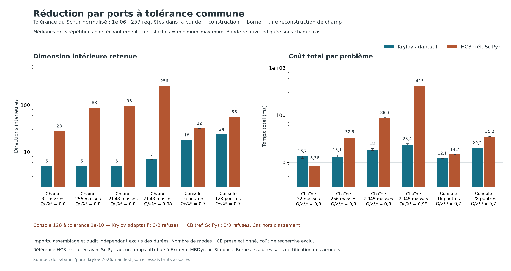

# Réduction par interfaces : preuves, prototype et confrontation HCB

État du 7 septembre 2026. Ce travail ajoute un prototype de recherche et
des preuves ; la version du logiciel reste 0.9.0. Le noyau généraliste
n'utilise pas encore cette réduction dans ses simulations non linéaires.

**Suite expérimentale :** le [relèvement en énergie](PORTS_RELEVES_PROTOTYPE.md)
traite la perte de précision observée ici et affine le diagnostic avec
des oracles à 70 chiffres. Les mesures et refus de cette première
campagne restent conservés.

Le résultat utile est une réduction adaptative qui construit les directions
intérieures depuis les ports, puis évalue une enveloppe d'erreur sur une
bande entière. Sur la chaîne de 2 048 masses, elle conserve 5 directions
intérieures contre 96 modes pour la référence HCB au même seuil de contrôle,
avec un coût total mesuré de 18,0 ms contre 88,3 ms. Sur la petite chaîne,
elle reste 1,64 fois plus lente. Ces temps comparent nos deux prototypes
SciPy sur les mêmes matrices ; ils ne mesurent pas Exudyn, MBDyn ou Simpack.

## Ce que le raisonnement mathématique apporte

Le [carnet de preuves](PORTS_KRYLOV_PREUVES.md) établit les identités, les
hypothèses et les limites. Le [dossier de sources](PORTS_KRYLOV_SOURCES.md)
rattache la construction aux résultats récents et à leurs antériorités.

Pour un intérieur coercif K ≥ λ_* M > 0, avec z = ω² < λ_*, le transfert
d'interface est H = Bᵀ(K−zM)⁻¹B. Pour un champ candidat X, son résidu est
R = B−(K−zM)X. Le fonctionnel corrigé H̃ = XᵀB+BᵀX−Xᵀ(K−zM)X satisfait
exactement **H−H̃ = Rᵀ(K−zM)⁻¹R ≥ 0**.

Cette identité transforme le contrôle de l'erreur de transfert en contrôle
d'un résidu. Une seule factorisation statique de K permet de calculer les
normes résiduelles. L'expansion d'une petite résolvante fournit ensuite une
majoration sur toute la bande, sans imposer une grille de fréquences pour
construire cette enveloppe. La grille reste un audit indépendant.

La preuve conserve les défauts de semence et d'invariance de la base.
Elle reste donc applicable lorsque des directions sont écartées : une
déflation ne vaut pas automatiquement satisfaction de la tolérance.
Le transfert corrigé conserve aussi le Gram réellement calculé. Cela
traite l'orthogonalité imparfaite dans l'algèbre ; les arrondis de chaque
opération exigent encore leur propre contrôle.

Une seconde dérivation explique la différence avec la troncature modale.
Dans la limite de la chaîne finement discrétisée, en posant
a = ω/ω₁,int < 1, l'erreur HCB après r modes vaut

**E_r(a) = 2a⁴ Σ_{j>r} 1/[j²(j²−a²)] ∼ 2a⁴/(3r³).**

Cette décroissance algébrique impose beaucoup de modes lorsque le seuil
se resserre. Le carnet justifie la limite et l'ordre des limites : à
nombre de masses fixé, conserver tous les modes rend la réduction exacte.
Krylov reproduit les 2q premiers moments avec q blocs exacts, d'où une
erreur locale en O(ω^(4q)). Ce dernier ordre ne prouve, à lui seul, ni
une convergence uniforme en taille ni une supériorité sur toute bande.
L'enveloppe résiduelle et les contre-épreuves sont donc nécessaires.

La complétion matricielle de type Gauss–Radau est également redérivée,
mais n'est pas implémentée ici. Les travaux de Zimmerling, Druskin et
Simoncini (2025) établissent des encadrements matriciels pour des
résolvantes positives ; leurs hypothèses de rang ne permettent pas de
supprimer silencieusement un bloc presque dépendant. L'encadrement
résiduel général sert de base au prototype.
[Article publié](https://link.springer.com/article/10.1007/s10915-025-02799-z).

## Domaine réellement essayé

- Intérieurs linéaires, sans amortissement, avec K_II et M_II positives ;
  couplage de masse M_IS nul. Charges appliquées aux interfaces.
- Ports physiques conservés : dernière masse de la chaîne, six degrés de
  liberté au bout d'une console droite. Aucun choix de ports à partir
  d'une base modale globale.
- Métrique égale à la raideur statique analytique du port. Si LLᵀ est
  cette métrique et W = L⁻ᵀ, l'erreur jugée est
  ‖Wᵀ(S_r−S)W‖₂. Elle est sans dimension, avec une échelle d'énergie
  physique ; ce n'est pas une erreur relative au Schur près de ses zéros.
- Borne spectrale analytique pour la chaîne. Pour la console intégrée,
  λ_* est obtenu par 1/trace(M_II K_II⁻¹), à partir des diagonales
  analytiques de flexibilité, sans calcul de tout le spectre.

Les bornes spectrales sont multipliées par 0,999 dans la campagne. Cette
marge conventionnelle ne certifie pas l'assemblage flottant. Un quotient
de Rayleigh peut réfuter la borne fournie ; son accord ne suffit pas
à la prouver.

## Protocole et résultats

L'[archive](bancs/ports-krylov-2026/manifest.json) conserve 56 essais,
les programmes exécutés et leurs empreintes SHA-256. Chaque essai part
dans un processus frais, sur le CPU 8 d'un AMD EPYC 7543, avec un fil
demandé aux bibliothèques. Quatre répétitions alternent l'ordre des deux
méthodes ; la première est exclue des médianes. Environnement : roue
Vinkulum 0.9.0 figée, Python 3.14.7, NumPy 2.5.3, SciPy 1.18.1.

Le temps total inclut la préparation, le contrôle uniforme, 257 requêtes
de Schur et la reconstruction d'un champ au bord supérieur de la bande.
Les imports, l'assemblage des matrices et l'audit indépendant sont exclus.
La référence HCB utilise une LU creuse réutilisée, des modes creux
sélectifs et une élimination modale diagonale à chaque fréquence. Le
petit cas de chaîne utilise une diagonalisation dense, explicitement
comptée. Aucun calcul spectral complet n'est imposé aux grands cas HCB
du tableau.

HCB reçoit un nombre de modes présélectionné par sondage pour satisfaire
son enveloppe résiduelle ; le coût de cette recherche n'est pas compté.
Ce nombre n'est pas revendiqué minimal. Krylov choisit sa dimension
pendant la préparation comptée. Les deux enveloppes sont évaluées avec
la même borne spectrale ; elles peuvent avoir des degrés de pessimisme
différents. La comparaison porte donc sur un seuil commun de contrôle,
avec vérification indépendante, plutôt que sur une erreur observée
strictement identique.

| Cas | Directions internes Krylov / HCB | Total Krylov / HCB | Rapport HCB / Krylov |
|---|---:|---:|---:|
| Chaîne, 32 masses | 5 / 28 | 13,75 / 8,36 ms | 0,61× |
| Chaîne, 256 masses | 5 / 88 | 13,11 / 32,91 ms | 2,51× |
| Chaîne, 2 048 masses | 5 / 96 | 18,02 / 88,34 ms | 4,90× |
| Même chaîne, bande proche du pôle intérieur | 7 / 256 | 23,37 / 415,01 ms | 17,76× |
| Console, 16 éléments | 18 / 32 | 12,15 / 14,66 ms | 1,21× |
| Console, 128 éléments | 24 / 56 | 20,17 / 35,21 ms | 1,75× |

Il faut ajouter respectivement 1 et 6 coordonnées de port aux dimensions
du tableau. Toutes les répétitions de ces six cas satisfont le seuil
1e−6 pour l'enveloppe et pour l'audit. La bande des chaînes se termine
à 0,8 ω₁,int, ou 0,98 ω₁,int pour le cas proche du pôle. Celle des consoles
se termine à 0,7 fois la racine de la borne par trace, plus conservative
que la première fréquence intérieure réelle.

Le gain vient principalement de la construction. Sur la chaîne de
2 048 masses, les 257 requêtes seules coûtent environ 3,86 ms pour
Krylov et 3,69 ms pour HCB. Il n'y a donc pas de gain démontré pour
l'évaluation seule d'un modèle réduit déjà disponible. Le nombre de
requêtes, la réutilisation des modèles et le coût de leur mise à jour
changeront le bilan d'une application.

## Contre-épreuve d'arrondi : tolérance refusée

La console de 128 éléments est aussi essayée à 1e−10. Les deux méthodes
échouent à ce seuil lors de l'audit, même avec tous les 762 modes
intérieurs pour HCB :

| Méthode | Enveloppe calculée | Écart de Schur audité |
|---|---:|---:|
| Krylov, 24 directions | 3,55e−13 | 1,22e−8 |
| HCB, 762 modes | 1,07e−23 | 1,39e−8 |

La référence creuse de Schur comporte elle aussi des arrondis ; ces
écarts ne constituent pas des erreurs exactes connues à tous leurs
chiffres. Ils montrent que les calculs flottants ne permettent pas
de valider 1e−10 par cet audit. Les grandes contributions statiques
soustraites au port et le conditionnement sont des causes à traiter.
Les huit essais sont conservés comme refus, sans rapport de vitesse
accepté. Le statut « tolerance_estimee » du réducteur désigne seulement
son enveloppe évaluée ; aucun certificat machine n'est revendiqué.

## Portée pour Vinkulum et pour la concurrence

Ce travail valide un axe pour réduire la dimension nécessaire à un
transfert d'interface précis. Il ne valide pas encore le temps d'une
trajectoire multicorps complète, les charges intérieures, le contact,
la gyroscopie, les changements de configuration ou les sensibilités
de la réduction adaptative. Près d'une résonance du système assemblé,
une petite erreur de Schur ne suffit pas à borner le déplacement :
une constante de stabilité globale supplémentaire est nécessaire.

Exudyn dispose déjà de HCB et de modes creux ; MBDyn propose la CMS,
et Simpack des réductions linéaires et non linéaires. Les sources
officielles et leurs limites documentaires figurent dans le
[dossier comparatif](PORTS_KRYLOV_SOURCES.md). Le code essayé ici est
notre référence HCB, pas leur implémentation. Krylov, les moments et
les fonctions de Stieltjes sont des antériorités établies.

La prochaine difficulté déterminante est d'obtenir une représentation
de Schur stable en machine, puis de composer les sous-structures avec
un contrôle de l'erreur globale. Une reformulation par relèvement
statique permet de séparer la raideur statique, la masse de contrainte
et la correction dynamique ; elle doit être éprouvée avant intégration.
L'intérêt de Radau est d'affiner l'enveloppe tout en conservant des
hypothèses vérifiables sur les rangs et le spectre.

## Reproduction

    OPENBLAS_NUM_THREADS=1 OMP_NUM_THREADS=1 python ci/test_ports_krylov.py
    OPENBLAS_NUM_THREADS=1 OMP_NUM_THREADS=1 python ci/test_reference_ports_hcb.py
    python ci/mesure_ports_krylov.py --verifier docs/bancs/ports-krylov-2026
    python ci/mesure_ports_krylov.py --sortie /tmp/ports-nouvelle-campagne --cpu 8

Les 22 contre-épreuves couvrent notamment le transfert énergétique
perturbé, les rangs incomplets, les budgets, les ports nuls, les
permutations physiques, une chaîne sans conversion dense, les identités
de flexibilité, le témoin HCB creux et les hypothèses refusées. La CI
locale exécute ces tests et vérifie l'intégrité de l'archive.
