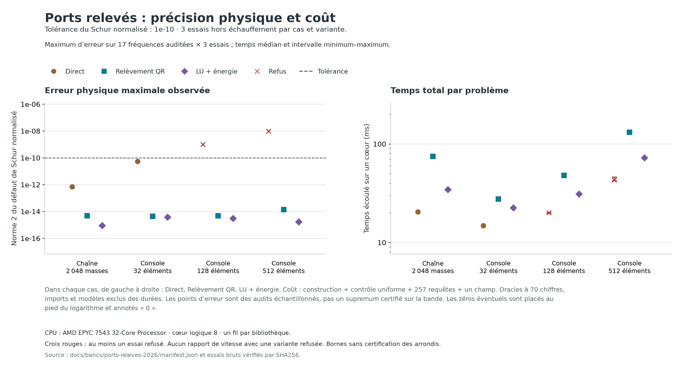
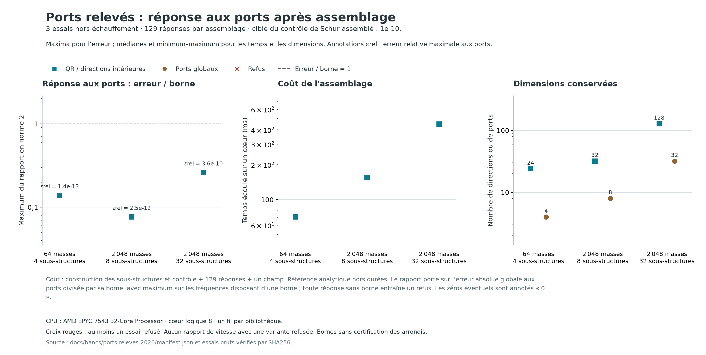

# Ports relevés en énergie : précision, coût et assemblage

Travail de recherche du 7 septembre 2026, après le
[prototype Krylov/HCB](PORTS_KRYLOV_PROTOTYPE.md). Le logiciel reste en
version 0.9.0 : ces interfaces de recherche ne sont pas encore des éléments
du noyau multicorps non linéaire.

Le problème traité est concret : la précédente réduction pouvait annoncer
une erreur inférieure à 1e−12 tout en produisant un écart de Schur d'environ
1e−8. Le calcul soustrayait de grandes contributions statiques, et la
matrice de raideur assemblée avait déjà perdu de l'information. Les nouveaux
algorithmes conservent le facteur élémentaire d'énergie et contrôlent
séparément la réduction, le modèle calculé et la réponse assemblée.

## Le changement mathématique

Une énergie quadratique s'écrit E(u) = ½‖Du‖². Former K = DᵀD puis son
complément de Schur peut détruire une petite raideur. Par exemple,

    D = [[1, 1], [0, epsilon]]

donne une raideur de port epsilon² lorsque la première colonne est
éliminée. Pour epsilon = 1e−9, l'entrée 1+epsilon² s'arrondit à 1
en double précision. L'information est perdue dans K. Une élimination
orthogonale de D conserve directement le résidu epsilon.

Pour les interfaces physiques, le QR partitionné donne

    Qᵀ[D_I, D_S W] = [[R, P], [0, E]].

Le relèvement statique est −R⁻¹P dans les coordonnées factorisées et la
raideur d'interface est EᵀE. Le prototype équilibre les colonnes intérieures
puis rétablit les coordonnées physiques lors de la reconstruction,
selon les formules du carnet. Son QR utilise des rotations de Givens creuses,
sans matrice orthogonale globale dense, avec un budget de remplissage.

Le [carnet de preuves](PORTS_RELEVEMENT_PREUVES.md) dérive également le
cas d'un relèvement approché Ψ et d'un couplage de masse M_IS non nul.
En posant L = [Ψ; I]W, K0 = LᵀKL, M0 = LᵀML,
R0 = (K_II Ψ+K_IS)W et C = (M_II Ψ+M_IS)W, on obtient exactement

**S(z) = K0−zM0−(R0−zC)ᵀ(K_II−zM_II)⁻¹(R0−zC).**

Le défaut R0 reste dans le calcul. Si le relèvement est exact, le
transfert dynamique est multiplié par z² ; la réponse statique et la
masse de contrainte sont déjà représentées. La réduction Krylov porte
sur les charges [R0, λ_*C], avec un contrôle sur toute la bande.

La deuxième voie utilise une LU creuse comme préconditionneur, puis
corrige les résolutions avec des résidus calculés depuis D. Les produits,
les Gram et l'énergie du port utilisent D directement. Les corrections
qui aggravent le résidu sont écartées. Une LU numériquement inutilisable
est refusée ; il n'y a pas de basculement automatique caché entre méthodes.

Ces principes ont des antériorités établies. Le dossier de
[six sources primaires](PORTS_RELEVEMENT_SOURCES.md) précise notamment
l'équivalence QR/Schur publiée en 2021, les conditions de précision
relative du QR et les limites des Gram formés en flottants. Il distingue
ces résultats de leurs transferts mécaniques et des prépublications récentes.

## Un contrôle indépendant du modèle utilisé pour calculer la base

Les facteurs QR arrondis ne sont pas déclarés égaux à D. Pour un champ
candidat X de trace imposée, son énergie et son résidu sont réévalués dans
**D d'entrée**. Sous K_II ≥ λ_* M_II et z < λ_*, on dispose de

**erreur d'énergie ≤ ‖résidu‖²_(M_II⁻¹) / (λ_*−z).**

Une expansion de la petite résolvante borne le résidu sur toute la bande.
Des différences entre petites projections bornent aussi l'écart entre
le Schur renvoyé et l'énergie réelle de ce candidat. Le contrôle final
inclut ces deux contributions. Il peut donc auditer une base construite
par QR ou par LU corrigée, sans supposer leur exactitude.

L'évaluation des résidus, des produits et des bornes spectrales reste en
flottants ordinaires. Le statut est un **majorant calculé sous hypothèses**,
avec satisfaction numérique du seuil ; la certification machine par
arrondis encadrés reste à établir.

## Références indépendantes et périmètre des mesures

Les oracles utilisent Decimal à 70 chiffres, avec contrôle à 90 chiffres,
sans dépendance supplémentaire. La condensation se fait par petits blocs
en O(n), sans matrice globale dense. Deux modèles sont distingués :

- les paramètres physiques de la console, recomposés en haute précision ;
- les coefficients binaires exacts de D et M, dont le Gram est formé
  uniquement en haute précision.

Leurs écarts avec la raideur native en double précision sont conservés.
Les méthodes représentent la même mécanique, mais n'utilisent pas des
matrices flottantes identiques : c'est précisément l'effet étudié.

Les cas locaux comparent le prototype direct sur K natif, le relèvement
QR et le relèvement avec LU corrigée. La construction, le contrôle
uniforme, 257 requêtes et un champ sont comptés ; imports, assemblage
du modèle et oracles sont exclus. Les nombres de directions sont
adaptatifs. Le seuil est 1e−10 dans la métrique statique des ports.

Ces temps ne sont pas des mesures d'Exudyn, de MBDyn ou de Simpack.
Ils ne peuvent pas classer une variante qui échoue au seuil demandé.

## Résultats de la campagne archivée

L'[archive des 60 essais](bancs/ports-releves-2026/manifest.json) conserve
48 essais locaux et 12 assemblages, références et sources exécutées.
Chaque essai part dans un processus frais, fixé au CPU logique 8 d'un
AMD EPYC 7543. Un fil est demandé aux bibliothèques ; la première des
quatre répétitions est exclue. L'ordre des variantes locales tourne à
chaque répétition. Les erreurs ci-dessous sont les maxima des audits
contre l'oracle physique ; les temps sont les médianes.

| Cas | Direct : erreur / temps | QR : erreur / temps | LU + énergie : erreur / temps |
|---|---:|---:|---:|
| Chaîne, 2 048 masses | 6,95e−13 / 20,47 ms | 4,88e−15 / 74,56 ms | 8,88e−16 / 34,32 ms |
| Console, 32 éléments | 5,44e−11 / 14,86 ms | 4,50e−15 / 27,68 ms | 3,67e−15 / 22,49 ms |
| Console, 128 éléments | **9,93e−10, refus** / 19,97 ms | 4,91e−15 / 48,01 ms | 2,98e−15 / 30,91 ms |
| Console, 512 éléments | **9,53e−9, refus** / 43,06 ms | 1,40e−14 / 131,19 ms | 1,68e−15 / 72,36 ms |

Les deux voies relevées passent tous les cas locaux au seuil 1e−10.
La voie directe passe la chaîne et la petite console ; elle est alors
plus rapide. Sur les deux grandes consoles, son temps accompagne un
résultat refusé. Il ne donne pas un rapport de vitesse à précision commune.

Les consoles relevées conservent 18 directions intérieures, contre 24
pour la voie directe ; ajouter six coordonnées de port. La LU corrigée
est plus rapide que le QR dans cette campagne. Cela motive de conserver
les deux voies : le QR réussit aussi le contre-exemple où la formation
du Gram détruit le rang, qui fait refuser la LU.

**Le nouvel oracle affine l'interprétation du bilan précédent.** Sur la
console de 128 éléments, l'écart d'environ 1e−8 entre deux calculs
ordinaires n'était pas l'erreur exacte du prototype. La référence à
70 chiffres situe l'erreur de la voie directe près de 1e−9 ; une partie
de l'écart provenait de la référence en double précision. Le refus à
1e−10 reste justifié. L'ancienne archive est conservée, sans remplacement
de ses observations.

Les limites de précision ne sont pas supprimées universellement. Les
bornes finales des voies relevées sont de l'ordre de 1e−14 à 4e−13 sur
ces cas, avec audits physiques autour de 1e−15 à 1e−14. Cela vérifie
le seuil demandé sur les essais ; les arrondis restent non certifiés.

## Composition des sous-structures

Les applications de ports expriment les déplacements locaux à partir
des coordonnées globales. Les majorantes locales s'assemblent par
congruence. Lorsque le défaut entre modèles est inclus, l'encadrement
est **bilatéral** : le signe de l'erreur du Schur renvoyé n'est pas
supposé positif.

Si b majore l'erreur globale et si σ_min(S_r) > b, la réponse calculée
u_r satisfait le contrôle conditionnel

**‖u−u_r‖ ≤ b ‖u_r‖ / [σ_min(S_r)−b].**

Cela traite aussi les fréquences où le Schur global est indéfini.
La coercivité des intérieurs ne garantit pas la stabilité de
l'assemblage : près d'une résonance globale, cette borne peut devenir
grande ou ne plus permettre de conclure.

Le témoin construit chaque segment indépendamment, sans réutilisation
par périodicité. Les masses aux interfaces sont partagées et une correction
de masse au bout retrouve exactement le modèle de chaîne d'origine.
Les ports de racine sont fixés par l'application de liaison ; les
déplacements et le champ reconstruit sont confrontés à la solution
analytique globale.

| Chaîne / segments | Directions internes + ports | Erreur relative maximale aux ports | Erreur du champ à Ω | Total |
|---|---:|---:|---:|---:|
| 64 / 4 | 24 + 4 | 1,43e−13 | 1,42e−11 | 70,79 ms |
| 2 048 / 8 | 32 + 8 | 2,53e−12 | 6,27e−10 | 155,62 ms |
| 2 048 / 32 | 128 + 32 | 3,55e−10 | 1,75e−13 | 449,26 ms |

Les 129 réponses aux ports de chaque essai sont sous leur majorant
calculé ; le plus grand rapport erreur/borne est 0,261. Le seuil 1e−10
porte sur le contrôle du Schur assemblé. La tolérance de chaque segment
est divisée par deux fois le nombre de segments, selon les applications
de ports utilisées. La borne de déplacement tient ensuite compte de
la stabilité globale ; elle n'impose pas une erreur relative constante.

Le champ complet est audité au bord supérieur de la bande. Son erreur
atteint 6,27e−10 avec huit segments : une petite erreur de Schur ne suffit
pas à imposer le même seuil au champ intérieur. Un contrôle uniforme des
observables du champ reste à ajouter.

Ces assemblages sont plus coûteux que la réduction monolithique sur la
chaîne uniforme testée. Ils valident ici la composition et le contrôle
des réponses. Le bénéfice d'une réutilisation ou d'une préparation
parallèle devra être mesuré sur des modèles qui en ont besoin.

## Limites pour le noyau généraliste

Le domaine testé demeure linéaire, sans amortissement, avec intérieurs
coercifs. Le facteur de la console provient des déformations élémentaires
du modèle intégré, droit et non précontraint. Pour une énergie non
linéaire, la tangente comporte aussi les dérivées géométriques pondérées
par les contraintes internes ; elle ne se réduit pas toujours à DᵀD.
Cette partie, la gyroscopie, le contact et l'évolution des interfaces
doivent être traités explicitement avant une intégration générale.

La précision des champs, les sensibilités des bases adaptatives et les
coûts d'une trajectoire complète restent des exigences distinctes.
L'amélioration de cette brique ne prouve pas une avance globale sur
les meilleurs solveurs.

## Reproduction

    OPENBLAS_NUM_THREADS=1 python ci/test_energie_ports.py
    OPENBLAS_NUM_THREADS=1 python ci/test_reference_ports_precision.py
    OPENBLAS_NUM_THREADS=1 python ci/test_ports_releves.py
    python ci/mesure_ports_releves.py --verifier docs/bancs/ports-releves-2026
    python ci/mesure_ports_releves.py --sortie /tmp/ports-releves-nouveaux --cpu 8
    python ci/trace_ports_releves.py --assemblage

Les 28 nouveaux tests couvrent les deux oracles, le rang perdu dans un
Gram, les couplages de masse, les défauts injectés et l'assemblage.
L'environnement de mesure est la roue 0.9.0 figée, avec Python 3.14.7,
NumPy 2.5.3 et SciPy 1.18.1. La CI locale vérifie les contre-épreuves
et l'intégrité des sources, références et essais archivés.
