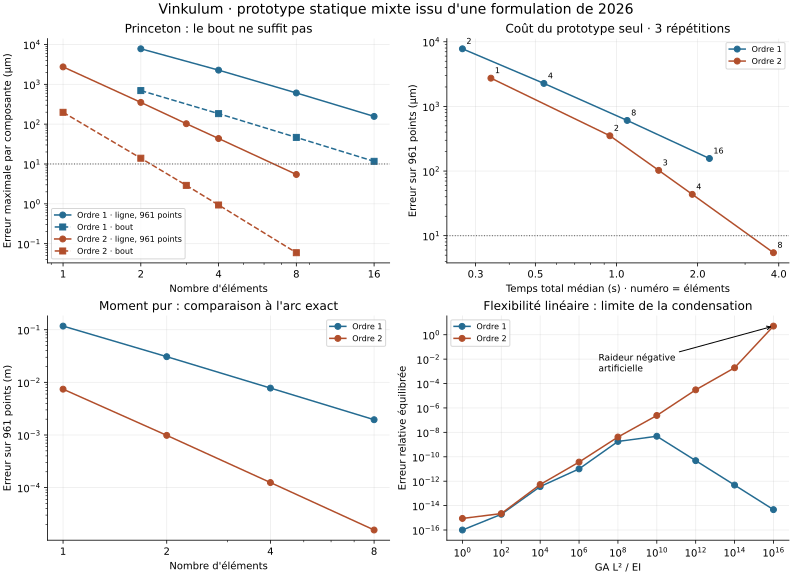

# Poutre mixte : transfert d'une formulation de 2026

Point du 7 septembre 2026. **Un prototype Rust exécuté, sans ajout à l'API
distribuée de Vinkulum 0.7.2.** Il améliore la convergence spatiale avec des
éléments quadratiques, mais son coût et sa condensation aux rapports de
raideurs extrêmes empêchent de le retenir comme remplacement du noyau.

Le point de départ est le préprint de **Humer, Steinbrecher et Pechstein**,
*Mixed Finite Elements for Geometrically Exact Beams using Discontinuous
Rotations and Discrete Curvature*, mai 2026. Sa forme hybride utilise des
rotations internes discontinues et des moments indépendants ; les poses
nodales restent les inconnues globales. Les sections 2–3 ont été étudiées,
notamment la forme variationnelle (49), la séparation multiplicative (51)
et l'intégration réduite de la section 3.3.
[Source primaire](https://arxiv.org/html/2605.04573v1).

L'implémentation ci-dessous est une dérivation propre spécialisée aux
éléments droits d'ordres 1 et 2, à coefficients matériels constants. Aucun
code de solveur tiers n'a été consulté. Ce travail ne reproduit pas tous
les cas ni tous les ordres de l'article, et ne vaut pas validation de
l'ensemble de ses résultats.

## Résultats mesurés

Le cas Princeton est une console anisotrope de longueur 0,508 m, sous une
force terminale de 8,896 N répartie également entre les directions y et z.
Les coefficients sont ceux de la
[confrontation 0.7.2](CONFRONTATION_MBDYN_0.7.2.md). L'erreur est ici
mesurée **au bout et sur 961 positions de la ligne moyenne**, à la même
abscisse matérielle que la référence continue. C'est un maximum par
composante sur cette grille, pas une borne certifiée entre les échantillons.

| Ordre | Éléments | Erreur au bout | Erreur sur la ligne | Temps total médian |
|---|---:|---:|---:|---:|
| 1 | 2 | 695,7 µm | 7 784,7 µm | 0,268 s |
| 1 | 4 | 183,6 µm | 2 267,7 µm | 0,538 s |
| 1 | 8 | 46,51 µm | 606,49 µm | 1,095 s |
| 1 | 16 | 11,67 µm | 156,43 µm | 2,212 s |
| 2 | 1 | 198,06 µm | 2 735,13 µm | 0,342 s |
| 2 | 2 | 13,97 µm | 351,40 µm | 0,945 s |
| 2 | 3 | 2,906 µm | 102,52 µm | 1,434 s |
| 2 | 4 | 0,935 µm | 43,60 µm | 1,910 s |
| 2 | 8 | 0,0593 µm | 5,453 µm | 3,823 s |

Le gain au bout ne suffit pas à qualifier la forme entière : trois éléments
quadratiques passent sous 10 µm au bout, huit sur la grille complète.
À huit éléments, l'ordre 2 divise l'erreur sur la ligne par environ 111
face à l'ordre 1, pour un temps multiplié par 3,49. Sur les maillages les
plus fins, l'erreur de l'ordre 2 décroît approximativement comme h⁴ au bout
et h³ sur la ligne.

La campagne conserve **36 exécutions** : neuf configurations, un échauffement
et trois répétitions chacune. Toutes convergent aux cinquante paliers
cosinus, avec résidu global inférieur à 10⁻⁸ et résidu interne inférieur à
10⁻⁹. Les profils des répétitions sont identiques. Le plus grand résidu
global accepté vaut 9,804×10⁻⁹ ; le plus grand résidu interne final vaut
9,404×10⁻¹⁰. Forces et moments sont contrôlés dans leurs unités SI,
sans prétendre à une invariance du critère sous changement d'unités.



Les mesures utilisent un seul processus à la fois, sur le CPU logique 8
d'un AMD EPYC 7543, avec les bibliothèques limitées à un fil. Le temps total
inclut le démarrage de l'exécutable, les paliers, le contrôle final et la
sortie JSON des 961 positions. Le temps interne exclut ce dernier contrôle
et la sortie. Le pic RSS observé est de 3 584 KiB ; la pile réservée au fil
de calcul est de 16 MiB, qui ne sont pas tous résidents.

**Aucun gain de vitesse face à la version livrée ou à MBDyn n'est établi.**
La confrontation précédente, limitée au déplacement terminal de Princeton,
donnait 0,387 s pour Vinkulum intégrée et 0,0186 s pour MBDyn. Le prototype
prend déjà 1,434 s avec trois éléments. Les politiques de chargement,
d'assemblage et de sortie diffèrent : ces nombres montrent un surcoût dans
les protocoles exécutés, sans constituer un classement des seuls noyaux.
MBDyn et Simpack n'ont pas été réexécutés dans cette campagne du prototype.

## Référence indépendante des éléments finis

[Le programme de tir continu](../ci/reference_cosserat.py) résout les
équations statiques de Cosserat, avec force spatiale F constante :

\[
r'=R(e_1+C_n^{-1}R^T F),\qquad
R'=R\widehat{C_m^{-1}R^T m},\qquad
m'=-r'\times F.
\]

La racine est encastrée, et les trois composantes de son moment interne
sont ajustées pour obtenir m(L)=0. Le tir suit seize charges croissantes.
L'intégration DOP853 est répétée aux tolérances relatives 10⁻¹⁰ et 2×10⁻¹².
Le raffinement change la position d'au plus **3,77×10⁻¹² m** sur la grille.
La référence fine donne au bout, en mètres :

```text
[0.49361034104015267, 0.10904308312500496, 0.008888885967018935]
```

Le défaut d'orthogonalité de la référence fine reste sous 2×10⁻¹³ ; celui
de conservation de m+r×F sous 2,3×10⁻¹⁵ N·m. Cette référence est indépendante
des discrétisations de Vinkulum et MBDyn, mais reste une solution numérique
sur la branche suivie par continuation, sans preuve d'unicité globale.

## Spécialisation et condensation

Pour un élément de longueur L, les rotations des sections aux extrémités
sont les orientations des corps multipliées par le repère matériel de
l'élément. Cela permet de définir des branches initialement inclinées.
La rotation interne s'écrit R_E(ξ)=R̄ exp(ξ â), avec ξ dans [−1,1].
Au premier ordre a=0 ; au second ordre a est une inconnue locale.

La ligne moyenne est linéaire à l'ordre 1. À l'ordre 2, une bulle locale b
ajoute L(1−ξ²)b à l'interpolation des deux positions terminales. Il reste
ainsi trois inconnues internes à l'ordre 1, neuf à l'ordre 2 : rotation
moyenne, pente de rotation et bulle de position. La partie extension et
cisaillement utilise respectivement un et deux points de Gauss.

Les moments polynomiaux sont éliminés analytiquement avant Newton. Avec
Hᵢⱼ=∫NᵢNⱼ ds, les coefficients de courbure discrète qᵢ comprennent la
courbure intérieure et les sauts de rotation aux extrémités. Leur énergie
condensée vaut :

\[
U_\kappa=\tfrac12\sum_{ij}(H^{-1})_{ij}\,q_i^T C_m q_j.
\]

En posant θ_A=log(R_E(−1)ᵀR_A) et θ_B=log(R_E(+1)ᵀR_B), la spécialisation
employée est :

\[
\begin{array}{ll}
k=1:&q=(-\theta_A,\theta_B),\quad
LH^{-1}=\begin{pmatrix}4&-2\\-2&4\end{pmatrix},\\[4pt]
k=2:&q=(a/3-\theta_A,4a/3,a/3+\theta_B),\quad
LH^{-1}=\begin{pmatrix}9&-1.5&3\\-1.5&2.25&-1.5\\3&-1.5&9\end{pmatrix}.
\end{array}
\]

Le programme différencie cette énergie par jets emboîtés. Il résout
l'équilibre interne puis forme le complément de Schur de la Hessienne.
Pour les rotations gauches, la conversion vers la dérivée du gradient
spatial soustrait la moitié de la matrice antisymétrique du moment
résiduel au bloc rotationnel. Cette correction est vérifiée en perturbant
indépendamment les poses et en redifférenciant le gradient spatial.

La résolution locale équilibre ses coordonnées, contrôle le gradient
original et exige une Hessienne interne positive à convergence. Les
recherches de pas locales et globales utilisent aussi la correction
prédite par la factorisation courante. Une différence d'énergies seule
devient mal résolue à proximité de l'équilibre d'un élément très raide.
Le prototype assemble des matrices globales denses et recalcule des
Hessiennes lors des recherches de pas ; il n'a pas été optimisé.

## Contrôles physiques et limites constatées

Les **huit tests passent**, dont trois contrôles AD existants et cinq
contrôles physiques propres au prototype :

- Flexibilité terminale linéaire de Timoshenko anisotrope, pour les deux
  ordres, et six modes rigides de l'élément libre.
- Invariance de l'énergie et covariance des forces et moments après
  superposition d'une translation et d'une rotation rigides.
- Tangente condensée comparée aux différences centrées du gradient spatial.
  Quatre pas de différence confirment la convergence ; l'erreur relative
  minimale vaut 7,82×10⁻¹¹ à l'ordre 1 et 2,57×10⁻⁹ à l'ordre 2.
- Convergence d'ordre quatre du déplacement terminal sous moment pur,
  avec angle terminal de 1 radian vérifié séparément.
- Équilibre d'une jonction à trois branches, y compris le bilan spatial
  du couple produit par deux forces opposées.

Les huit sondages supplémentaires sous moment pur comparent toute la
ligne à l'arc analytique r(s)=(sin s,1−cos s,0), sur une console de 1 m.
À huit éléments, l'ordre 2 donne 0,0476 µm d'erreur au bout et 15,64 µm
sur la ligne. Une exactitude terminale n'est donc pas une exactitude de
la géométrie. L'interpolation intégrée déjà présente dans Vinkulum peut
représenter l'arc à courbure constante avec un seul élément ; ce prototype
polynomial n'a pas cet avantage.

Les vingt sondages de flexibilité linéaire explorent GA L²/EI de 1 à 10¹⁶,
puis EI=0. L'erreur de flexibilité est normalisée composante par composante
par la racine du produit des flexibilités diagonales exactes. À l'ordre 2,
elle atteint 3,05×10⁻⁵ à 10¹², 1,96×10⁻³ à 10¹⁴, puis 5,09 à 10¹⁶.
Dans ce dernier cas, la plus petite valeur propre de la raideur condensée
vaut −0,245 alors que la console linéaire devrait être stable. Cette perte
de stabilité est observée dans notre condensation en double précision ;
elle ne démontre pas un défaut de la formulation en arithmétique exacte.
L'erreur n'est pas monotone, notamment à l'ordre 1. Sur la figure, une
erreur calculée nulle est placée à 10⁻¹⁶ pour l'affichage logarithmique.

Avec EI=0, les deux ordres refusent l'équilibre interne. Le câble au repos
sans tension possède des mécanismes physiques : ce refus ne caractérise
pas le comportement d'un câble tendu. La limite du câble en charge reste
à traiter. Le logarithme de rotation refuse également le voisinage de sa
coupure à π ; aucune robustesse globale vis-à-vis des branches de rotation
n'est revendiquée.

La dynamique, les inerties internes, les charges distribuées, le flambement,
les contacts et les adjoints ne sont pas implémentés dans cet exemple.
La condensation statique ne définit pas à elle seule les modes dynamiques.
L'intégration au noyau exigera une condensation plus stable, un coût réduit
et des contrôles sur ces couplages généralistes. Le prototype ne démontre
aucune supériorité générale sur MBDyn ou Simpack.

## Reproduction et provenance

Le [manifeste](bancs/poutre-mixte-2026.json) lie les binaires et les sources
mesurés à une [archive compressée](bancs/poutre-mixte-2026-donnees.json.gz).
Celle-ci contient les sorties brutes, les répétitions, les références
continues, les sondages, les sources et le journal des tests. Son
vérificateur recalcule les erreurs et les bilans physiques. Les tests
Rust et la vérification de cette archive entrent dans la CI locale.

Dans un environnement de vérification Vinkulum avec SciPy et NumPy :

```bash
cargo build --release --example poutre_mixte --example poutre_mixte_sondes
cargo test --release --example poutre_mixte
OPENBLAS_NUM_THREADS=1 python ci/reference_cosserat.py /tmp/reference-mixte.json
taskset -c 8 python ci/mesure_poutre_mixte.py \
  --executable target/release/examples/poutre_mixte \
  --reference /tmp/reference-mixte.json --sortie /tmp/campagne-mixte
python ci/sonde_poutre_mixte.py \
  --executable target/release/examples/poutre_mixte \
  --sondes target/release/examples/poutre_mixte_sondes \
  --sortie /tmp/sondages-mixte.json
python ci/archive_poutre_mixte.py --verifier docs/bancs/poutre-mixte-2026
```

Choisir un CPU autorisé sur la machine de reproduction. Le dossier de
campagne doit être nouveau ; ne lancer aucune compilation pendant les
mesures. Le tracé se régénère avec Matplotlib par
`python ci/trace_poutre_mixte.py docs/bancs/poutre-mixte-2026`.
