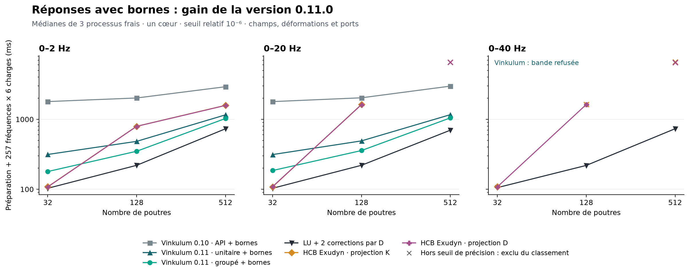

# Réponses avec bornes : Vinkulum 0.10.0, 0.11.0 et HCB Exudyn

La 0.11.0 partage les calculs indépendants des charges dans l'API publique.
Sur 128 poutres jusqu'à 20 Hz, six charges avec leurs bornes passent de
**2,029 à 0,358 s**, préparation comprise : **5,68×**. Les appels unitaires
successifs bénéficient également du partage et prennent **0,491 s**.
Le témoin HCB Exudyn le plus rapide retenu prend **1,619 s** ; le gain
local est **4,53×**. La LU corrigée reste plus rapide, à **0,220 s**.

## Résultats conservés

Temps totaux en secondes, médianes de trois processus frais après un
échauffement séparé, pour 257 fréquences × six charges. **† : hors seuil
physique, exclu du classement**. Un refus n'est pas un temps nul.

| Poutres | Bande Hz | API 0.10 | API 0.11 unitaire | API 0.11 groupée | LU corrigée | HCB K | HCB D |
| ---: | --- | ---: | ---: | ---: | ---: | ---: | ---: |
| 32 | 0–2 | 1,792 | 0,314 | 0,179 | 0,103 | 0,109 | 0,108 |
| 32 | 0–20 | 1,790 | 0,313 | 0,185 | 0,103 | 0,108 | 0,109 |
| 32 | 0–40 | refus | refus | refus | 0,106 | 0,108 | 0,108 |
| 128 | 0–2 | 2,016 | 0,484 | 0,349 | 0,220 | 0,794 | 0,792 |
| 128 | 0–20 | 2,029 | 0,491 | 0,357 | 0,220 | 1,630 | 1,619 |
| 128 | 0–40 | refus | refus | refus | 0,219 | 1,635 † | 1,626 |
| 512 | 0–2 | 2,920 | 1,157 | 1,027 | 0,732 | 1,584 | 1,577 |
| 512 | 0–20 | 2,978 | 1,164 | 1,046 | 0,698 | 6,561 † | 6,524 † |
| 512 | 0–40 | refus | refus | refus | 0,733 | 6,592 † | 6,508 † |

[Bilan, médianes et plages](bancs/reponses-groupees-0.11.0/bilan.json) ·
[Manifeste](bancs/reponses-groupees-0.11.0/manifest.json) ·
[Figure vectorielle](figures/reponses-groupees-0.11.0.svg)



La préparation et les réponses restent séparées dans le bilan. Sur 512
poutres à 20 Hz, le lot 0.11.0 prend **0,821 s de préparation** et
**0,225 s de réponses**, contre 0,819 et 2,160 s en 0.10.0. La phase de
réponse est accélérée d'environ **9,6×**, le total de **2,85×** seulement.
Les médianes des phases ne s'additionnent pas nécessairement exactement
à la médiane des totaux. La préparation représente environ 78 % du coût
et n'est pas optimisée par ce lot.

Les trois voies Vinkulum passent **6 cas sur 9** et refusent les trois
bandes à 40 Hz, comme en 0.10.0. Elles conservent 12 directions intérieures
à 2 Hz et 18 à 20 Hz. La pire erreur relative d'opérateur de la voie
groupée est **5,56 × 10⁻⁹**, dans le seuil demandé **10⁻⁶**.
La LU corrigée passe les neuf cas et demeure plus rapide au total sur
les six cas Vinkulum acceptés. HCB K passe six cas, HCB D sept.

Le cas HCB K, 128 poutres et 40 Hz, était qualifié dans la campagne 0.10.0.
Ici l'erreur relative d'opérateur au port varie entre **8,04 × 10⁻⁷** et
**1,93 × 10⁻⁶** sur les répétitions mesurées ; l'échauffement dépasse
également le seuil. Ce cas est donc exclu. Les entrées, versions et choix
de rang sont les mêmes ; cette variabilité observée appelle une étude de
reproductibilité du calcul modal et de la projection, sans attribution
causale démontrée. Les mesures précédentes sont conservées sans modification.
Les échecs des deux projections à 512 poutres sur 20/40 Hz persistent.
Aucun réglage HCB supplémentaire n'a été cherché dans cette campagne.

## Ce qui est mathématiquement partagé

À fréquence et réduction fixées, soit S le Schur réduit, X le relèvement
et F la matrice des forces normalisées. Toutes les colonnes vérifient

\[
SY=F,\qquad U=XY.
\]

Une seule factorisation de S et un seul calcul de X suffisent. Si
l'enveloppe du Schur vaut ε et si σ_min(S)>ε, la colonne j conserve
le majorant de port

\[
b_j=\frac{\|F_j-SY_j\|_2+\varepsilon\|Y_j\|_2}
{\sigma_{\min}(S)-\varepsilon}.
\]

Pour chaque norme physique N, le majorant de champ conserve sa forme
`défaut intérieur local + amplification du relèvement × b_j`, décrite
dans les [preuves du contrôle de champ](CHAMP_INTERIEUR_PREUVES.md).
Le partage porte sur S, sa marge, X et les amplifications ; les résidus,
champs, normes et bornes restent propres à chaque colonne. L'identité est
élémentaire : le gain vient de son transfert dans l'API, sans revendication
d'un théorème inédit.

Le stockage supplémentaire d'un relèvement local est O(n_i p_i) par
composant, sans extension à tous les ports globaux. Une seule fréquence
est retenue entre les appels ; les tableaux de sortie coûtent O(n k).
Reconstruire k champs exige toujours d'écrire ces n k valeurs. Réduire ce
coût asymptotique demanderait un contrat de sortie différent, par exemple
des observables seulement, à comparer séparément.

**La norme du champ n'est pas évaluée dans un Gram réduit.** Si deux
colonnes de X presque égales se compensent, `yᵀ(XᵀX)y` peut s'arrondir
à zéro alors que `Xy` reste non nul. La régression fixe ε=2⁻³⁰ et obtient
ce témoin exactement dans le calcul binary64. Le code forme le champ,
puis D fois ce champ pour sa déformation. Les Gram servent uniquement
aux normes maximales d'opérateur ; leurs arrondis restent non certifiés.

## Protocole, juge et mémoire

Les [modèles et oracles de la confrontation 0.10.0](CONFRONTATION_PORTS_EXUDYN_0.10.0.md)
sont réutilisés : consoles natives en aluminium de 1 m, section 40 × 6 mm,
32/128/512 poutres de Timoshenko intégrées, masses nodales et six charges
terminales. D, M, métrique et charges sont les mêmes pour toutes les voies.
La référence vise les coefficients binary64 de `DᵀD − ω²M`, avec
résolution indépendante Decimal à 70 et 90 chiffres. Leur concordance
est contrôlée dans les trois normes et pour les combinaisons de charges.
L'erreur de discrétisation du continuum n'est pas évaluée par ce juge.

Chaque méthode doit passer les normes massique, déformation et port,
pour les six colonnes **et toutes leurs combinaisons linéaires à chaque
fréquence testée**. Ce contrôle par quotient d'opérateurs ne certifie pas
les intervalles entre les 257 points. Les bornes internes Vinkulum sont
confrontées séparément aux erreurs absolues des six colonnes, avec marge
`64 × epsilon_machine × norme_reference`. Elles couvrent ces erreurs
dans tous les essais terminés. C'est un diagnostic flottant, sans preuve
machine ; la borne relative massique maximale à 512 poutres et 20 Hz
reste **3,80 × 10⁻⁴**, donc plus conservatrice que le juge commun.

La campagne contient **216 essais**, 54 échauffements et 162 mesures.
Ordre des variantes inversé un passage sur deux, CPU logique 8, un fil
par bibliothèque, Python 3.14.7, NumPy 2.5.3, SciPy 1.18.1. Les champs
complets et leurs normes sont produits par tous ; les trois API Vinkulum
produisent en plus leurs bornes, dont le coût est inclus. Les imports,
lecture des mêmes entrées et juge de référence sont hors chronomètre.
Les tailles HCB proviennent de la grille précédente : aucun optimum
global de rang ou de temps d'Exudyn n'est revendiqué.

Le témoin utilise la routine **HCB officielle d'Exudyn 1.11.0**, puis le
pilote documenté de projection/réponse avec deux corrections résiduelles.
Il ne mesure pas une simulation temporelle Exudyn FFRF complète.
MBDyn et Simpack ne sont pas exécutés dans cette nouvelle campagne.

La mémoire Vinkulum est mesurée par **VmHWM**, avant chargement de
l'oracle, après préallocation des sorties et calcul des empreintes par
lecture en blocs. Le pic inclut l'interpréteur, les imports et le calcul,
pas seulement le cache. Sur 512 poutres à 20 Hz, les médianes sont
**120,7 Mio** pour l'API 0.10.0, **125,1 Mio** pour l'API 0.11.0 unitaire
et **124,6 Mio** pour le lot 0.11.0. Aucun gain de mémoire n'est revendiqué.
Le `ru_maxrss` brut de l'ancien pilote LU/HCB est conservé mais exclu
de toute comparaison, en raison du pic hérité du parent déjà démontré.

## Reproduction et provenance

L'archive contient les 216 comptes rendus, les valeurs du juge par
fréquence et charge, les bornes, journaux, neuf entrées NPZ et les six
scripts exacts employés. Les références complètes sont identifiées par
empreinte et se reconstruisent avec l'oracle livré dans les sources.
Les distributions installées, extensions et modules Python sont identifiés
par leurs empreintes ; les trois environnements chronométrés sont figés.
La roue de livraison 0.11.0 reçoit ensuite le README final : son code
exécutable est comparé à celui de la roue mesurée, dans le
[contrôle de livraison](bancs/version-0.11.0.json).

Depuis un environnement avec NumPy et SciPy :

```sh
python ci/mesure_reponses_groupees.py --verifier docs/bancs/reponses-groupees-0.11.0
python ci/test_reponses_groupees_archive.py
```

Pour relancer les mesures, les trois interpréteurs doivent désigner des
installations isolées, l'affinité choisie doit être disponible, et ENTREES
contenir les NPZ et références `.ref.npy` accompagnées de leurs JSON.
Le [protocole antérieur](CONFRONTATION_PORTS_EXUDYN_0.10.0.md) décrit la
construction des données et oracles.

```sh
python ci/mesure_reponses_groupees.py --campagne SORTIE ENTREES PY010 PY011 PYEXUDYN --cpu 8
python ci/mesure_reponses_groupees.py --archiver SORTIE ENTREES ARCHIVE
```

Un premier candidat a été arrêté après découverte d'une course dans le
cache. Il n'entre dans aucun résultat ci-dessus. Un test d'entrelacement
déterministe a échoué avant la correction, puis passé avec les 27 autres
tests publics de réduction. La campagne complète a été relancée avec une
nouvelle roue figée après cette correction.

Le résultat livré corrige le coût des contrôles répétés. La préparation,
l'encadrement du complément spectral et le passage à la mécanique
non linéaire restent les obstacles suivants, avec preuves et contre-épreuves
à satisfaire avant tout classement plus général.
