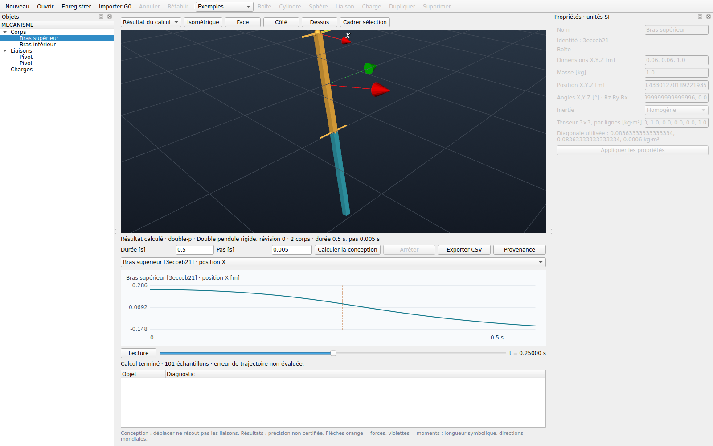
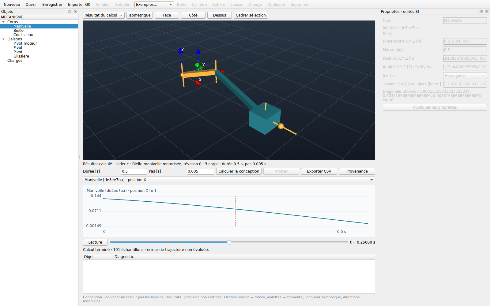

# Studio 0.2.0 — qualification de l'éditeur 3D

État au 9 septembre 2026 : implémentation et qualification automatisée Linux
terminées dans le checkout de publication. **La recette humaine sur bureau Linux
et la qualification macOS ARM64 restent ouvertes.** Cette page ne déclare donc
pas une livraison qualifiée sur les deux plateformes ni une certification du noyau.
Les modifications ne sont pas encore publiées sur le dépôt distant.

## Ce qui est utilisable

L'éditeur construit des corps rigides boîte/cylindre/sphère, pivots, rotules,
glissières et encastrements. Il propose sélection synchronisée, pose numérique
et manipulation 3D, inerties homogènes ou explicites, lois de mouvement,
forces et moments temporels, sauvegarde JSON avec UUID et historique. Les
ancrages incohérents et références supprimées produisent des diagnostics.

Le calcul utilise un noyau neuf dans un worker. Le résultat conserve le projet
capturé et affiche ses propres poses, propriétés, courbes et provenance. Les
modifications de conception pendant le calcul restent conservées. Les archives
sont bornées, validées avant allocation, sans pickle. Les fichiers G0 restent
importables. Voir le [guide utilisateur](../apps/studio/README.md).

Le noyau passe à **0.19.0**, Studio à **0.2.0**. Les deux extensions natives sont
[documentées séparément](VERSION_0.19.0.md). Le checkout privé et ses quatre
fichiers modaux en cours sont inchangés, empreintes vérifiées.

## Vérifications effectuées

Les journaux et empreintes sont archivés dans [bancs/studio-3d](bancs/studio-3d/manifest.json).
Les empreintes identifient les sources testées sur la base publique `d2191b4` ;
elles ne doivent pas être interprétées comme un commit de livraison déjà publié.

| Contrôle | Résultat observé |
|---|---|
| `ci/local.sh --bancs` | Succès, y compris fmt, clippy, preuves Lean, archives et contre-épreuves |
| Tests Rust du noyau | 88 réussis ; prototype poutre mixte : 8 réussis |
| Régressions Python principales | 209 réussies |
| Campagne de vérification | 41/41 cas réussis |
| Nouveaux efforts / repères explicites | 8 contre-épreuves Python réussies ; tangente et puissance vérifiées en Rust |
| Bancs mécaniques / contact | 46/46 et 9/9 réussis |
| Studio installé hors du dépôt | 29 tests réussis sous Qt/X11/OpenGL, aucune exclusion graphique |
| Noyau installé hors du dépôt | 41/41 vérifications et 8 contre-épreuves des nouvelles API réussies |
| Distribution et workflow | 36 modèles, 150 dépendances vérifiées ; actionlint valide |
| Concordance des roues | Modules Python comparés octet pour octet aux sources de construction |

Les recettes graphiques couvrent la création du double pendule par les champs
et dialogues, une charge linéaire, le calcul, l'animation, les exports, le
rechargement, l'annulation et les défaillances du worker. Une régression vérifie
le remplacement d'un résultat déjà affiché : aucun signal du curseur ne doit
atteindre l'ancienne scène et l'arbre/propriétés doivent suivre le nouveau projet.
Une autre protège les saisies non appliquées et le geste de déplacement pendant
la réception d'un résultat. Le test VTK exerce l'orbite par événements souris,
le picker, la transaction du manipulateur et la réutilisation des acteurs.
Il ne remplace pas un essai humain de tous les gestes.

### Références physiques

Le double pendule est comparé à des équations de Lagrange indépendantes, résolues
par DOP853 (`rtol=1e-12`, `atol=1e-14`) sur 0,5 s. L'erreur maximale d'angle
observée vaut 9,81346e-4, 2,45434e-4 et 6,13785e-5 rad pour les pas 0,01,
0,005 et 0,0025 s. Les rapports sont proches de quatre ; le seuil préétabli
est 4e-4 rad au pas fin, avec rapports supérieurs à 3,5.

La bielle-manivelle motorisée est comparée à sa fermeture géométrique analytique
avec une tolérance absolue de 1e-9 m. Les charges temporelles ont des références
de translation polynomiale, de rotation et de force déportée avec DOP853. Ces
résultats concernent les cas testés : aucune borne d'erreur générale n'est déduite.

## Rendu observé





Linux x86_64, glibc 2.39, Python 3.14.7, PySide6 6.11.2, VTK 9.7.0.
Le serveur Xvfb utilise **Mesa llvmpipe**, LLVM 20.1.2, OpenGL 4.5 : rendu
logiciel, sans mesure de GPU physique. Le rapport [desktop.json](bancs/studio-3d/desktop.json)
conserve les capacités OpenGL et les chemins des paquets installés.

Mesure d'un viewport de 1920 × 1080, 120 images après 20 images de chauffe,
mise à jour des poses, rendu synchrone et événements Qt compris :

| Corps mobiles | Médiane | 95e centile | Débit moyen |
|---|---:|---:|---:|
| 3 | 10,96 ms | 11,48 ms | 90,84 images/s |
| 32 | 11,24 ms | 11,65 ms | 87,59 images/s |

Ces scènes de mesure n'ont ni liaison ni charge. Ce sont des observations
locales, pas une garantie de 60 images/s sur tout mécanisme ou matériel.
La lecture suit l'horloge et peut sauter des échantillons d'affichage sans
modifier la trajectoire calculée.

## Reproduire et terminer la recette bureau

Après l'installation décrite dans le guide :

```sh
PY="$VIRTUAL_ENV/bin/python" bash ci/studio.sh
python ci/recette_studio_3d.py --output /tmp/vinkulum-studio-3d-recette
vinkulum-studio
```

Sur Linux sans écran, préfixer la deuxième commande par
`QT_QPA_PLATFORM=xcb xvfb-run -a -s '-screen 0 1920x1080x24'`.
Sur macOS ARM64, compiler le noyau localement ; la roue Linux
`manylinux_2_39_x86_64` ne convient pas. Exécuter les commandes depuis une session
bureau Cocoa. Le rapport doit identifier version macOS, architecture, versions
installées, résultat des tests et capacités OpenGL.

Recette humaine restant à consigner sur chaque bureau :

1. Orbiter, zoomer, cadrer et sélectionner les trois primitives ; déplacer et
   tourner à la souris, puis vérifier les valeurs et l'annulation/rétablissement.
2. Construire deux corps et une liaison, déplacer un ancrage pour provoquer un
   diagnostic, le corriger puis calculer.
3. Ouvrir la bielle-manivelle, modifier la loi du pivot et relancer ; ouvrir le
   cas de force temporelle, modifier la loi et vérifier l'aperçu puis le calcul.
4. Modifier pendant un calcul, arrêter, lire le résultat précédent, sauvegarder,
   fermer, recharger et exporter. Vérifier l'accès aux boutons avec le clavier,
   le redimensionnement et la fermeture sans worker restant.
5. Consigner les défauts ou le succès, le périphérique utilisé et le rapport de
   recette. Une exécution automatique seule ne clôt pas ces contrôles humains.

La CI GitHub configure les tests graphiques dans le job Ubuntu existant et
conserve les journaux/captures. Ce workflow modifié n'a pas encore été exécuté
sur GitHub puisque cette évolution n'est pas poussée. Aucun runner supplémentaire
n'est ajouté ; la qualification Mac n'est pas simulée par un job Linux.
