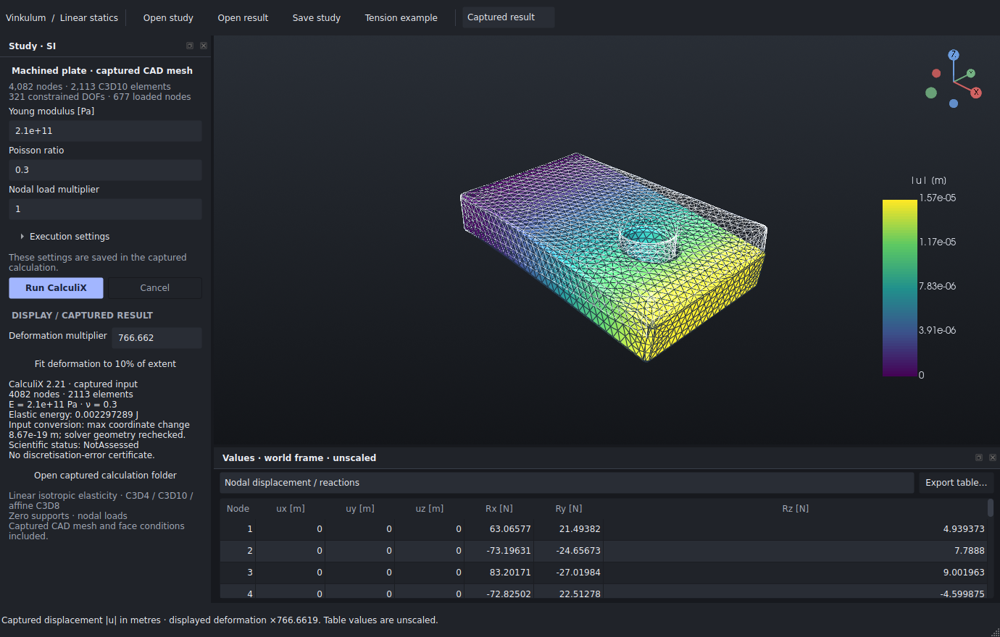

# From a CAD solid to a CalculiX study

**Experimental; included in Studio 0.6.0a1.** Select a CAD solid, generate a
tetrahedral mesh with a separate Gmsh executable using **OCCT 8 or newer**, assign
supports and loads to its captured faces, then open the CalculiX workspace.
The [Linux alpha](https://github.com/Brietat71/vinkulum-public/releases/tag/studio-v0.6.0a1-linux)
includes the workspace and a saved example. Follow
[Examples/README.md](../apps/studio/packaging/EXAMPLES.md) to inspect it without
installing the separate engines. This workflow was introduced in source 0.6.0.dev4.


## Try the workflow

1. Open the included [machined plate](../examples/studio/platine-percee.vinkulum.json)
   and select its body in the model tree.
2. Choose **Run → Static study from CAD…** (`Ctrl+Shift+M`). The new window
   captures that solid and its world placement.
3. Expand **Execution settings** and choose a Gmsh executable built with OCCT 8.
   Use quadratic **C3D10** elements and a target size of **40 mm** for this first
   plate example, then select **Generate mesh**.
4. Click faces in the view or select them in the face list. Ctrl/Shift+click
   toggles selection; dragging orbits the camera without changing the selection.
   Filtering the list preserves selected faces that become hidden.
5. Add a **Support…**, **Pressure…** or **Force…**. Give it a name and specify its
   world directions or physical values. Selecting a condition highlights its
   assigned faces. **Edit…** applies the currently selected faces to that
   condition. Add, edit and remove operations support undo/redo.
6. Set the material and optional load multiplier. **Save CAD study…** captures
   the mesh, solid, material, physical conditions and their face identities.
7. Choose **Open in CalculiX workspace**, then run an installed `ccx` executable.
   Inspect displacement, reactions, integration-point stress and elastic energy.

The generated mesh is saved automatically in a new directory. **Open mesh…**
rechecks its input, raw mesher output and log without launching either engine.
**Open CAD study…** restores saved material and boundary conditions. Ordinary
mesh-only studies remain available through the separate CalculiX workspace.

The viewport colours distinguish selected faces, supports, pressure, total
force and combined conditions. Displayed mesh lines follow the actual linear
or quadratic element edges. Extra triangles used to draw curved surfaces are
not presented as new finite elements.



## Engines and local builds

Studio does not load Gmsh libraries into the CAD or Qt process. It supervises
the executable directly and checks its `-info` output for the OCCT version.
The system Gmsh 4.12.1 / OCC 7.6.3 used in earlier investigations is refused.

The local Linux qualification used unmodified upstream sources:

| Component | Revision |
|---|---|
| OCCT 8.0.1 | [`b8f597c`](https://github.com/Open-Cascade-SAS/OCCT/tree/b8f597c677811d1f9f4d8a97f5ae2825c0353a42) |
| Gmsh 5.0.0 development source | [`91b4154`](https://gitlab.onelab.info/gmsh/gmsh/-/tree/91b4154a2ba9865335a548b1c146a38d0dea7141) |
| CalculiX | Installed `ccx` 2.21 |

The pinned Gmsh source already contains OCCT 8 adaptations. The
[Linux build recipe](../ci/build_mesher.py) collects the configuration used for
these local builds. It requires Git, CMake, Ninja, a C++ compiler and Linux/X11
development headers. It builds in the chosen directory and keeps logs:

```sh
python ci/build_mesher.py /tmp/vinkulum-mesher --jobs 4
/tmp/vinkulum-mesher/gmsh-install/bin/gmsh -info
```

Choose that executable under **Execution settings**. OCCT libraries use a local
`$ORIGIN` lookup path, while Gmsh records the absolute OCCT installation prefix.
Keep the installation at its original location; this recipe does not create a
relocatable Studio distribution. Builds can take tens of minutes. Existing clean
source checkouts can be supplied with `--occt-source` and `--gmsh-source`.

Gmsh retains its [upstream GPL licence and exceptions](https://gitlab.onelab.info/gmsh/gmsh/-/blob/91b4154a2ba9865335a548b1c146a38d0dea7141/LICENSE.txt).
OCCT retains its LGPL licence and Open CASCADE exception. Neither executable is
redistributed by this source change. The original adapter code is Apache-2.0.

## Physical meaning of the face conditions

- **Support:** zero displacement at every node of the selected mesh faces, in
  the selected world X/Y/Z directions. Admission checks whether the supports
  remove the six rigid-body modes.
- **Pressure [Pa]:** positive values act inward along the local outward-normal
  opposite direction. Consistent nodal loads integrate the triangle shape
  functions against the area vector. For a quadratic face, that integrand is
  polynomial of degree four; the degree-five triangle rule integrates it in
  exact arithmetic. The implementation still uses floating-point arithmetic.
- **Total force [N]:** one world-vector force distributed as uniform traction
  over the union of the selected faces. The surface-area integral on curved
  faces uses quadrature. This is not a point force at the CAD body's origin.

Multiple loads add. The study's load multiplier applies to physical load
conditions before their nodal assembly; it remains explicit when saved and
reopened. It does not scale zero supports or displayed geometry.

BREP and mesher coordinates are in local millimetres. The importer converts
them once into world metres and applies the captured body pose. It explicitly
converts Gmsh's C3D10 edge-node ordering to the CalculiX/VTK convention. The
[decimal transport contract](CALCULIX_NUMERIC_TRANSPORT.md) then preserves the
requested study while revalidating the coordinates actually delivered to
CalculiX's 20-character input fields.

## Captures and limits

Face identities belong to one captured mesh. Changing the CAD document does
not modify an existing study. **Capture selected solid** starts from a new
snapshot. Successfully regenerating a mesh clears all face conditions; a
failed or cancelled operation keeps the previous mesh and conditions.
These are not persistent CAD face/edge names.

Current admission budgets are **6,000 nodes and 5,000 volume elements**, one
connected solid and one tetrahedron family. Size, curvature and small CAD
features jointly affect mesh density. The 12 mm plate request exceeded these
budgets and was refused; the installed-package demonstration at 40 mm admitted
4,082 nodes and 2,113 C3D10 elements across 29 boundary groups. Refining a feature-rich part may therefore
reach the current prototype limits.

The captured plate's mesh volume differed from the BREP by approximately **0.0785%**.
This is a diagnostic, not an accuracy certificate: volume agreement cannot
bound stress error. Exact local Jacobian checks do not establish global
injectivity, absence of distant intersections or fidelity of the boundary to
the original CAD surface. A mesh-convergence study is still required before
interpreting local stress concentrations.

The [qualification capture](bancs/studio-cad-meshing-060/README.md) includes the
full mesh/calculation example and its checks. To repeat the real GUI recipe in
an installed source-version environment:

```sh
xvfb-run -a -s '-screen 0 1600x1100x24' \
  python ci/studio_mesh_recipe.py /tmp/vinkulum-plate-demo \
  --gmsh /tmp/vinkulum-mesher/gmsh-install/bin/gmsh
```

That plate example checks the complete workflow and numerical balances. It is
not an analytic elasticity reference. Independent traction and bending cases
remain in the adapter's [tetrahedral qualification](STUDIO_TETRAHEDRA.md).
Rerunning the parallel mesher can change node counts and connectivity slightly;
reproduction means preserving and rechecking each captured run, not promising
bitwise identical meshes on every run or platform.
