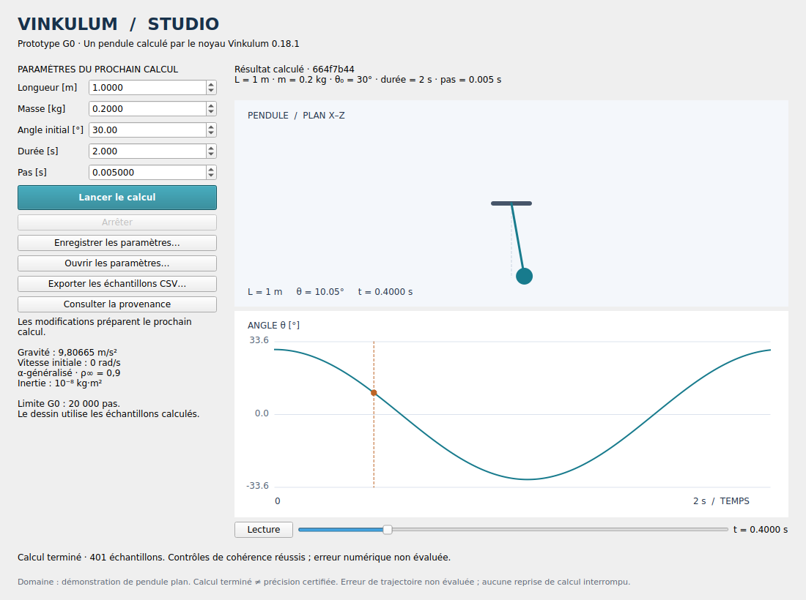

# Vinkulum Studio 0.1.0 — recette L0/G0 et suites prioritaires

État du 9 septembre 2026. Application optionnelle dans `apps/studio`, ajoutée
sur le checkout `2da2f443788c9534e77dccd273de6b5717f03ef7`. Le noyau installé
reste **0.18.1**. Aucun fichier de son implémentation Rust/Python, manifeste
ou verrou Cargo n'est modifié. Le checkout de travail privé et ses modifications
modales en cours restent intacts.

Le [cahier des charges v1.1](../outputs/Cahier_des_charges_suite_ingenierie_Vinkulum.md)
est conservé tel que fourni. Sa référence historique au noyau privé 0.18.0
n'est pas réécrite : la présente recette identifie le socle effectivement utilisé.

## Livrable

Le [guide de lancement](../apps/studio/README.md) décrit l'installation. Le
paquet `vinkulum-studio` possède sa propre version **0.1.0** et une roue Python
sans binaires Qt intégrés. Il dépend de Vinkulum 0.18.1 et PySide6 6.11.2.
Le numéro du noyau reste inchangé puisque son paquet et son API ne changent pas.

La fenêtre ouvre le pendule préchargé et propose cinq paramètres avec unités.
Lancer capture un objet immutable, construit un noyau neuf dans un processus
et reçoit une trajectoire complète. Les champs restent éditables. La courbe,
le dessin et l'export utilisent les paramètres du résultat sélectionné.
Une annulation, une erreur de calcul ou un processus défaillant conserve ce
résultat avec la mention « Résultat précédent conservé ».

Lecture/pause et curseur temporel parcourent les échantillons scientifiques.
Le JSON versionné sauvegarde le brouillon. Le CSV sauvegarde les échantillons
du résultat affiché, ses entrées, les unités, le schéma de calcul, les versions,
la plateforme et le SHA-256 de l'extension native. Les deux chemins de sauvegarde
remplacent atomiquement leur destination après écriture réussie.



## Vérifications effectuées

La roue Studio a été construite, installée dans un **nouvel environnement**
avec la roue publiée du noyau, puis testée depuis `/tmp`, hors du checkout.
Linux x86_64, CPython 3.14.7, PySide6 6.11.2, NumPy 2.5.3, SciPy 1.18.1.

**8 tests réussis, en 2,324 s** pour cette exécution. Ce temps de recette n'est
pas une mesure de performance du solveur. Les sous-cas couvrent notamment :

| Exigences / recette | Vérification observée |
|---|---|
| GUI-01, GUI-08, T00 | Fenêtre ouverte, vrai calcul, animation, curseur, modification, relance, arrêt, sauvegarde/rechargement |
| GUI-02, GUI-07 | Bornes, valeurs finies, JSON strict, refus des versions inconnues, champs inconnus et clés dupliquées |
| GUI-03, GUI-04, GUI-06, T06 adapté | Édition après capture ; géométrie et résultat conservent les anciennes entrées ; un seul lancement admis |
| GUI-05, ARCH-02/03 | Échec contrôlé, sortie corrompue, crash, worker absent, annulation forcée et fermeture ; résultat précédent conservé |
| GUI-05, GUI-04 | Worker témoin résistant à SIGTERM, arrêt forcé après une seconde ; timer de l'interface continue à avancer |
| GUI-07 | Export relu : unités, entrées capturées et dernier échantillon identiques |
| T10 adapté | Échec injecté de remplacement du fichier ; sauvegarde précédente et contenu du répertoire préservés |
| T07 adapté, L0 | Pendule comparé à une EDO indépendante et raffinement temporel |
| T17 adapté | Import et recette sur roue installée, hors du checkout |

Tests : [test_studio.py](../apps/studio/tests/test_studio.py).
Preuves : [journal complet](bancs/studio-g0/recette.log) et
[environnement, empreintes et résultats](bancs/studio-g0/qualification.json).
Le mode Qt `offscreen` exerce la vraie fenêtre et les événements ; il ne prouve
pas l'intégration avec un gestionnaire de fenêtres, l'accessibilité système
ou les dialogues natifs d'un bureau réel. Les opérations de fichiers sont testées
via les mêmes méthodes que les boutons, sans automatiser les sélecteurs natifs.

### Référence physique et seuils

Pour la longueur L, la masse m et l'inertie isotrope J du cas existant,
l'équation indépendante employée est :

```text
θ̈ = −m g L / (m L² + J) · sin(θ)
J = 10⁻⁸ kg·m² ; g = 9,80665 m/s² ; θ̇(0) = 0
```

Cette référence inclut l'inertie du corps ; elle n'assimile pas silencieusement
le montage à une masse ponctuelle. Résolution DOP853, `rtol=1e-12`, `atol=1e-14`.
Cas : L = 1 m, m = 0,2 kg, θ₀ = 30°, durée 2 s.

| Pas [s] | Écart maximal d'angle à la référence [rad] | Rapport au pas suivant |
|---|---:|---:|
| 0,020 | 1,161747282 × 10⁻³ | 3,99798 |
| 0,010 | 2,905833034 × 10⁻⁴ | 3,99982 |
| 0,005 | 7,264912491 × 10⁻⁵ | — |

Seuils inscrits dans le test avant son exécution : erreur au pas fin < 4 × 10⁻⁴ rad
et chaque rapport > 3,5. Cette observation étaye l'ordre deux sur **ce cas**.
Elle n'est ni une borne rigoureuse de l'erreur de toute trajectoire ni une
qualification de toutes les valeurs acceptées par les champs.

## Limites de livraison et CI

- **macOS ARM64 et bureau Linux interactif : recette encore à effectuer.**
  Aucun installateur macOS, signature ou notarisation n'est livré. La roue
  Linux du noyau ne convient pas à un Mac ; il faut une construction compatible.
- La nouvelle recette est ajoutée au job GitHub existant de la roue, après sa
  vérification indépendante du noyau, sur le même runner standard Ubuntu.
  YAML vérifié par `actionlint`. La recette locale ci-dessus précède la première
  exécution distante de ces étapes ; son résultat doit être consulté dans
  GitHub Actions pour le commit publié.
- La recette G0 n'a pas relancé la CI complète Rust/Lean/mécanique : aucun
  changement numérique ou du paquet noyau. Le push est soumis au hook `pre-push`
  du dépôt, qui exécute `ci/local.sh`. Les contrôles distants sont également
  déclenchés par le push sur `main`, conformément à `CONTRIBUTING.md`.
- Le domaine livré par G0 est le **pendule plan**. La CAO, la collaboration
  et les expressions appartiennent aux lots suivants.
- Pas d'historique persistant des calculs/erreurs, de checkpoint ou d'estimation
  a posteriori. Le succès du processus et des contrôles de cohérence donne le
  statut scientifique **NotAssessed**.
- Les limites de pas et de taille des sorties sont des limites applicatives,
  sans quota mémoire imposé par l'OS. Le sous-processus n'est pas un bac à sable.
- Chargement sans arrondi silencieux : un JSON valide dont la précision dépasse
  les décimales des champs G0 est refusé avant toute modification du brouillon.

## Étapes prioritaires après cette recette

| Ordre | Lot / travail borné | Condition de sortie |
|---|---|---|
| 1 | Terminer la recette G0 sur macOS ARM64 et un bureau interactif ; tester installation, rendu, sélecteurs et fermeture | GUI-08 et T17 réalisés sur les plateformes annoncées, avec versions et journaux |
| 2 | L1 : document stable et Run persistable, paramètres avec unités, expressions limitées et dépendances | T01–T06 adaptés ; aucune validation périmée acceptée ; entrées/résultats identifiés |
| 3 | L2 : historique local, sauvegarde/récupération, diagnostics persistants et comparaison de résultats | Réouverture après interruption, export traçable et parcours entièrement hors ligne |
| 4 | L5 : premier atelier mécanique supplémentaire à partir d'une capacité existante du noyau | Cas d'usage choisi, référence indépendante, domaine et recette documentés |
| 5 | L3 / L4 : collaboration ou CAO, après contrats locaux stabilisés | Tests de convergence/conflit ou références topologiques et confinement des crashes |
| 6 | L6 / R : couplage et recherche | Checkpoints/rollback qualifiés pour le couplage ; bénéfice mesuré avant intégration de recherche |

L3 et L4 peuvent être développés indépendamment après L2, selon les moyens.
Aucune réécriture du noyau ou adoption de nouvelle méthode scientifique n'est
une condition préalable aux trois premières étapes. Les ambitions de la suite
restent généralistes ; chaque atelier doit prouver son propre domaine.
