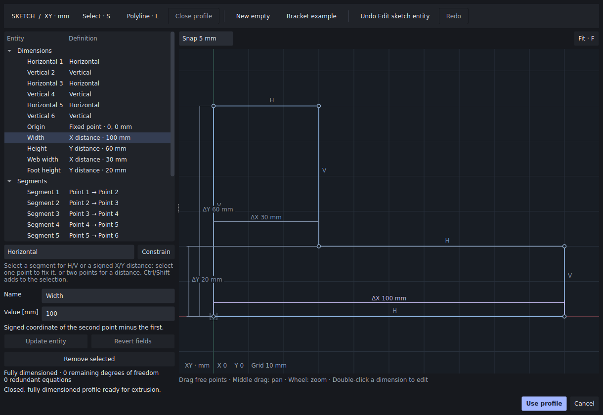
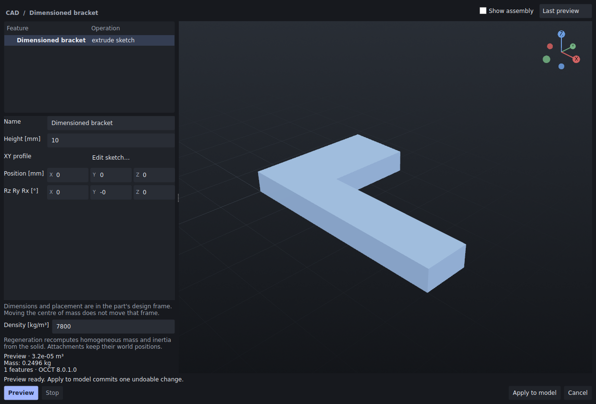

# Draw a profile. Set a dimension. Rebuild the solid.

**Source: Studio 0.6.0a2.dev2.** The sketch editor draws a closed line profile,
stores its dimensional intent and extrudes it through the real OCCT 8 worker.
Changing an upstream dimension regenerates the CAD feature graph and recomputes
the solid's homogeneous mass and inertia. The downloadable **0.6.0a1 Linux alpha**
predates this editor; use the [source CAD installation](STUDIO_CAD.md#reproducible-installation).

## Try the bracket in a few minutes

1. Choose **Create → Sketch extrusion…**, or press **Ctrl+Shift+G**.
2. Select **Edit profile…**. The example is a closed L profile, 80 mm wide and
   60 mm high, with a 30 mm web and a 20 mm foot. Its origin is fixed; the
   editor reports zero remaining affine degrees of freedom.
3. Double-click the **ΔX 80 mm** dimension. Enter `100`, then choose
   **Update entity**. Press **F** over the canvas to frame the expanded profile.
4. Choose **Use profile**, a height of **10 mm** and density **7800 kg/m³**.
   Create the solid. The resulting mass is **0.2496 kg**; the 80 mm version is
   **0.2184 kg**. Both values follow the independent two-cuboid volume formula.
5. Select the body and choose **Create → Edit CAD features… → Edit sketch…** to change its
   upstream profile again. **Preview** leaves the document unchanged.
   **Apply to model** commits one change that document Undo can reverse.

The [saved before/after projects and executable recipe](bancs/studio-sketch-060/README.md)
let a contributor inspect the complete transaction.

## Draw and constrain your own profile

Choose **New empty**, then **Polyline** or **L**. Click successive vertices and
click the first point again to close the loop, or use **Close profile**. Closing
reuses the first point's identity. The snap selector offers off, 1, 5 and 10 mm.
Use **S** to select, the middle mouse button to pan, the wheel to zoom and **F**
to frame. Escape leaves drawing mode. Ctrl/Shift adds to the selection.

| Selection | Available constraint | Meaning |
|---|---|---|
| One segment | Horizontal / Vertical | Equal Y / X coordinates at its endpoints |
| One point | Fixed point | Two absolute coordinates in the sketch's XY frame |
| Two points or one segment | X distance / Y distance | Signed second coordinate minus first coordinate |

A distance is along one coordinate axis. It is not the Euclidean segment length.
Enter a decimal such as `12.5` or `-2e-3`. Double-click a displayed distance to
edit it. The Browser exposes all dimensions and stable entity identities.

Drag a free point to move the translations left by the constraints. Fixed axes
stay fixed. One drag creates one undo entry; keyboard Undo/Redo also covers
construction and dimension edits. A contradictory dimension remains visible in
the draft, with its conflicting cycle highlighted. Edit or remove it before
using the profile. Invalid pending text stays in its field when selection changes.
Deleting an entity requires explicitly handling its dependent segments and
constraints, so deletion cannot silently discard dimensional intent.

## Mathematical and numerical contract

The admitted constraints form two independent affine systems, one per axis:
`x_b − x_a = d`, with fixed coordinates connected to a distinguished zero origin.
Decimal dimension strings are parsed as exact rational numbers. Seeds used to
position free components are the exact rational values of their binary64 coordinates.

For each connected component, graph traversal assigns potentials `p_i`. Every
edge checks that its potential difference equals its dimension exactly. A
nonzero residual identifies a contradictory cycle; there is no tolerance that
silently relaxes it. Consequently `0.1 + 0.2 = 0.3` is consistent, while a
dimension differing by `10⁻²⁰ mm` can be reported as contradictory. This is a
consistency property of the entered affine equations, not a physical manufacturing tolerance.

An unanchored component admits exactly one translation `t` on that axis. An
anchored component admits none. Summing those translations across X and Y gives
the exact remaining degrees of freedom. If there are `n` points and `D` free
translations, the rank is `2n − D`; redundant scalar equations are the equation
count minus that rank. These statements apply to consistent systems.

For a free component without an active drag, the chosen translation minimises
`Σᵢ(p_i + t − seed_i)²`, giving `t = mean(seed_i − p_i)`. A drag instead selects
the translation through the dragged coordinate. Rational coordinates convert to
binary64 once; the code checks a maximum coordinate transport error of
`10⁻⁹ mm`. A two-coordinate difference therefore has error at most `2 × 10⁻⁹ mm`.
These bounds do not certify OCCT's subsequent operations or a mechanics solution.

Before extrusion, the rounded coordinates that OCCT will receive must form one
connected, simple closed loop. Orientation, segment intersections, touching,
adjacent overlap and signed area are checked with exact rational predicates on
those binary64 inputs. Every edge must be at least **0.001 mm** long. The loop is
oriented towards +Z and extruded by a positive height in its design frame.

The model admits at most 64 points, 64 segments and 128 constraints. Dimension
literals have at most 64 characters and bounded exponents; dimensions and solved
coordinates remain within ±10⁶ mm. Exact arithmetic here has bounded inputs;
it is not a general symbolic algebra system.

## Persistence and engine composition

Sketch, point, segment, dimension and feature UUIDs survive upstream edits and
save/reopen. Canonical recipe fingerprints do not depend on entity array order.
The profile belongs to an `extrude_sketch` feature in the existing CAD graph.
Changing its centre of mass keeps the design origin and existing world
attachments consistent with the [CAD frame contract](STUDIO_CAD_HISTORY.md#geometry-mass-and-attachment-frames).

Projects containing a sketch extrusion use **schema 4**. Existing non-sketch
projects retain schemas 1–3, and all four remain readable. Saving a sketch under
an older schema is refused. A separate Pinocchio worker must also install a
Studio version that understands `extrude_sketch` (this source version or later);
the old worker cannot read a schema-4 capture. Pinocchio receives the captured
mass and full inertia tensor and does not load the CAD engine.

## Evidence and remaining work

The [qualification record](bancs/studio-sketch-060/README.md) includes real Qt
interaction, the installed OCCT worker, independent two-cuboid integrals,
before/after projects, exact conflict checks and a dense linear algebra reference
for rank and projection. The [implementation](../apps/studio/vinkulum_studio/sketch.py)
and [tests](../apps/studio/tests/test_sketch.py) are inspectable.

The current domain covers planar line profiles and affine dimensions. Arcs,
circles, splines, angles, radii, Euclidean-distance constraints, nested loops,
multiple profiles, arbitrary sketch planes and persistent CAD face/edge naming
remain open. Stable sketch UUIDs do not establish TNaming or topology split/merge
resolution. This increment contributes to CAD-02; it does not close the entire
CAD specification.

Contributions with reproducible examples are especially useful: interaction
improvements for dense sketches, independent affine-system adversarial cases,
and a carefully scoped nonlinear constraint solver with explicit singularity
and branch-selection behaviour. See the [contributor projects](CONTRIBUTOR_PROJECTS.md).
