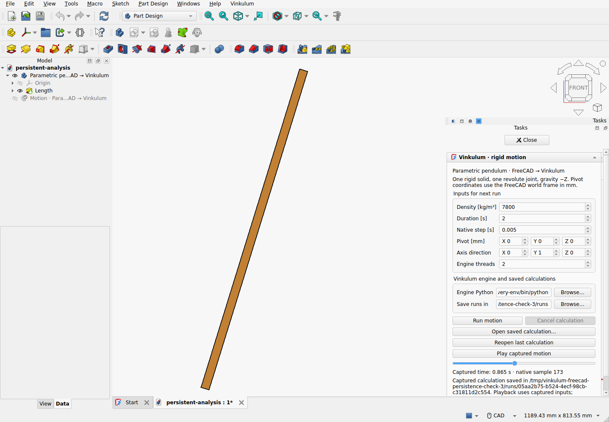

# FreeCAD 0.1.0a2 — persistent motion analyses

The extension stores a native `App::FeaturePython` Motion object in the `.FCStd`
document: source link, schema version, stable analysis/body identifiers, density,
world pivot and axis, duration, native step, thread allocation and last capture
folder. Double-click and context-menu actions reopen its native task panel.
Recompute and document restoration never start the external solver.



## Retained experiment

The runtime remains official FreeCAD 1.1.3, Python 3.11.14, Qt 6 and OCCT 7.8.1
on Linux/X11 with Xvfb. The separate engine uses Vinkulum 0.20.0, Studio backend
0.6.0a2.dev7 and OCCT 8.0.1. Runtime provenance is in the
[original extension record](../freecad-extension-010/README.md).

[precommit-extension-check.json](precommit-extension-check.json) records 18
passing checks against the installed extension ZIP. It deliberately records
`source_dirty: true` and individual packaged-file hashes, because this run
preceded the source commit. The release archive is rebuilt from clean committed
source and qualified separately; its report identifies the exact commit.

The recipe creates an analysis, undoes/redoes its creation, edits its parameters,
undoes/redoes a task-panel edit, saves a real `.FCStd`, closes and reopens it.
Source links and identifiers survive. Restored double-click and context-menu
callbacks open the same analysis. No solver or replay starts on document load.
Opening the panel preserves the numeric values exactly in memory, and editing
one vector component preserves the other components exactly.

The first development assertion required bitwise equality after native file
serialization. It exposed FreeCAD's 16-fractional-decimal XML output for these
properties: a step of `0.005000000000012345` reopens as `0.0050000000000123`.
The qualification now measures this separately from panel precision. Maximum
absolute difference across the selected numeric properties is
`4.5102810375396984e-17`, against a declared `1e-15` round-trip budget for these
test values. This is not a universal relative-precision guarantee for arbitrary
magnitudes. No solver or geometry-admission tolerance changed.

An actual worker consumes density `7800.000000123456` directly from the document,
even though the compact panel displays fewer digits. Editing density to
`8100.123456789` after launch does not alter that captured input, and completion
does not overwrite the newer document value. The analysis remembers the capture
folder; after save/close/reopen, explicit replay uses the retained result.

The earlier calculation, native-pose display, save-time removal of temporary
geometry, stale-source rejection, failed-start, single-job admission, real
cancellation and document-close checks also pass. A new source-link change
during a real running process closes its panel, cancels the job and retains the
previous capture reference.
Unlinking the source during playback also removes the temporary copy and restores
the original source visibility, even though it is no longer linked to the analysis.
Rigid-frame transport has maximum position and
rotation component differences of approximately `1.639e-13 m` and `3.023e-13`,
against the unchanged `1e-8` budgets.

## Reproduce

Run the current [qualification macro](../../../apps/freecad/qualify_extension.FCMacro)
against the matching **0.1.0a2** archive, using fresh output directories:

```sh
python3 apps/freecad/package.py /tmp/Vinkulum-FreeCAD-0.1.0a2.zip --require-clean
python3 ci/freecad_extension.py \
  --freecad /absolute/path/to/FreeCAD/AppRun \
  --engine-python /absolute/path/to/vinkulum-environment/bin/python \
  --archive /tmp/Vinkulum-FreeCAD-0.1.0a2.zip \
  --output /tmp/new-freecad-analysis-check
```

For the older 0.1.0a1 release, use its tagged source and qualification recipe.
The current macro requires the new persistent-analysis features.

## Limits

This remains one top-level rigid solid, one revolute joint, rest initial
velocities and gravity -Z; no Assembly constraint conversion or FEM controls.
Captures remain external folders. `LastCapture` is an absolute path, not an
embedded or portable archive; locate a moved folder with Open saved calculation.
The engine executable stays in local preferences, outside the document.

Native properties remain authoritative. Compact controls show a rounded value;
their tooltips disclose the stored value. Editing a control intentionally writes
the entered value, while opening it or editing other controls does not. Native
FreeCAD file serialization retains its own precision. Large-model STEP capture
latency, all expression/link/undo combinations, other FreeCAD versions and other
operating systems remain unqualified. This record establishes the exercised
document lifecycle, not a general numerical or desktop reliability guarantee.
