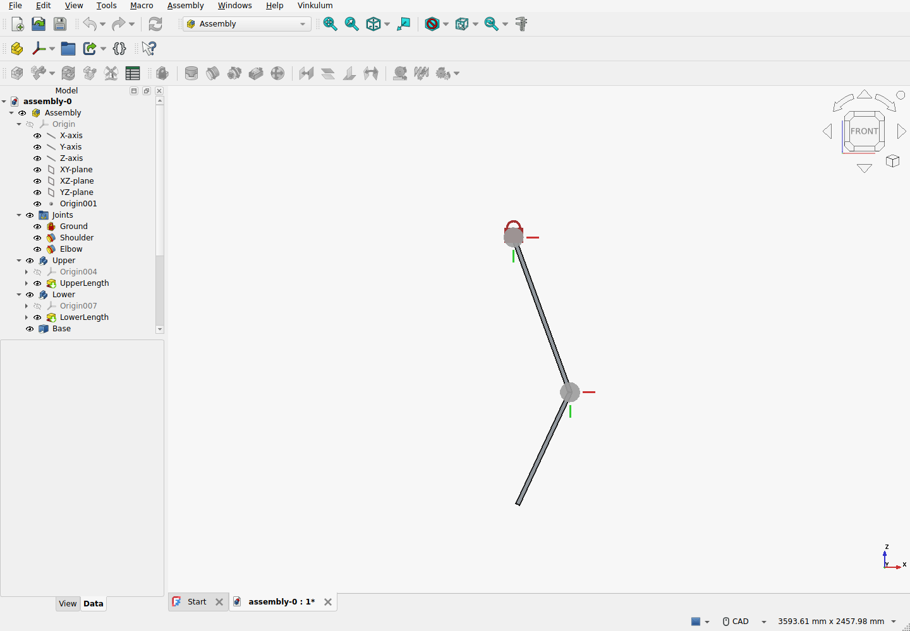

# Native FreeCAD Assembly conversion — 10 September 2026

A native FreeCAD Assembly containing two linked PartDesign solids, a grounded
component and two Revolute joints now crosses the existing CAD/mechanics boundary.
The external Vinkulum process imports both evaluated STEP solids, checks their
physical properties, constructs the two native pivots and calculates the motion.
FreeCAD replays the returned samples on copies in a separate document. Its source
Assembly, links, sketches, pads and design placements remain intact.

This is an **experimental conversion API and executable qualification recipe**.
It extends the existing Python extension; it creates no competing workbench or
standalone GUI. The published Motion task remains the single-solid workflow.
Native Assembly selection, persistent multi-body analyses and their interactive
document lifecycle still need integration into that task.



## Contract and scope

[assembly_capture.py](../../../apps/freecad/assembly_capture.py) reads native
`Assembly::AssemblyObject`, `App::Link`, `GroundedJoint` and Revolute objects via
the installed Assembly APIs. It accepts a flat assembly with one grounded
component and at most sixteen moving components, each containing one valid solid.
All moving solids share an explicit positive density. Motion starts at rest under
gravity −Z; capture is limited to ten seconds and 2,001 native samples.

Both connector origins must agree within 10⁻⁸ m and their Z axes must be parallel
or antiparallel within a 10⁻⁸ dot-product budget. Missing component references,
other joint types and enabled joint limits are refused. Suppressed joints do not
enter the mechanical model. Nested assemblies and multi-solid components remain
outside this converter's domain.

The qualified fixture uses native detached joint coordinate systems
(`Detach1/Detach2`) with explicit local placements. It does not establish the
persistence of face/edge attachments after arbitrary topology changes. The recipe
calls FreeCAD's native Assembly solver before capture; the adapter then reads the
evaluated placement and connector state. It does not solve or alter the source
Assembly while capturing it.

An `App::Link` shape includes its local placement but omits the enclosing Assembly
placement. The converter uses `UtilsAssembly.getGlobalPlacement` and
`getJcsGlobalPlc` to transport both geometry and joints consistently. The captured
world geometry starts with identity body rotation in Vinkulum; returned rotations
act on that captured shape, not on the FreeCAD design feature's local frame.

[assembly_worker.py](../../../apps/freecad/assembly_worker.py) reuses the existing
solid importer and mechanical adapter. FreeCAD's volume, mass, centre and every
centroidal inertia component must agree with the OCCT 8 reimport. The existing
absolute budgets stay unchanged: εV, εm, εL and εmL², with ε = 10⁻⁸ and L the
imported bounding-box diagonal. Millimetre geometry becomes SI using 10⁻⁹ for
volume and density × 10⁻¹⁵ for the inertia integral in mm⁵.

Admission checks the original request bytes, run identity, ordered body identities,
current world geometry, grounding and both native joint frames. It also checks
finite increasing times, proper rotation matrices and the complete initial pose.
The macro tests eleven direct admission counterexamples: changed geometry, moved
Assembly, changed grounding, displaced connector, missing reference, unsupported
joint, enabled limit, improper rotation, exchanged body identities, boolean time
and replaced input with a matching replacement result hash. These are explicit
post-calculation admission probes, not coverage of all interactive lifecycle races.

## Independent mechanics check

The model has uniform 20 × 30 mm rectangular sections, lengths 800 and 600 mm,
density 2,700 kg/m³, and initial angles 20° and −25° from downward vertical.
Its two masses are 1.296 and 0.972 kg. Each run lasts 0.5 s. Four actual native
calculations cover steps of 5 and 2.5 ms, both at the origin and with the parent
Assembly translated by (125, −75, 210) mm and yawed by 17°.

[verify_assembly.py](../../../apps/freecad/verify_assembly.py) requires only NumPy.
It implements the independent 2 × 2 Lagrange equations for finite-section rods,
using RK4 with 16 and 32 reference subdivisions per native interval. For lengths
L, half-lengths c, masses m and centroidal pivot-axis inertias I, its mass matrix is

```text
[ I₁ + m₁c₁² + m₂L₁²     m₂L₁c₂ cos(α−β) ]
[ m₂L₁c₂ cos(α−β)        I₂ + m₂c₂²       ]
```

The right-hand side includes the centrifugal terms and gravity torques; it uses
no Vinkulum, FreeCAD, OCCT, build123d or Qt implementation. It checks analytic box
properties, hinge kinematics, world-frame covariance, exact native NPZ/JSON sample
agreement and the actual displayed centres recorded by FreeCAD.

In the retained run, maximum angle error is 3.410 × 10⁻⁴ rad at 5 ms and
8.529 × 10⁻⁵ rad at 2.5 ms, for either parent placement. Fine/coarse error is
0.2502. The reference refinement gap is below 4.32 × 10⁻¹³ rad; world-frame
position and rotation discrepancies are below 8.82 × 10⁻¹⁴ m and 1.34 × 10⁻¹³.
The declared budgets are 2 × 10⁻³ / 5 × 10⁻⁴ rad for the two native steps,
10⁻¹⁰ rad for reference refinement, 10⁻⁸ for world-frame transport, and a
fine/coarse ratio below 0.4. They are checked by the verifier.

Each run replays 41 actual native frames. All 164 displayed-centre checks are
below 10⁻⁹ m, and the Qt heartbeat continues during each external calculation.
These observations qualify this double-pendulum path on the stated runtime;
they do not qualify arbitrary mechanisms, closed loops, contact, FEM or other
operating systems. The normal result status remains `NotAssessed`.

## Reproduce

Install the extension ZIP built from this branch and the separate engine
environment described in the [FreeCAD guide](../../../apps/freecad/README.md).
Use an empty, dedicated FreeCAD process: the recipe creates its own documents
and closes that process when finished. It refuses an existing output directory.

```sh
export VINKULUM_ASSEMBLY_CAPTURE=/tmp/native-assembly-capture
export VINKULUM_FREECAD_PYTHON=/absolute/path/to/engine/bin/python
FreeCAD /absolute/path/to/repo/apps/freecad/qualify_assembly.FCMacro
/absolute/path/to/numpy-only/bin/python apps/freecad/verify_assembly.py \
  "$VINKULUM_ASSEMBLY_CAPTURE"
```

On headless Linux, prefix FreeCAD with
`xvfb-run -a -s '-screen 0 1600x1100x24'`. The recorded run uses separate temporary
XDG config/data/cache directories. The macro imports the installed extension,
checks its complete module manifest and starts the installed worker script in
the explicitly selected engine interpreter. FreeCAD's Python and library
overrides are removed from the worker environment.

The archive contains all four `.FCStd` source documents, eight STEP solids,
requests, saved mechanical projects, native trajectories, worker outputs,
admission reports and independent verification. It also retains the candidate
extension ZIP and producer sources. Its package manifest explicitly identifies
an uncommitted qualification candidate based on `818bbaa`; this record is not a
new public extension release. Check and extract it with:

```sh
cd docs/bancs/freecad-assembly-2026
sha256sum -c SHA256SUMS
unzip record.zip -d /tmp/retained-assembly
/absolute/path/to/numpy-only/bin/python \
  ../../../apps/freecad/verify_assembly.py /tmp/retained-assembly/record
```

[Three external-worker regressions](../../../apps/studio/tests/test_freecad_assembly.py)
use the retained transported Assembly capture. They run the real two-body engine
against the independent reference and reject inconsistent mass or an uncaptured
joint endpoint before simulation. The existing two single-solid regressions
exercise the shared importer too. These tests require the CAD engine environment,
but no running FreeCAD.

## Regression checks

The installed candidate also passes all 18 checks of the canonical native Motion
extension, including document persistence, Undo/Redo, exact input preservation,
actual simulation, saved-result reopening, invalidation, cancellation and close.
Its FreeCAD process exits normally. The shared importer passes both existing
single-solid regressions and all three new Assembly regressions.

`ci/local.sh --bancs` passes (kernel, Python regressions, Lean proofs, retained
numerical records and mechanical/contact campaigns; three optional Exudyn checks
are skipped). The complete `ci/studio.sh` suite runs 217 tests with no failures
and 17 skips: sixteen numerical Pinocchio checks require their direct external
environment and one optional foreground-keyboard check is not enabled. The external
Pinocchio worker integration checks do run. No standalone Studio GUI feature was
changed. Distribution provenance, Python 3.11 syntax and changed-source formatting
checks pass. The archive retains both complete CI logs.

## Provenance

The host is the unchanged official FreeCAD 1.1.3 Linux x86-64 AppImage,
Python 3.11.14, Qt 6 and OCCT 7.8.1. Its
[upstream download](https://github.com/FreeCAD/FreeCAD/releases/download/1.1.3/FreeCAD_1.1.3-Linux-x86_64-py311.AppImage)
has SHA-256 `3a853eb69ee595f779f2255dbf80a765926981d8ff68903cefee4dfb03a8f5ef`.
The separate engine is Vinkulum 0.20.0, Studio 0.6.0a2.dev6, Python 3.14.7,
build123d 0.11.1+vinkulum.occt8 and OCCT 8.0.1.0. The independent reference
environment contains Python 3.14.7 and NumPy 2.5.3.

The adapter calls public APIs from upstream
[JointObject.py](https://github.com/FreeCAD/FreeCAD/blob/145529fe741292ff0b3977a01195bf0247425794/src/Mod/Assembly/JointObject.py)
and [UtilsAssembly.py](https://github.com/FreeCAD/FreeCAD/blob/145529fe741292ff0b3977a01195bf0247425794/src/Mod/Assembly/UtilsAssembly.py).
No third-party solver implementation is copied. The converter, recipe, models,
reference equations and captured data are original Apache-2.0 contributions;
the separately installed FreeCAD runtime retains its upstream licence.
