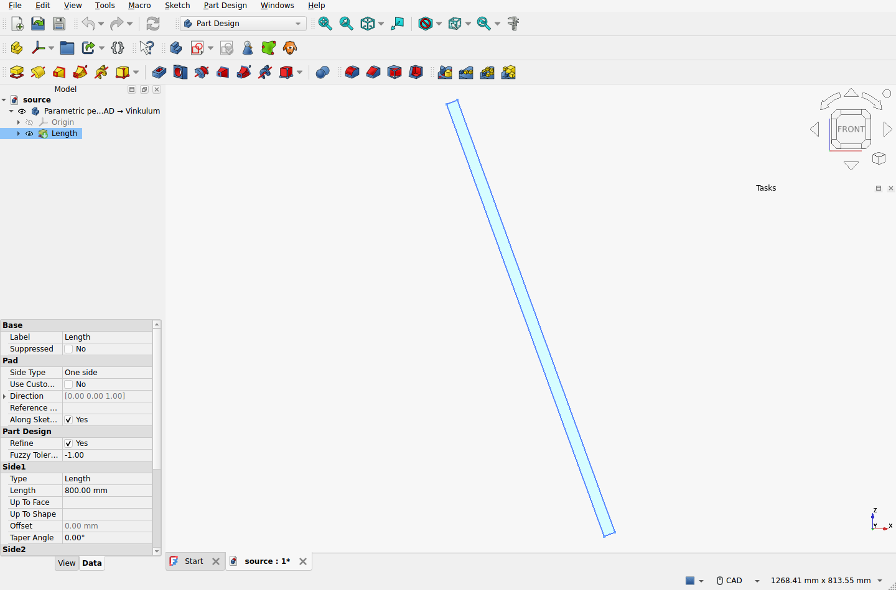
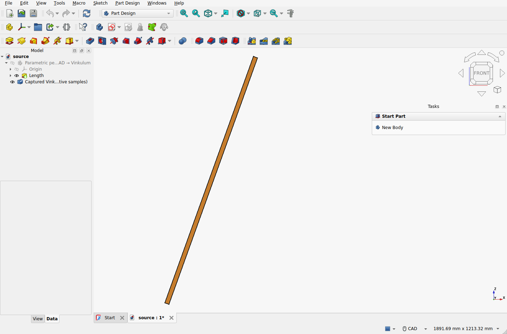
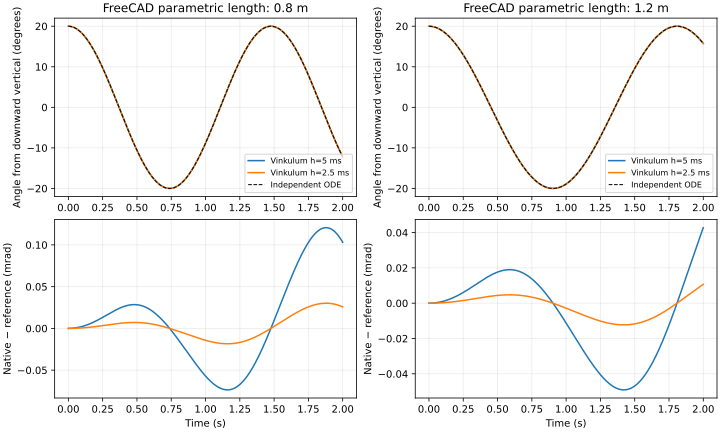

# FreeCAD bridge qualification — 2026-09-10

The [prototype](../../../apps/freecad/README.md) was exercised in the real
FreeCAD GUI on Linux/X11 using the official
[FreeCAD 1.1.3 release](https://github.com/FreeCAD/FreeCAD/releases/tag/1.1.3).
Its x86-64 Python 3.11 AppImage was checked against the upstream SHA-256:

```text
3a853eb69ee595f779f2255dbf80a765926981d8ff68903cefee4dfb03a8f5ef
```

The retained archive and observations below are original experiment outputs.
They include the source scripts used to obtain them, source fingerprints, the
official runtime locator, editable FreeCAD documents, STEP inputs and the full
Vinkulum request/project/result/trajectory files. The application wheel's 62
Python modules match main `d9673f1`; bridge files are additional experiment code.





## Independent reference and observations

The section is 20 × 30 mm; length L is 0.8 or 1.2 m and density is 7800 kg/m³.
The pad is rotated by 160° about world Y, placing its centre at
`(L sin(20°)/2, 0, −L cos(20°)/2)` metres. The hinge is at the world origin,
about world Y. From rest, the angle θ measured from downward vertical satisfies

```text
θ'' = −g (L/2) / (L²/3 + width²/12) sin(θ)
θ(0) = 20°, θ'(0) = 0, g = 9.80665 m/s²
```

This follows from `I_pivot = m(L²/3 + width²/12)`, including the finite
cross-section, and gravitational torque `−mg(L/2) sin(θ)`. The verifier integrates
this scalar equation with RK4 at 16 and 32 substeps per native interval. Their
maximum discrepancy is below `7 × 10⁻¹⁴ rad` for these runs. It independently
computes the box's mass, centre and all nine rotated centroidal tensor entries.

| Length | Mass | Native step | Maximum angle difference from reference |
|---|---:|---:|---:|
| 0.8 m | 3.744 kg | 5 ms | 1.2061852 × 10⁻⁴ rad |
| 0.8 m | 3.744 kg | 2.5 ms | 3.0155445 × 10⁻⁵ rad |
| 1.2 m | 5.616 kg | 5 ms | 4.9098096 × 10⁻⁵ rad |
| 1.2 m | 5.616 kg | 2.5 ms | 1.2274745 × 10⁻⁵ rad |

Halving the native step gives error ratios 0.2500068 and 0.2500045, consistent
with second-order convergence in these cases. This comparison is not a general
trajectory error bound. The retained solver manifest remains `NotAssessed`.



All FreeCAD and OCCT 8 properties meet the stated scale-based budgets. The
displayed copy's centre agrees with the selected native samples to less than
`10⁻⁹ m`; the verifier records the actual, smaller residuals. Display chooses
native samples directly, without interpolation. Every frame also checks that
the source geometry and placement remain unchanged. The recorded event-loop
ticks show that the external calculations allow FreeCAD to continue processing
events; they are not a general interactive-latency qualification.

Four input/result failures are exercised in the real FreeCAD session: modifying
the source pad, translating an enclosing Part while its child's local BREP stays
unchanged, corrupting a returned rotation, and replacing the captured request
along with the returned request hash. Each is refused at admission;
restoring the captured geometry/data permits admission again.

## Retained record

`record.zip` contains the complete captures and the three executed bridge/macro
sources, plus the independent verifier and runtime provenance. `SHA256SUMS`
identifies the retained files. Extract it into a new directory and run:

```sh
python apps/freecad/verify.py /path/to/extracted/record
```

The verifier needs numpy; no installed FreeCAD, Studio, OCCT or Vinkulum kernel
is needed to check the stored physical references and native data. See the
[prototype reproduction commands](../../../apps/freecad/README.md#reproduce)
to repeat the actual GUI experiment. The qualification covers the stated Linux
runtime, two rectangular pendula and the recorded failure cases.

Repository validation: `ci/local.sh --bancs` passed all 46 mechanical and nine
contact cases, with three optional Exudyn integration tests skipped. The installed
Studio suite passed 214 tests with 17 skips (16 optional in-process Pinocchio
tests and one optional keyboard recipe). Both external bridge-worker tests also
pass against the final retained STEP/request capture, and the extracted archive
passes the independent verifier without FreeCAD or a physics engine installed
in the verification environment.
