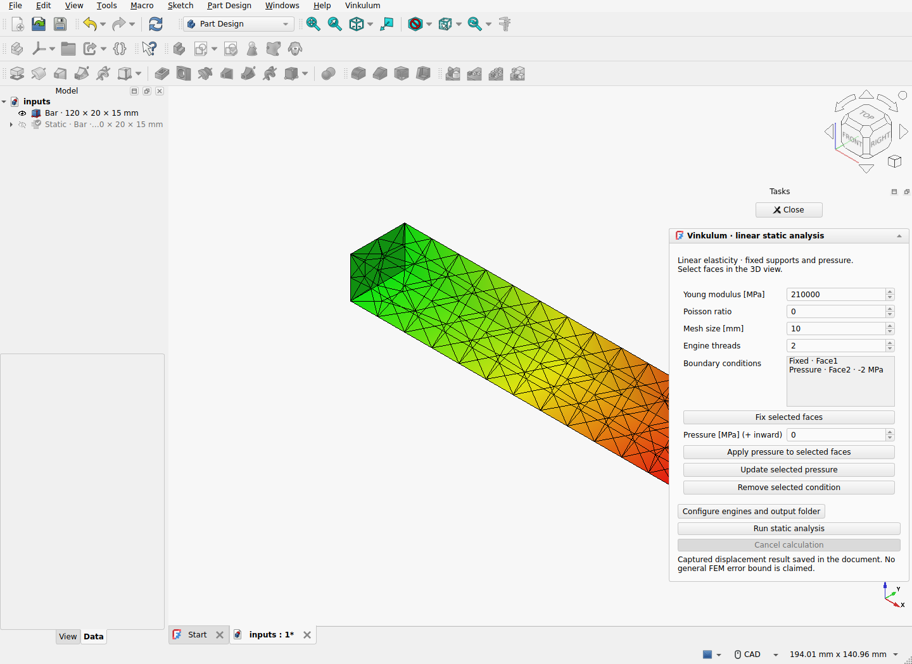

# FreeCAD first-run reference — 2026-09-10

[Installation and first calculation](../../FREECAD_FIRST_RUN.md).



Development extension **0.1.0a3.dev3** passes fourteen installed native checks on
Linux. The menu creates an editable 120 × 20 × 15 mm bar, fixed end and −2 MPa
pressure without starting a solver or changing the active workbench. Five
successive menu-open/document-close cycles pass. The user then opens the static
task and starts the calculation explicitly.

The final recorded calculation has a maximum nodal displacement error of
**4.762e-13 m** against the affine tension solution, with E = 210 GPa and Poisson
ratio zero. The free-end displacement is approximately 0.001143 mm. The GUI timer
fires 582 times during the accepted calculation: evidence of event-loop activity,
not a latency benchmark. The run also checks native input/result persistence,
Undo/Redo, pressure editing, the visible Close button, source restoration after
result-mesh deletion, stale-result handling, changed-geometry refusal, cancellation
and document closure. A second real solve rejects results after material changes.
See [static-check.json](static-check.json) for the fourteen grouped checks and
[the previous task qualification](../freecad-static-task-2026/README.md) for their
scope and process-group cancellation fixture.

`record.zip` contains the exact installed ZIP, source hashes and executed sources,
raw Gmsh/CalculiX calculations, STEP captures, FCStd inputs and results, screenshot,
console and report. Run `sha256sum -c SHA256SUMS` before extracting. Producer and
packaged source hashes were compared with the checkout after this run. The ZIP
manifest deliberately records an uncommitted development candidate based on
c66aaa405084a96a3db609b1ca3f00eb85551abc; this is not a new official release.
Absolute paths in the record identify the experiment, not portable defaults.

The final qualification includes the documented INSTALLATION.txt bytes. It exits
zero with no Python traceback in the native console. Runtime: FreeCAD 1.1.3 / Qt 6,
Python 3.11 and host OCCT 7.8.1; separate Python 3.14.7 engine with Vinkulum 0.20
and OCCT 8.0.1; Gmsh HXT 5.0.0-git-91b4154 / OCCT 8.0.1; CalculiX 2.21. Two
engine threads, Linux x86-64. To repeat with your installed executable paths:

```sh
python3 ci/freecad_static.py --recipe static-task \
  --freecad /absolute/path/to/FreeCAD \
  --engine-python /absolute/path/to/engine/venv/bin/python \
  --gmsh /absolute/path/to/gmsh --ccx /absolute/path/to/ccx \
  --output /tmp/vinkulum-first-run-check
```

Assembly and single-solid Motion qualifications belong to the previous dev2
package; they were not rerun for this menu addition. This record establishes the
stated static example and lifecycle cases. It does not establish general FEM
accuracy, arbitrary topology persistence, all queued close-event interleavings,
other operating systems or finished UI polish. The native screenshot retains the
host's task overlay and its partial occlusion of the result.
