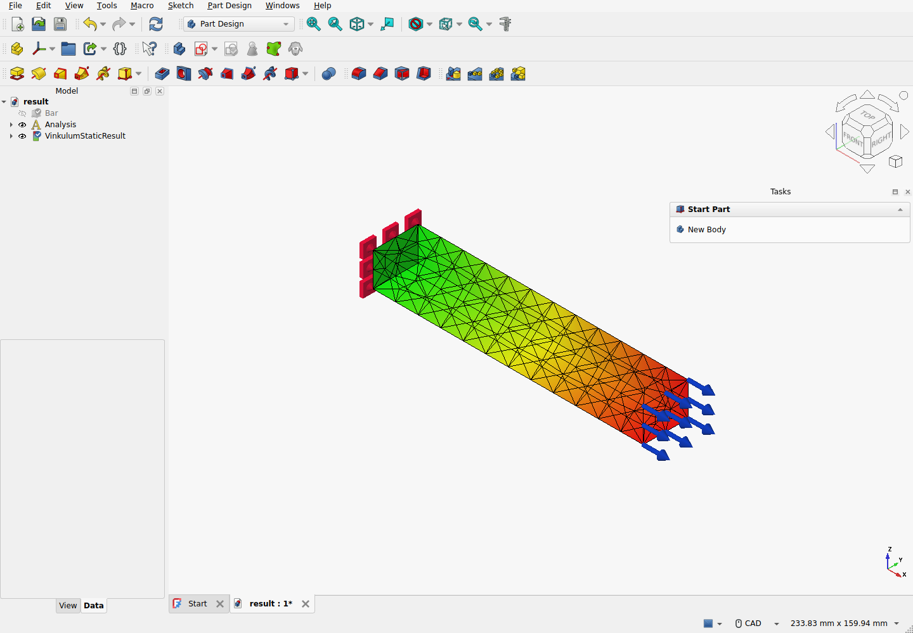

# Native FEM input qualification — 2026-09-10

Development sources only; see [reproduction and scope](../../FREECAD_STATIC_EXPERIMENT.md#native-fem-inputs-development-sources).
The `--native-inputs` recipe reads FreeCAD FEM analysis, fixed/pressure boundary
and solid material objects, then uses the existing captured-face worker and native
FEM result import. No custom input widgets or published command are added.

Host: official FreeCAD 1.1.3, Python 3.11, Qt 6, OCCT 7.8.1 on Linux x86_64.
Separate engine: Python 3.14.7, Vinkulum 0.20, OCCT 8.0.1;
Gmsh 5.0.0-git-91b4154 / OCCT 8.0.1 HXT and CalculiX 2.21, two threads.
The dedicated native-input and unchanged legacy recipes both exited zero.

| Independent reference | Original bar | Rotated/translated bar |
| --- | ---: | ---: |
| Nodes / quadratic tetrahedra | 611 / 260 | 613 / 262 |
| Maximum displacement error [m] | 4.762e-13 | 7.067e-14 |
| Relative strain-energy error | 5.000e-8 | 5.000e-8 |
| Net reaction error [N] | 1.000e-5 | 5.592e-10 |
| Native inputs and results saved/reopened | pass | pass |

Each case refuses changed pressure magnitude/direction, changed material modulus,
edge references and enabled amplitudes before adding document objects. The shared
import still refuses changed source geometry. A separate actual FreeCAD admission
probe also refuses unknown analysis members. Restoring input values restores the
same deterministic snapshot. Unit conversion represents 7800 kg/m³ as
7799.999999999999; this normal binary rounding is retained, not rounded away.

Raw CalculiX archives and CAD mapping were independently replayed for both cases.
Renumbering mesh surfaces preserves support/load arrays; ambiguous matches,
displaced faces and wrong areas are refused. The NumPy-only reference constructs
its own Rodrigues rotation and checks affine displacement, energy and reaction
balance without importing FreeCAD, Studio, OCP or Vinkulum.

Verify `sha256sum -c SHA256SUMS`, then extract `record.zip` into a new directory.
Run `python verify_reference.py` there with NumPy installed in a separate minimal
environment. The script requires the CAD/physics imports to be absent. For raw
solver and mapping replay use `ci/check_freecad_static_mapping.py` on that extracted
directory with the qualified external engine.

The archive includes native source/result FCStd documents, STEP captures, mesh
and solver records, reports, actual screenshot, exact executed producer sources,
and their pre-commit provenance. Dirty source status is intentional: the executed
bytes are retained and their hashes matched the working sources before archiving.
Original absolute paths identify the qualification environment; they are not
installation paths. The separate admission macro is retained as executed evidence,
while `verify_reference.py` uses paths relative to the extracted archive.

This qualifies the two affine elastic transfer cases and stated refusal probes.
It does not establish general FE convergence or arbitrary face correspondence.
The adapter requires a dedicated input analysis: existing solver objects, meshes,
additional physics and non-global materials are refused. Results are snapshots;
post-import invalidation, job progress/cancellation and a complete interactive
FEM execution workflow remain future work.

## Integration with the native static task

After merging the shared runner from #38, the native-input mode passes both cases
and the installed interactive task passes twelve checks. Their execution records
and sources are in `integration-record.zip`; see `integration.json`. The two
real-process guardian regressions pass. Combining `--native-inputs` with
`--recipe static-task` is refused before creating the output directory.

Two initial task runs failed because the native Close button was still hidden at
the qualification's fixed 400 ms observation. The qualification now waits up to
five seconds for actual visibility, then keeps the same visible-button click
assertions. The accepted integrated run needed one additional 100 ms observation.
The old failure reports are retained; they are not successful qualifications.
This changes test synchronization, not task behavior or numerical tolerances,
and makes no GUI latency claim.
