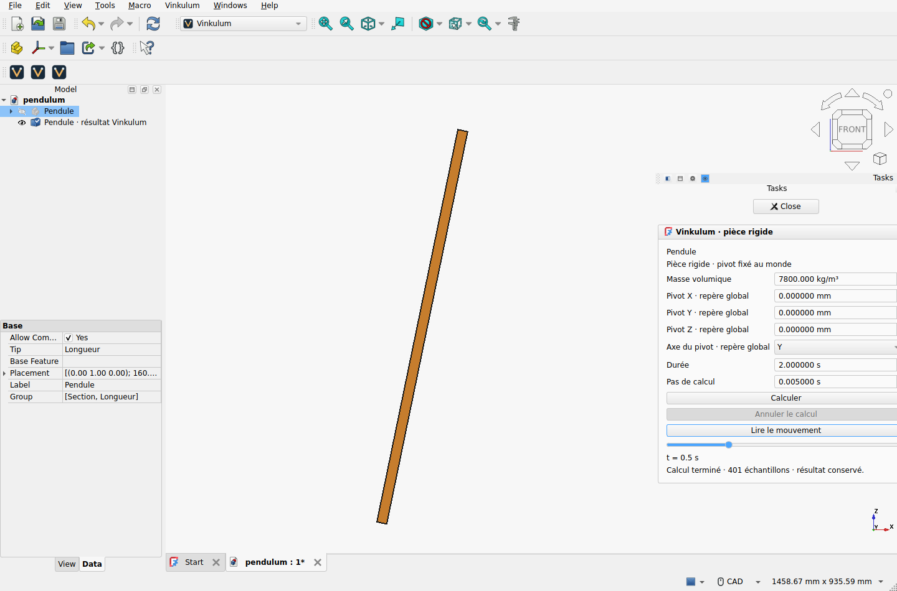

# Atelier Vinkulum installé dans FreeCAD

Qualification du 10 septembre 2026 : **FreeCAD 1.1.3 Linux x86-64**, atelier
**0.1.0a1**, moteur externe Vinkulum **0.20.0** / services Studio **0.6.0a2.dev6**.
Cette livraison applique la [priorité FreeCAD](../../FREECAD_INTEGRATION.md).

[Télécharger l’atelier](Vinkulum-FreeCAD-0.1.0a1.zip) ·
[Instructions d’installation](../../../apps/freecad/README.md) ·
[Données et recettes](record.zip) · [Empreintes SHA-256](SHA256SUMS)



## Ce qui a été exécuté

L’archive a été extraite dans le dossier utilisateur `Mod/Vinkulum` d’une
installation FreeCAD dédiée. FreeCAD charge lui-même `InitGui.py` et l’atelier ;
les macros de qualification importent le module installé et contrôlent ses
empreintes. Le moteur tourne dans un vrai processus externe, avec son Python
et son OCCT propres. Aucun moteur ni runtime FreeCAD n’est inclus dans l’archive.

Le parcours utilise les commandes de l’atelier et les boutons Qt : exemple
PartDesign, calcul, animation, sauvegarde par `Std_Save`, fermeture/réouverture
du `.FCStd`, reprise du résultat, modification de la longueur et nouvelle capture.
La source paramétrique reste inchangée par la lecture ; une ancienne capture
reste lisible après modification de cette source. Le bouton d’annulation est
testé lorsque le processus est `Running`, avec conservation du résultat précédent.
Fermer son document pendant un calcul actif arrête aussi le processus et la tâche.

Trois captures de deux secondes, pas de 5 ms, section 20 × 30 mm, densité
7800 kg/m³, sont conservées :

| Cas | Géométrie et pivot | Référence indépendante | Écart maximal |
|---|---|---|---|
| Y | Longueur 800 mm, pivot à l’origine | Pendule physique scalaire | 1,2062 × 10⁻⁴ rad |
| X | Longueur 1200 mm, rotation globale Z de 90°, pivot (100, −200, 300) mm | Même pendule après changement de repère | 4,9099 × 10⁻⁵ rad |
| Z | Longueur 1200 mm, pivot (100, −200, 300) mm | Couple gravitaire nul autour de Z ; immobilité depuis le repos | Dérive du centre 1,1330 × 10⁻¹³ m |

Le vérificateur calcule les propriétés analytiques de la boîte, dont le tenseur
d’inertie complet après rotation. Il compare les poses aux échantillons de
l’archive native et contrôle la fermeture cinématique autour du pivot. La
référence scalaire est intégrée par RK4 avec 16 puis 32 subdivisions ; leur écart
est inférieur à 7 × 10⁻¹⁴ rad. Les masses sont respectivement 3,744 et 5,616 kg.
Le centre affiché à 0,5 s dans le premier cas diffère du centre calculé de moins
de 7 × 10⁻¹⁷ m. La [campagne initiale](../freecad-bridge-2026/README.md) conserve
séparément la convergence lors de la division du pas par deux.

Les dix scénarios de durée de vie sont : échec du lancement, annulation au
démarrage, annulation en cours, suppression de la source, fermeture du document,
annulation après écriture du résultat, dépassement du délai, source modifiée,
réussite après les annulations avec refus d’un calcul concurrent, fermeture
de FreeCAD. Chaque notification arrive après l’arrêt du processus enfant ;
le délai et les observateurs sont libérés. Le dialogue natif d’enregistrement
est exercé : **Cancel** garde le document ouvert, puis **Save** permet de quitter.

Le contrôleur de qualification suspend certains enfants juste avant le moteur
ou juste après l’écriture du résultat. Le vrai `worker.py` s’exécute dans ce même
processus, sans sous-processus supplémentaire. Ces barrières rendent les courses
reproductibles ; elles ne sont pas distribuées dans l’atelier. Le test du délai
raccourcit le minuteur ; la limite normale reste de 60 secondes.

## Vérifier et reproduire

Depuis la racine du dépôt, avec un Python contenant seulement NumPy :

```sh
python -m zipfile -e docs/bancs/freecad-workbench-2026/record.zip /tmp/freecad-record
python apps/freecad/verify_workbench.py /tmp/freecad-record/workbench \
  --installed-archive docs/bancs/freecad-workbench-2026/Vinkulum-FreeCAD-0.1.0a1.zip \
  --lifecycle-root /tmp/freecad-record/lifecycle
```

Ce contrôle a passé dans un environnement Python 3.14.7 / NumPy 2.5.3 sans
FreeCAD, Vinkulum, Studio, OCP, build123d ni PySide6. La CI refait la construction
de l’archive, vérifie sa correspondance à la livraison conservée et réexécute
ces références ; elle ne relance pas le bureau FreeCAD.

Les contrôles locaux de cette contribution ont également passé :
`ci/local.sh --bancs` (46 bancs rapides et 9 contacts, 3 intégrations Exudyn
ignorées faute de moteur) et `ci/studio.sh` (214 tests découverts, 197 réussis,
17 ignorés : 16 références nécessitant l’environnement Pinocchio direct et
un parcours clavier optionnel). Les deux régressions du worker FreeCAD sont
incluses parmi les tests réussis. Les vérifications de distribution et la
reconstruction identique de l’archive avec Python 3.12 et 3.14 ont passé.

Pour rejouer les parcours graphiques, installer l’archive, configurer un moteur
avec les [dépendances CAO](../../STUDIO_CAD.md), puis lancer chaque recette dans
une session FreeCAD vide et dédiée. Chaque dossier de sortie doit être nouveau.
Ces recettes ferment leurs documents et quittent leur session de test.

```sh
export VINKULUM_FREECAD_PYTHON=/absolute/path/to/engine/bin/python
export VINKULUM_FREECAD_CAPTURE=/tmp/workbench-fresh
FreeCAD "$PWD/apps/freecad/qualify_workbench.FCMacro"
export VINKULUM_FREECAD_CAPTURE=/tmp/lifecycle-fresh
export VINKULUM_FREECAD_QUALIFICATION="$PWD/apps/freecad"
FreeCAD "$PWD/apps/freecad/qualify_lifecycle.FCMacro"
```

Sur Linux sans écran, préfixer chaque commande FreeCAD par
`xvfb-run -a -s '-screen 0 1600x1100x24'`. La qualification conservée a utilisé
l’`AppRun` extrait de l’[AppImage officiel 1.1.3](https://github.com/FreeCAD/FreeCAD/releases/tag/1.1.3),
Python 3.11.14 et OCCT 7.8.1. Son SHA-256 et les empreintes des recettes figurent
dans `provenance.json`. Le moteur utilise Python 3.14.7, OCCT 8.0.1.0 et
build123d 0.11.1+vinkulum.occt8. Les profils XDG étaient propres à cette qualification.

`record.zip` contient les rapports, requêtes, STEP, projets Vinkulum, trajectoires,
documents FreeCAD et recettes. Les documents conservent le chemin absolu de leur
calcul : après extraction ailleurs, remplacer la propriété `VinkulumDirectory`
de chaque résultat par le chemin du dossier correspondant dans
`workbench/calculations/`, en conservant son dernier composant UUID. Le document
seul n’est pas encore un paquet portable incluant les trajectoires.

## Limites et provenance

Une pièce rigide uniforme et un pivot explicite sont couverts. Les assemblages
à plusieurs corps, les références persistantes aux faces, le FEM dans FreeCAD,
macOS/Windows et les autres versions de FreeCAD restent à qualifier. Les écarts
mesurés sur ces pendules ne constituent pas une borne générale de trajectoire.

Code, icône, géométries et références sont des contributions originales Vinkulum
sous [Apache-2.0](../../../LICENSE). Le runtime FreeCAD officiel est utilisé sans
modification et reste distribué par son projet amont sous sa propre licence.
