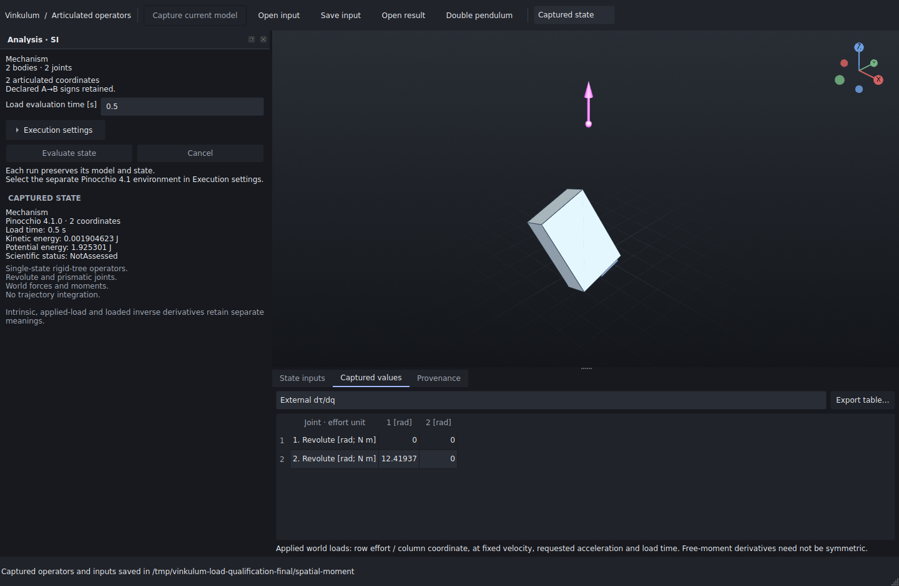

# Applied world-load derivatives — 10 September 2026

Original reference, supported domain and reproduction: [applied-load derivative contract](../../PINOCCHIO_LOADS.md).

The [full report](qualification.json) retains all increments, errors, samples, CPU/thread settings, versions and source hashes. [Captured inputs and results](captured-results.zip) reopen with the schema-2 reader; the fixtures are original and contain no third-party model.

| Reference | Analytic max absolute error | Best central-difference external error | Scaled condition number |
|---|---:|---:|---:|
| spatial-force | 4.44e-16 | 4.99e-11 | 1.056 |
| spatial-moment | 0 | 2.25e-10 | infinite |
| spatial-wrench | 4.44e-16 | 2.2e-10 | 21.46 |
| mixed-wrench | 1.67e-16 | 4.87e-11 | 1.14 |

Errors have entry-specific effort/coordinate units. Conditioning uses the characteristic units stated in the contract. The pure free-moment derivative has rank one and is nonsymmetric. Finite differences are secondary evidence and do not establish a general accuracy guarantee.

| Coordinates | Loads | All operators (ms) | Load derivatives with existing Jacobians (ms) | Python + imports (ms) | Full CLI, one run (ms) |
|---:|---:|---:|---:|---:|---:|
| 2 | 1 | 0.433 | 0.086 | 159.324 | 345.655 |
| 16 | 2 | 3.343 | 0.241 | 159.269 | 352.118 |
| 32 | 2 | 11.055 | 0.226 | 166.535 | 368.437 |

Table entries are medians of seven samples except the single full CLI run. The report also separates model construction, bare Python startup, JSON encoding, file writing and result reading. Timings were collected in a shared environment without an exclusive CPU reservation; variation is visible in the retained samples. The intervals overlap and must not be added. No speedup or universal scaling claim follows from these measurements.

The Hessian binding probe directly compares raw and diagnostically unpacked arrays against an independent COM Jacobian derivative. The raw maximum error is 1.18712; diagnostic unpacking gives 2.78e-17. Production does not use this binding tensor or its unpacking.



Capture the retained `spatial-moment` result with the Studio GUI interpreter:

```sh
unzip docs/bancs/studio-applied-loads-2026/captured-results.zip -d /tmp/vinkulum-load-results
PYTHONPATH="$PWD/apps/studio" xvfb-run -a -s "-screen 0 1600x1100x24" \
  python ci/studio_applied_load_recipe.py /tmp/vinkulum-load-results/spatial-moment \
  /tmp/vinkulum-load-capture
```

The archive opens without Pinocchio in the GUI process. The screenshot displays a real saved result; it is not a rendered mockup.


Validation:

- [Full Studio suite](studio-tests.log.gz): 174 tests, 157 pass and 17 skips, after integrating main `a3c4f4b` (including the C3D8 study). Sixteen numerical tests require the separate Pinocchio process environment and pass in the dedicated run below; the other skip is the opt-in keyboard recipe.
- [Installed numerical references](installed-numerical.log.gz): all 11 existing Pinocchio tests and all six applied-load tests pass from the installed wheel, outside the checkout and without `PYTHONPATH`.
- [Installed Qt/worker suite](installed-gui.log.gz): all six tests pass, including actual schema-2 calculation, corruption rejection, table/CSV values and legacy reopening without an engine in the GUI process.
- The worker's declared package dependencies pass `uv pip check`. The installed wheel's five changed implementation modules match the checked source byte for byte.
- [Full local CI](ci-local.log.gz): `ci/local.sh --bancs` passes, including kernel tests, Lean proofs, 46 mechanical cases and nine contact cases. Three optional Exudyn checks are skipped. This CI ran before rebasing over the C3D8 study; the rebase changed no native, proof, local-CI or Studio implementation files from the checked tree.
- All seven retained result archives were extracted and reopened from the installed GUI environment without importing Pinocchio.
