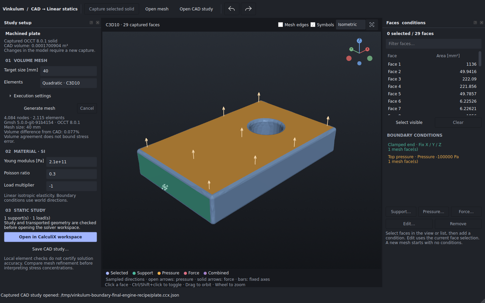
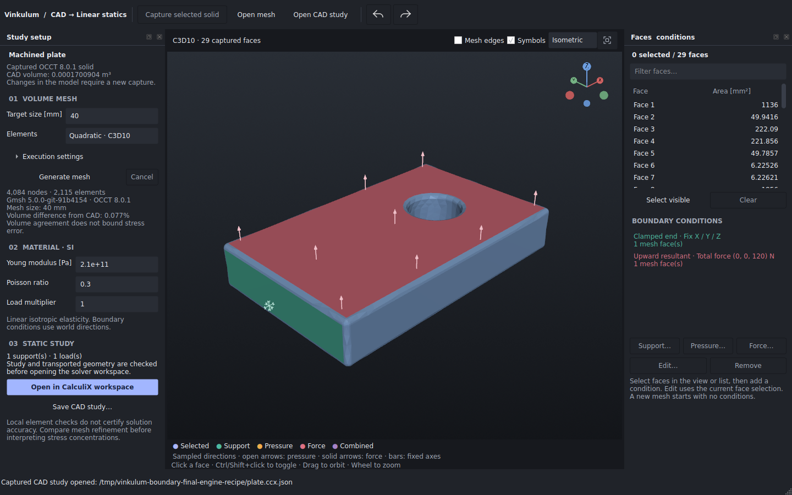

# Boundary-direction display qualification

**Studio 0.6.0a2.dev1 · Linux x86-64 · installed source wheel.** This increment
adds pressure, total-force and support directions to the CAD study viewport.
The downloadable standalone application remains **0.6.0a1** and does not contain
these new symbols. Restarting an editable source installation is sufficient
for Python/UI changes; rebuilding a standalone archive is not required.






These are unmodified application screenshots. Open arrows show pressure,
solid arrows show a total-force direction, and capped bars show constrained
world axes. Arrows have a nominal scale of 30 logical pixels; foreshortening
and perspective apply. Their length does not represent a physical magnitude.
The corresponding values appear in the condition list. The three screenshots
show separate display states, not simultaneous loads or new solver results.

## Evidence and scope

The [qualification manifest](qualification.json) identifies the wheel, all
51 installed Python modules, the tests and the external executables. The
[desktop log](studio-tests.log) and [200% display log](hidpi-tests.log) record
the final runs: **125 passed and 10 skipped** in the full desktop suite;
**all nine boundary-workspace tests passed** at 200%. The skipped tests require
Pinocchio inside the main interpreter. The separate Pinocchio worker was used
successfully by the GUI integration tests. They exercise keyboard toggling, picking through symbols,
signed and invalid multipliers, unchanged physical conditions, camera fitting,
zoom and resizing. Actual OpenGL image checks measure arrow orientation and
extent, and verify contrast against each type of coloured face in the tested
views. They do not qualify every camera, driver or accessibility requirement.

The independent geometric reference is the quadratic surface
`x(r,s) = (r, s, 3rs/4)`. At its barycentre, the position is
`(1/3, 1/3, 1/12)` and the oriented normal is proportional to `(-1/4, -1/4, 1)`.
Tests also rotate and translate this reference and exercise normalization
with very small and large finite numbers. These extreme helper inputs are
not claims that physical CAD models at those scales are admitted or accurate.

Surface frames use the actual P1/P2 boundary mapping and are prepared in the
background worker. At most nine samples per captured face and 24 anchors per
condition are displayed. Positive pressure follows the inward normal;
total-force vectors and support axes use world coordinates. Symbols depict
the initial captured mesh, not individual consistent nodal loads, the sum of
overlapping conditions, or follower pressure on a deformed result.

## Reproduce the saved display

The [raw example archive](mesh-and-static-example.zip) contains the generated
mesh, material, boundary conditions, saved study and CalculiX input/output.
After installing this Studio source version with its CAD dependencies:

```sh
unzip docs/bancs/studio-boundary-symbols-060/mesh-and-static-example.zip -d /tmp/vinkulum-symbol-example
xvfb-run -a -s '-screen 0 1600x1100x24' \
  python ci/studio_boundary_recipe.py /tmp/vinkulum-symbol-captures \
  --study /tmp/vinkulum-symbol-example/plate.ccx.json
```

The [display recipe](../../../ci/studio_boundary_recipe.py) reopens the saved
study, captures its signed-pressure states and an alternative total-force
state, restores the original conditions and checks that the input file is
unchanged. No external engine is executed. [Its report](direction-recipe.json)
records the conditions, sample points, directions and image hashes.

The separate [engine workflow report](engine-recipe.json) comes from a fresh
Gmsh/OCCT 8 mesh, real CalculiX execution and checked reopening in the installed
application: **4,084 nodes, 2,115 C3D10 elements**, and observed elastic energy
**0.002297249949073421 J**. The 19-file archive also reopened in a fresh process
with external execution disabled; its file contents and timestamps remained
unchanged. The workflow can be repeated with [the meshing recipe](../../../ci/studio_mesh_recipe.py).
The plate is a workflow example, not an independent elasticity solution or
mesh-convergence result. Parallel meshing may change connectivity between runs;
the archive preserves the exact run behind these screenshots.
