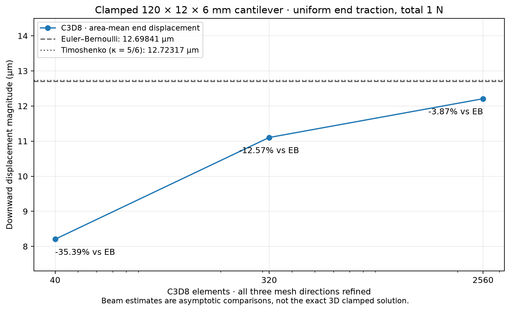

# C3D8 cantilever: three uniform refinements

**CalculiX 2.21, Linux, 2026-09-10.** This experiment addresses
[issue #4](https://github.com/Brietat71/vinkulum-public/issues/4): characterise
bending in the affine C3D8 adapter beyond its uniform-strain patch cases.
The displacement gap to Euler–Bernoulli decreases from **−35.39% to −3.87%** over
three meshes. The finest result is not a certified 3D solution, and these three
meshes do not establish a converged limit or an asymptotic convergence order.
The scientific status remains `NotAssessed`.



## Model and load definition

The solid occupies `0 ≤ x ≤ L`, `−b/2 ≤ y ≤ b/2`, `−h/2 ≤ z ≤ h/2`:

| Quantity | Value |
|---|---:|
| Length L | 0.12 m |
| Width b | 0.012 m |
| Height h, in the bending direction | 0.006 m |
| Young modulus E | 210 × 10⁹ Pa |
| Poisson ratio ν | 0.3 |
| End force Fz | −1 N |
| End area A = bh | 7.2 × 10⁻⁵ m² |
| Second moment Iy = bh³/12 | 2.16 × 10⁻¹⁰ m⁴ |

All three translations are fixed at **every node of x = 0**. The other faces
are traction-free except x = L, which carries uniform world-Z traction
`tz = Fz/A = −13888.8888889 Pa`. There are no body forces, prescribed rotations,
nonzero imposed displacements or nodal couples. The applied resultant is
`(0,0,−1) N` and its moment about the clamped-face centre is `(0,0.12,0) N m`.
Coordinates, material data and nodal forces supplied to the adapter are SI.

Each loaded bilinear face contributes `Fz / (4 ny nz)` to each of its four
corner nodes, with contributions combined at shared nodes. This is the
consistent integral of the constant traction against the face shape functions.
Consequently, edge and interior end-face nodes have different tributary weights.
The tests check total force, total moment, the complete clamp, and exact work on
a bilinear virtual displacement with odd y, z and yz terms.

All elements are regular affine cubes. Every refinement halves the element
side in **all three directions**, preserving geometry, material, support region
and continuous traction:

| nx × ny × nz | Cube side (mm) | Elements | Nodes | Total DOFs | Fixed DOFs | Free DOFs |
|---|---:|---:|---:|---:|---:|---:|
| 20 × 2 × 1 | 6 | 40 | 126 | 378 | 18 | 360 |
| 40 × 4 × 2 | 3 | 320 | 615 | 1845 | 45 | 1800 |
| 80 × 8 × 4 | 1.5 | 2560 | 3645 | 10935 | 135 | 10800 |

All meshes are inside the adapter's 6000-node / 5000-element budgets. A further
uniform refinement would require 24633 nodes and 20480 elements and is outside
this adapter's current domain.

## Independent beam comparisons

The code derives these estimates from geometry and material constants, without
using any FEM displacement or stress. For a prismatic Euler–Bernoulli beam,
the bending moment magnitude is `|Fz|(L−x)` and curvature is `M/(E Iy)`.
Twice integrating with zero displacement and slope at the clamp gives

```text
uz_EB(L) = Fz L³ / (3 E Iy) = −12.6984126984 µm
U_EB = ∫₀ᴸ M²/(2 E Iy) dx = Fz² L³/(6 E Iy) = 6.34920634921 × 10⁻⁶ J
```

Euler–Bernoulli neglects transverse shear deformation and treats cross-sections
as plane and normal to the deflected axis. As a second explicit estimate, use
Timoshenko shear deformation with `G = E/[2(1+ν)]` and the assumed rectangular
shear factor **κ = 5/6**:

```text
uz_T(L) = uz_EB(L) + Fz L/(κGA) = −12.7231746032 µm
U_T = U_EB + Fz² L/(2κGA) = 6.36158730159 × 10⁻⁶ J
```

The shear correction is 0.195% of the Euler–Bernoulli deflection. The specimen
has `L/h = 20`, `L/b = 10`; its displacements are small relative to h. These are
slender-beam comparisons with a specified shear-factor approximation. Neither
formula is the exact 3D elasticity solution with a completely fixed end face,
free lateral faces and uniform end traction. The clamp suppresses local Poisson
contraction/warping, and the end traction differs from an idealised beam stress
distribution. Local end effects are part of the 3D problem and do not disappear
merely by refining the mesh.

## Observed displacement, energy, residuals and time

The reported displacement is the **area-weighted mean world-Z displacement on
x = L**, using the consistent nodal tributary areas. It is not the maximum
nodal displacement or an unweighted average. With `wi = Fzi/Fz`,
`ūz = Σ wi uzi`; external elastic work is `½Σ Fi·ui = ½Fz ūz`.

Strain energy comes independently from integrating the solver's printed `ENER`
density at the eight Gauss points per element, using the adapter's quadrature
weights. The largest relative disagreement with half the nodal work is
**1.38 × 10⁻⁷**, within the adapter's `5 × 10⁻⁶` print-rounding allowance.

| Cells X×Y×Z | Free DOFs | Mean end uz (µm) | Strain energy (J) | Gap to EB (%) | Gap to Timoshenko (%) |
|---|---:|---:|---:|---:|---:|
| 20×2×1 | 360 | −8.204759 | 4.1023795 × 10⁻⁶ | −35.38752 | −35.51327 |
| 40×4×2 | 1800 | −11.102108 | 5.5510534 × 10⁻⁶ | −12.57090 | −12.74106 |
| 80×8×4 | 10800 | −12.207391 | 6.1036965 × 10⁻⁶ | −3.86679 | −4.05389 |

Gaps are `100(ūz/uz_beam − 1)`. They compare observables to approximate beam
models; they are **not** certified FEM discretisation errors. The figure joins
the three measurements and contains no extrapolated continuum value.

The [generated full table](table.md) also reports the Euclidean norms of force
and moment residuals and the solver time for every mesh. In
[summary.json](summary.json), the residuals are retained as three-component
vectors in N and N m. They use `Σ(F_applied + R)` and
`Σ x × (F_applied + R)` about the clamped-face centre, with undeformed positions.
CalculiX `RF` includes applied forces; the adapter subtracts them to recover R.
The largest recorded force residual is **1.80 × 10⁻⁶ N** and largest moment
residual is **1.20 × 10⁻⁸ N m**. These include cancellation of rounded printed
reactions; the parser's scale-aware equilibrium checks pass on all three runs.

The solver reports elapsed times of **0.008776, 0.045245 and 0.436655 s**.
`solver_elapsed_s` comes from its `Total CalculiX Time` log line.
`adapter_elapsed_s` separately measures engine identification, input preparation,
solving and output validation; it excludes mesh construction, compression and
plotting. Each is one measurement, with no repetition or performance claim.
The adapter sets `OMP_NUM_THREADS`, `CCX_NPROC_RESULTS` and
`CCX_NPROC_EQUATION_SOLVER` to **1**. The archive records CalculiX 2.21, the
executable hash, requested thread count, platform and Python 3.14.7. It does
not pin the process to a CPU or claim a hardware-independent runtime.

## Why the coarse meshes are stiff

The fully integrated trilinear brick uses `2×2×2` Gauss integration. In bending,
its displacement approximation can introduce parasitic shear strains; full
integration retains their energy, producing excessive stiffness. The
[CalculiX element description](https://web.mit.edu/calculix_v2.7/CalculiX/ccx_2.7/doc/ccx/node26.html)
(Guido Dhondt's manual, mirrored by MIT) identifies excessive bending stiffness
and poor behaviour for nearly isochoric material response. At ν approaching
0.5, the volumetric constraint adds a separate locking concern. This experiment
uses moderate ν = 0.3 and does not qualify nearly incompressible materials.

The observed increase in compliance with refinement is consistent with the
known bending limitation. This single sequence does not isolate contributions
from shear locking, volumetric constraints, ordinary interpolation error and
the physical end effects. At the clamp/lateral-face junction, mixed boundary
conditions also make peak stresses unsuitable as an assumed convergent scalar.
The raw integration-point stresses are retained, but no peak clamp stress is
used as an accuracy observable.

## Reproduce or recheck the retained calculation

The original mesh, load construction and beam formulas are in
[the recipe](../../../ci/studio_c3d8_refinement.py). They and these original
calculation outputs are contributed under Vinkulum's Apache-2.0 licence.
CalculiX remains a separately installed executable with its own licence.

From the repository root, with `PY` pointing to the Studio Python environment:

```sh
# Creates a new output directory; existing results are refused.
PYTHONPATH=apps/studio "$PY" ci/studio_c3d8_refinement.py run /tmp/c3d8-new --ccx /usr/bin/ccx

# Reparse all raw files and rebuild the numerical comparison, without a solver.
PYTHONPATH=apps/studio "$PY" ci/studio_c3d8_refinement.py verify docs/bancs/studio-c3d8-refinement-2026

# Optional standalone figure; Matplotlib is required only for this command.
PYTHONPATH=apps/studio "$PY" ci/studio_c3d8_refinement.py plot /tmp/c3d8-new
```

Each ZIP contains `study.json`, the actual `study.inp`, unmodified `study.dat`,
`solver.log` and `result.json`. The input and raw-output fingerprints are checked
by `load_static_result`, which reparses the values and energy. The recipe also
reconstructs each specified mesh, support set and traction, recomputes the
summaries and checks the generated table. Re-aggregation tolerances are
`10⁻¹²` relative, with absolute scales of 1 N and 0.12 N m for residual vectors;
these are archive-reproduction tolerances, not solution-error bounds.
The live `run` command preserves uncompressed calculation folders too, including
diagnostics if a solver fails.

[Two Studio tests](../../../apps/studio/tests/test_c3d8_refinement.py) check the
load/clamp invariants and revalidate all three retained calculations while
rejecting any attempt to launch a solver. The existing archive parser verifies
numeric consistency; the historical executable fingerprint is provenance,
not authentication of the producer or a proof of continuum accuracy.
