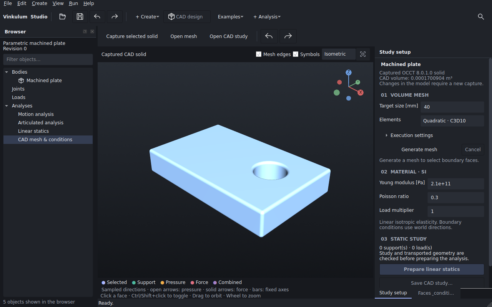

# Unified project window: installed Linux evidence

These are actual 1280 × 800 window captures from the installed Studio
0.6.0a2.dev7 delivery candidate, under X11/Xvfb, Fusion style and en_GB locale.
[interaction.json](interaction.json) records all 63 application module hashes,
package versions, OpenGL driver and exact measurement boundaries. Every installed
module matches the candidate source. The images include the persistent browser.

[Model](interaction.png) · [Linear statics](interaction-static.png) ·
[Articulated analysis](interaction-articulated.png)

The full installed suite at application commit a11ad0a passed: 224 discovered,
203 executed, 21 optional/platform skips, 129.886 seconds. The final small delta
keeps the existing CAD analysis action enabled while another analysis is visible;
all seven navigation regressions were then rerun on the new installed wheel and
passed in 5.055 seconds. The recipe now refuses to time a disabled QAction and
returns to the model before timing an existing analysis again.

The seven regressions cover one top-level window, actual browser and face clicks,
pending material and camera preservation, contextual save/undo, panel persistence,
close refusal, background-view preservation and a real threaded preparation
barrier that protects newer target input. No numerical tolerance was changed.

[previews-at-a11ad0a.json](previews-at-a11ad0a.json) records the preceding installed,
nonfrozen application recipe: native dynamics, OCCT/STEP, CAD regeneration and
saved CAD/FEM/Pinocchio captures, all passed. The delivered example files were
unchanged. This report is not a frozen macOS qualification.

In the final local diagnostic, synchronous return took about 5–7 ms when reopening
an existing analysis and 133–169 ms for initial analysis construction. The plate
open command took 128 ms. These are individual observations, not first-frame
latencies or a performance guarantee; they do not establish a Mac speedup.
The public macOS workflow separately runs the full suite and checks its copied
frozen application before publishing a DMG.
